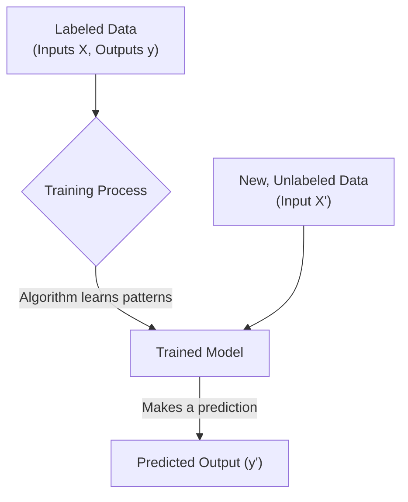

Supervised learning is the most common and straightforward type of machine learning. It's called "supervised" because the process of training the algorithm is like having a teacher. You provide the computer with a dataset containing lots of examples, each with the correct answer. The algorithm's job is to learn the rules that map the examples to the answers.

The entire goal is to train a `model` that can make accurate predictions on new data it has never seen before.

## The Core Concept: Learning from Labeled Data

Everything in supervised learning starts with your data. This data must be **labeled**, meaning each piece of input data is tagged with the correct output or "ground truth."

-   **Input (X):** Also known as features or variables. These are the attributes that describe your data point.
-   **Output (y):** Also known as the label or target. This is the correct answer you are trying to predict.

The learning process involves showing the model the input `X` and the correct output `y` over and over, until the model learns the relationship between them.



## The Two Flavors of Supervised Learning

Supervised learning problems almost always fall into one of two categories: classification or regression. The difference is in the kind of output (`y`) you are trying to predict.

### 1. Classification: Predicting a Category

In classification, the goal is to predict a discrete label or a category. The question you're asking is "Which class does this belong to?"

**Examples:**
-   Is this email `spam` or `not spam`? (2 classes)
-   Is this photo a `cat`, a `dog`, or a `bird`? (3 classes)
-   Will this customer `churn` or `stay`? (2 classes)

#### Visualizing Classification
Imagine plotting customer data based on age and spending. A classification model tries to find a "decision boundary" that separates the different classes (e.g., those who churned vs. those who stayed).

```plotly
{
  "data": [
    {
      "x": [25, 45, 22, 55, 60, 30, 35, 50],
      "y": [300, 800, 250, 900, 1000, 400, 500, 850],
      "mode": "markers",
      "type": "scatter",
      "name": "Stayed",
      "marker": {"color": "blue", "size": 10}
    },
    {
      "x": [65, 70, 58, 62, 75],
      "y": [200, 150, 300, 250, 100],
      "mode": "markers",
      "type": "scatter",
      "name": "Churned",
      "marker": {"color": "red", "size": 10}
    },
    {
      "x": [15, 80],
      "y": [600, 400],
      "mode": "lines",
      "type": "scatter",
      "name": "Decision Boundary",
      "line": {"color": "green", "dash": "dash"}
    }
  ],
  "layout": {
    "title": "Classification: Separating Customer Groups",
    "xaxis": {"title": "Customer Age"},
    "yaxis": {"title": "Monthly Spending ($)"}
  }
}
```

#### Code Example: Spam Detection

Let's train a simple model to classify a message as `spam` or `not spam` based on keywords.

```python
from sklearn.feature_extraction.text import CountVectorizer
from sklearn.naive_bayes import MultinomialNB

# Labeled Data (X=messages, y=labels)
messages = [
    "win free money now",
    "claim your exclusive prize",
    "meeting about the project tomorrow",
    "can you review this document",
    "free viagra and money",
]
labels = ["spam", "spam", "not spam", "not spam", "spam"] # 0 for not spam, 1 for spam

# Convert text into numerical features
vectorizer = CountVectorizer()
X = vectorizer.fit_transform(messages)

# y labels should be numerical
y = [1, 1, 0, 0, 1]

# Choose and train the model
# Multinomial Naive Bayes is great for text classification
model = MultinomialNB()
model.fit(X, y)

# Make predictions on new data
new_messages = ["let's discuss the project prize", "free money meeting"]
new_X = vectorizer.transform(new_messages)
predictions = model.predict(new_X)

# Print results
for msg, pred in zip(new_messages, predictions):
    result = "spam" if pred == 1 else "not spam"
    print(f'Message: "{msg}" -> Prediction: {result}')
```

### 2. Regression: Predicting a Number

In regression, the goal is to predict a continuous numerical value. The question you're asking is "How much?" or "How many?"

**Examples:**
-   What will be the `price` of this house?
-   How many `sales` will we make next quarter?
-   What will the `temperature` be tomorrow?

#### Visualizing Regression
Imagine plotting house size against price. A regression model tries to find the "line of best fit" that best describes the relationship between the features and the numerical outcome.

```plotly
{
  "data": [
    {
      "x": [1000, 1500, 1200, 2000, 2500, 1800, 3000],
      "y": [250, 350, 300, 500, 600, 450, 680],
      "mode": "markers",
      "type": "scatter",
      "name": "Actual Prices"
    },
    {
      "x": [800, 3200],
      "y": [200, 750],
      "mode": "lines",
      "type": "scatter",
      "name": "Regression Line (Prediction)",
      "line": {"color": "red"}
    }
  ],
  "layout": {
    "title": "Regression: Predicting House Prices",
    "xaxis": {"title": "Size (Square Feet)"},
    "yaxis": {"title": "Price (in $1000s)"}
  }
}
```

#### Code Example: Predicting House Prices

Let's train a simple `LinearRegression` model.

```python
from sklearn.linear_model import LinearRegression
import numpy as np

# Labeled Data (X=features, y=price)
# Features: [Size (sq ft), Num Bedrooms]
X = np.array([
    [1500, 3], 
    [2500, 4], 
    [1200, 2], 
    [3000, 4],
    [1800, 3]
])
y = np.array([300000, 550000, 270000, 650000, 400000]) # Prices

# Choose and train the model
model = LinearRegression()
model.fit(X, y)

# Predict the price of a new house: 2000 sq ft, 3 bedrooms
new_house = np.array([[2000, 3]])
predicted_price = model.predict(new_house)

print(f"Predicted price for the new house: ${predicted_price[0]:,.2f}")
```

## Key Challenges in Supervised Learning

Building a good model is more than just running `model.fit()`. Here are the most important challenges.

#### Garbage In, Garbage Out
The single most important factor for success is the quality of your data.
-   **Not enough data:** Models need lots of examples to learn properly.
-   **Inaccurate labels:** If your data is mislabeled, the model will learn the wrong patterns.
-   **Biased data:** If your data doesn't represent the real world, your model's predictions will be biased too. For example, a loan approval model trained only on data from one city will perform poorly in another.

**Important:** Your model is only as good as the data you feed it. Spend most of your time cleaning, preparing, and understanding your data.
{: .notice--warning}

#### Overfitting and Underfitting

This is the central balancing act of supervised learning.

<details>
  <summary>Click to understand Overfitting vs. Underfitting</summary>
  
  - **Overfitting:** This happens when your model learns the training data *too well*. It memorizes the noise and random fluctuations in the data instead of the underlying pattern. An overfit model performs great on the data it was trained on, but fails miserably on new, unseen data. It's like a student who memorizes the answers to a practice exam but can't answer any new questions on the real test.

  - **Underfitting:** This happens when your model is *too simple* to capture the underlying pattern in the data. It performs poorly on both the training data and new data. It's like a student who didn't study at all and fails both the practice and the real exam.

  The goal is to find a "Goldilocks" model that is complex enough to capture the real pattern but simple enough to ignore the noise. We achieve this by splitting our data into **training** and **testing** sets. We train on the first set and then evaluate the model's performance on the second, unseen set. This gives us an honest assessment of how it will perform in the real world.

</details>

Supervised learning is a massive field, but it all comes down to this: using labeled data to train a model that can make useful predictions. Whether you're classifying emails or predicting prices, the principles of clean data, choosing the right model type, and avoiding overfitting remain the same.
