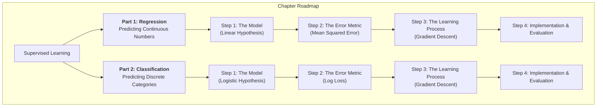

### Introduction: The Principle of Learning from Examples

At its heart, machine learning is about creating systems that can identify patterns and make decisions without being explicitly programmed for every possible scenario. The most common and powerful branch of this field is **Supervised Learning**.

The core idea is beautifully simple and mirrors how we learn as humans. Imagine teaching a child to identify fruits. You don't give them a complex set of rules. Instead, you show them an apple and say "apple." You show them a banana and say "banana." You provide labeled examples. After seeing enough of these pairs, the child learns the underlying patterns—color, shape, texture—and can correctly identify a new fruit they've never seen before.

Supervised learning does exactly this. We provide a computer algorithm with a dataset of examples where we already know the correct answer (the "labels"). The algorithm's task is to learn the intrinsic relationship between the input data and its corresponding label.

This process allows us to solve two fundamental types of problems:

1.  **Regression:** Predicting a continuous numerical value.
    *   *Core Question:* "How much?" or "How many?"
    *   *Example:* Based on a car's age and mileage, how much is it worth?

2.  **Classification:** Predicting a discrete category or class.
    *   *Core Question:* "Which one?" or "Is it this or that?"
    *   *Example:* Based on the pixel data of an image, is it a cat, a dog, or a bird?

This guide will serve as a detailed chapter on both of these topics. We will explore them in parallel, discovering that while their goals are different, the intellectual framework for building and training them is remarkably similar.



---

## Part 1: Regression — The Art of Predicting Numbers

**Our Guiding Problem:** Let's imagine we are data scientists working for a real estate company. Our task is to build a model that can predict the selling price of a house. To start, we will use the most intuitive feature: the size of the house in square feet.

We have a small dataset of houses that have recently sold:

| Size (sq. ft.), `x` | Price ($1000s), `y` |
|---------------------|---------------------|
| 2104                | 400                 |
| 1600                | 330                 |
| 2400                | 369                 |
| 1416                | 232                 |

Our mission is to create a system that can take the size of a *new* house and give us a reasonable estimate of its price.

### Step 1.1: The Model's Blueprint (The Hypothesis Function)

Our first step is to make an assumption about the relationship between size and price. The simplest and most common starting point is to assume this relationship is **linear**. That is, as the size increases, the price increases in a steady, straight-line fashion.

In algebra, we know the equation for a line is `y = mx + c`. In machine learning, we use a slightly different notation for this same concept. We call it our **hypothesis function**, and we write it as `h(x)`:

$$
h_\theta(x) = \theta_0 + \theta_1 x
$$

This equation is the absolute foundation of our model. Let's patiently break down every single component, as understanding it is crucial.

-   `h(x)`: This is our **hypothesis**, which is just another name for our model's prediction. You provide an input `x` (a house size), and the function `h(x)` outputs a predicted price.
-   `x`: This is our input **feature**. In this case, the size of the house.
-   `θ₁` (pronounced "theta-one"): This is a **parameter** of our model, corresponding to the slope (`m`) of the line. It represents the weight or importance of the feature `x`. In our example, `θ₁` is the "price per square foot." For every 1-unit increase in `x`, our predicted price will increase by `θ₁`. Our model must *learn* the best value for this parameter.
-   `θ₀` (pronounced "theta-zero"): This is the other **parameter** of our model, corresponding to the y-intercept (`c`). It can be thought of as the base price of a house, representing the value of the land and permits before we even consider its size. Our model must also learn the best value for this parameter.

The entire "learning" process is simply the search for the optimal numerical values of `θ₀` and `θ₁` that create the line that best represents our data.

```plotly
{
  "data": [
    {
      "x": [2104, 1600, 2400, 1416],
      "y": [400, 330, 369, 232],
      "mode": "markers",
      "type": "scatter",
      "name": "Our Housing Data"
    }
  ],
  "layout": {
    "title": "Our Goal: Find the Best Possible Line Through This Data",
    "xaxis": {"title": "Size (sq. ft.)"},
    "yaxis": {"title": "Price ($1000s)"}
  }
}
```

### Step 1.2: Quantifying Error (The Cost Function)

Our eyes can guess at a good line, but a computer needs a precise mathematical way to measure how good or bad a particular line is. For this, we use a **cost function**. Its job is to take a proposed line (defined by a pair of `θ₀` and `θ₁` values) and calculate a single number that represents the total error.

For regression, the industry-standard cost function is the **Mean Squared Error (MSE)**. Let's build it up from first principles to understand its logic.

1.  **First, find the error for a single house.** For any one house in our dataset, the error is simply the vertical distance between the actual price (`y`) and the price our line predicted (`h(x)`).

    ```plotly
    {
      "data": [
        { "x": [1600, 2104, 2400], "y": [330, 400, 369], "mode": "markers", "type": "scatter", "name": "Actual Data Points" },
        { "x": [1000, 3000], "y": [150, 550], "mode": "lines", "type": "scatter", "name": "A Possible Model (h(x))" },
        { "x": [2104, 2104], "y": [400, 410.8], "mode": "lines", "type": "scatter", "name": "Error for one point", "line": {"color": "red", "width": 3, "dash": "dash"} }
      ],
      "layout": { "title": "The Error is the Vertical Distance Between Actual and Predicted", "xaxis": {"title": "Size"}, "yaxis": {"title": "Price"} }
    }
    ```

2.  **Next, square the error.** The difference `h(x) - y` could be positive (over-prediction) or negative (under-prediction). If we just added these up, they could cancel out, giving us a misleadingly low total error. To prevent this, we square each error: `(h(x) - y)²`. This has two excellent properties: all errors become positive, and it disproportionately penalizes larger mistakes. An error of 10 becomes 100, while an error of 2 only becomes 4.

3.  **Finally, sum all the squared errors and take the average.** We do this for all `m` houses in our dataset to get a single, representative measure of the model's total error.

This logic leads us directly to the formal equation for the cost function, `J(θ₀, θ₁)`:

$$
J(\theta_0, \theta_1) = \frac{1}{2m} \sum_{i=1}^{m} (h_\theta(x^{(i)}) - y^{(i)})^2
$$

Let's re-examine every symbol to ensure full clarity:
-   `J(θ₀, θ₁)`: The cost, which is a function of our chosen parameters. Our goal is to minimize this value.
-   `m`: The total number of examples (houses) in our training dataset.
-   `Σ`: The Greek letter Sigma, which is the mathematical symbol for summation. It means "add everything up."
-   `i=1` to `m`: This tells us to sum over every single example, from the first (`i=1`) to the last (`m`).
-   `x⁽ⁱ⁾`: The input feature (size) of the `i`-th house in our dataset.
-   `y⁽ⁱ⁾`: The actual output label (price) of the `i`-th house.
-   `h(x⁽ⁱ⁾)`: Our model's prediction for the `i`-th house.
-   The `1/2` is a standard mathematical convenience that simplifies the calculus in the next step. It scales the cost but doesn't change the location of its minimum point.

### Step 1.3: The Learning Algorithm (Gradient Descent)

We now have a precise goal: find the values of `θ₀` and `θ₁` that minimize the cost `J`. The algorithm that accomplishes this is **Gradient Descent**.

The intuition is powerful and elegant. Imagine our cost function `J(θ₀, θ₁)` as a giant, bowl-shaped valley. The two horizontal dimensions are our parameters, `θ₀` and `θ₁`, and the vertical dimension is the cost `J`. We are standing somewhere on the side of this valley, and our goal is to walk to the absolute lowest point.

Since we are in a fog and can't see the bottom, our strategy is simple:
1.  Feel the slope of the ground right where we are standing.
2.  Identify the direction that goes most steeply downhill.
3.  Take a small step in that direction.
4.  Repeat from our new position until we can go no lower.

This is precisely what Gradient Descent does. "The slope of the ground" is given by the **partial derivative** of the cost function, written as `∂/∂θⱼ J(...)`. This is a tool from calculus that tells us the rate of change of the cost `J` with respect to a single parameter `θⱼ`.

The algorithm works by repeatedly updating our `θ` parameters according to this rule:
$$
\theta_j := \theta_j - \alpha \frac{\partial}{\partial \theta_j} J(\theta_0, \theta_1)
$$
-   `:=` is the assignment operator, meaning we are updating the value of `θⱼ`.
-   `α` (alpha) is the **learning rate**. This is a small number we choose (e.g., 0.01) that controls the size of our downhill step. If `α` is too large, we might leap across the valley and miss the bottom. If `α` is too small, our learning process will be incredibly slow.
-   The `-` sign is vital. The derivative `∂/∂θⱼ J` points in the *uphill* direction. By subtracting it, we ensure we always move *downhill*, toward lower cost.

When the calculus is performed for our specific MSE cost function, we get the following concrete update rules which the computer executes in a loop:

Repeat {
<br>
&nbsp;&nbsp;&nbsp;&nbsp;\\(\theta_0 := \theta_0 - \alpha \frac{1}{m} \sum_{i=1}^{m} (h_\theta(x^{(i)}) - y^{(i)})\\)
<br>
&nbsp;&nbsp;&nbsp;&nbsp;\\(\theta_1 := \theta_1 - \alpha \frac{1}{m} \sum_{i=1}^{m} (h_\theta(x^{(i)}) - y^{(i)})x^{(i)}\\)
<br>
}

With each pass through this loop, our `θ` values are nudged closer to the optimal solution, and our hypothesis line `h(x)` becomes a better and better fit for the data.

### Step 1.4: Connecting Theory to Code and Evaluating the Result

Libraries like `scikit-learn` abstract away this complex math, but now we understand exactly what is happening under the hood when we call `.fit()`.

```python
from sklearn.linear_model import LinearRegression
from sklearn.model_selection import train_test_split
from sklearn.metrics import mean_absolute_error, r2_score
import numpy as np

# Our data: [Size], [Price in $1000s]
X = np.array([[1500], [2200], [1200], [1800], [2500], [1300]])
y = np.array([300, 450, 210, 370, 520, 240])

# We split the data to train on one part and test on an unseen part.
# This gives a fair evaluation of how well our model generalizes to new data.
X_train, X_test, y_train, y_test = train_test_split(X, y, test_size=0.3, random_state=42)

# --- This is where our theory is put into practice ---

# 1. The Hypothesis: The LinearRegression() object is our model's blueprint, h(x) = θ₀ + θ₁x.
# It is waiting for the optimal parameters to be learned.
model = LinearRegression()

# 2 & 3. Cost Function and Optimization: The .fit() method is the learning engine.
# Internally, it runs an advanced and highly efficient version of Gradient Descent
# to find the θ₀ and θ₁ values that minimize the Mean Squared Error (MSE) cost function.
model.fit(X_train, y_train)

# After fitting, the model has learned the optimal parameters.
# model.intercept_ is our learned θ₀
# model.coef_ is our learned θ₁
print("--- Model Training Complete ---")
print(f"Learned Parameters: θ₀ (Base Price) = ${model.intercept_:.2f}k, θ₁ (Price per sq. ft.) = ${model.coef_[0]:.2f}k")

# --- Now, we evaluate our trained model on the test data it has never seen ---
predictions = model.predict(X_test)

# Evaluation Metric 1: Mean Absolute Error (MAE)
# This answers the question: "On average, how far off are our model's predictions?"
mae = mean_absolute_error(y_test, predictions)
print(f"\n--- Model Evaluation ---")
print(f"Mean Absolute Error: Our model's price predictions are off by an average of ${mae:.2f}k.")

# Evaluation Metric 2: R-squared (R²)
# This answers the question: "What percentage of the variation in house prices can be explained by our model?"
# A value of 1.0 would mean our model explains everything perfectly.
r2 = r2_score(y_test, predictions)
print(f"R-squared: Our model explains {r2*100:.2f}% of the variance in house prices based on size alone.")
```

## Part 2: Classification — The Art of Predicting Categories

We now shift our focus from predicting numbers to predicting labels. In classification, our goal is to assign an input to a specific, discrete category.

**Our Guiding Problem:** Let's transition to a medical context. We are data scientists at a research hospital, and our task is to build a model that can help doctors diagnose tumors. Based on a single feature, the size of a tumor, we want to predict whether it is **Malignant** (cancerous) or **Benign** (non-cancerous).

To work with this mathematically, we assign numerical labels to our classes:
-   `1` for Malignant
-   `0` for Benign

Our dataset might look like this:

| Tumor Size (mm), `x` | Class, `y` |
|----------------------|------------|
| 2                    | 0 (Benign) |
| 3                    | 0 (Benign) |
| 4                    | 0 (Benign) |
| 7                    | 1 (Malignant)|
| 8                    | 1 (Malignant)|
| 9                    | 1 (Malignant)|

Our mission is to create a system that, given the size of a new tumor, can predict its class as either `0` or `1`.

### Step 2.1: The Model's Blueprint (The Logistic Hypothesis)

We immediately face a challenge. Our linear regression model, `h(x) = θ₀ + θ₁x`, is not suitable for this task. It can output any numerical value, like `3.5` or `-1.2`. These numbers don't make sense as class labels. What we need is a model that outputs a **probability**—a number between 0 and 1.

Specifically, we want our model to answer the question: "What is the probability that `y=1` (the tumor is malignant)?"

To achieve this, we introduce a new mathematical tool: the **Sigmoid Function**, also known as the Logistic Function. Its formula is:

$$
g(z) = \frac{1}{1 + e^{-z}}
$$

The magic of the sigmoid function is its "squashing" ability. No matter what number `z` you put into it (large, small, positive, or negative), the output `g(z)` is always constrained between 0 and 1.

```plotly
{
  "data": [
    { "x": [-10, -5, 0, 5, 10], "y": [0.00004, 0.0067, 0.5, 0.9933, 0.9999], "mode": "lines", "type": "scatter", "name": "Sigmoid Function g(z)" }
  ],
  "layout": {
    "title": "The Sigmoid Function: A 'Squashing' Machine",
    "xaxis": {"title": "Input z (any real number)"},
    "yaxis": {"title": "Output g(z) (a probability between 0 and 1)"}
  }
}
```

We can now build our hypothesis for **Logistic Regression**. We take our familiar linear equation, `θ₀ + θ₁x`, and simply feed it into the sigmoid function:

$$
h_\theta(x) = g(\theta_0 + \theta_1 x) = \frac{1}{1 + e^{-(\theta_0 + \theta_1 x)}}
$$

The output of this new `h(x)` is now a probability. For instance, if we input a tumor size `x` and our model outputs `h(x) = 0.9`, we interpret this as a 90% probability that the tumor is malignant. To make a final decision, we can use a simple threshold: if the probability is 0.5 or greater, we predict "Malignant" (`1`); otherwise, we predict "Benign" (`0`).

### Step 2.2: A New Way of Measuring Error (The Cost Function)

Just as before, we need a cost function to measure how wrong our model is. Using the Mean Squared Error (MSE) from regression is a bad idea here. It would create a cost function with many "wiggles" and local minima, making it very difficult for Gradient Descent to find the true global minimum.

We need a cost function designed specifically for penalizing wrong probabilities. This function is called **Log Loss** or **Binary Cross-Entropy**.

Let's develop the intuition for it by considering the cost for a single training example.

-   **Case 1: The actual tumor is Malignant (`y=1`).**
    In this case, we want our model's prediction `h(x)` to be as close to `1` as possible. The cost for this specific scenario is defined as `−log(h(x))`.
    Let's examine this choice. The graph of `−log(z)` shows that if our model is confident and correct (e.g., predicts `h(x) = 0.99`), the cost `−log(0.99)` is very close to zero. But if our model is confident and catastrophically wrong (e.g., predicts `h(x) = 0.01`), the cost `−log(0.01)` becomes enormous. This is exactly the behavior we want—a massive penalty for being confidently wrong.

-   **Case 2: The actual tumor is Benign (`y=0`).**
    Here, we want our model's prediction `h(x)` to be as close to `0` as possible. The cost for this scenario is `−log(1−h(x))`.
    The logic is parallel. If the model is correct (e.g., predicts `h(x) = 0.01`), the cost is `−log(1 - 0.01) = −log(0.99)`, which is very small. If it is confidently wrong (e.g., predicts `h(x) = 0.99`), the cost is `−log(1 - 0.99) = −log(0.01)`, which is again enormous.

These two distinct cases are brilliantly combined into a single equation for the cost function `J(θ)`:
$$
J(\theta) = -\frac{1}{m} \sum_{i=1}^{m} [y^{(i)}\log(h_\theta(x^{(i)})) + (1 - y^{(i)})\log(1 - h_\theta(x^{(i)}))]
$$
This equation looks complex, but it's just a clever mathematical trick to implement our two cases.
-   When `y⁽ⁱ⁾ = 1`, the second term `(1 - y⁽ⁱ⁾)...` becomes zero, and we are left with the cost `−log(h(x))`.
-   When `y⁽ⁱ⁾ = 0`, the first term `y⁽ⁱ⁾...` becomes zero, and we are left with the cost `−log(1−h(x))`.

### Step 2.3: The Learning Algorithm (Gradient Descent)

The great news is that our learning process remains conceptually identical. We use **Gradient Descent** to find the `θ₀` and `θ₁` values that minimize this new Log Loss cost function. The update rule is the same in principle:

$$
\theta_j := \theta_j - \alpha \frac{\partial}{\partial \theta_j} J(\theta)
$$

The only thing that changes is the calculation of the partial derivative `∂/∂θⱼ J(θ)`, because it is now derived from our Log Loss function instead of the MSE function. Miraculously, after performing the calculus, the final update rule looks identical to the one for linear regression, even though the hypothesis `h(x)` and cost `J(θ)` are completely different!

Repeat {
<br>
&nbsp;&nbsp;&nbsp;&nbsp;\\(\theta_j := \theta_j - \alpha \frac{1}{m} \sum_{i=1}^{m} (h_\theta(x^{(i)}) - y^{(i)})x_j^{(i)}\\)
<br>
}

### Step 2.4: Connecting Theory to Code and Evaluating the Result

For classification, accuracy is a starting point, but it can be dangerously misleading, especially if one class is much rarer than the other. Therefore, we use a richer set of metrics.

```python
from sklearn.linear_model import LogisticRegression
from sklearn.metrics import accuracy_score, precision_score, recall_score, confusion_matrix
import numpy as np
import seaborn as sns
import matplotlib.pyplot as plt

# Our data: [Tumor Size], [Is_Malignant (1=Yes, 0=No)]
X = np.array([[2], [3], [4], [5], [6], [7], [8], [9]])
y = np.array([0, 0, 0, 0, 1, 1, 1, 1])

# --- This is where our theory is put into practice ---

# 1. The Hypothesis: The LogisticRegression() object is our model's blueprint, h(x) = g(θ₀ + θ₁x).
# It is designed to output a probability.
model = LogisticRegression()

# 2 & 3. Cost Function and Optimization: The .fit() method is the learning engine.
# It uses an advanced optimizer to find the θ₀ and θ₁ values that minimize the Log Loss cost function.
model.fit(X, y)

# --- Now, we evaluate our trained model ---
predictions = model.predict(X)

print("--- Model Evaluation ---")

# Evaluation Metric 1: Accuracy
# Answers: "Overall, what percentage of our predictions were correct?"
accuracy = accuracy_score(y, predictions)
print(f"Accuracy: {accuracy*100:.2f}% of the model's predictions were correct.")

# Evaluation Metric 2: Precision
# Answers: "Of all the tumors we predicted were Malignant, how many actually were?"
# High precision is crucial when the cost of a false positive (e.g., an unnecessary biopsy) is high.
precision = precision_score(y, predictions)
print(f"Precision: {precision*100:.2f}%. When our model predicts a tumor is malignant, it is correct 100% of the time.")

# Evaluation Metric 3: Recall
# Answers: "Of all the tumors that were *actually* Malignant, how many did our model successfully find?"
# High recall is crucial when the cost of a false negative (e.g., missing a cancer diagnosis) is very high.
recall = recall_score(y, predictions)
print(f"Recall: {recall*100:.2f}%. Our model successfully identified 100% of the truly malignant tumors.")

# The Confusion Matrix provides a complete breakdown of the results.
print("\n--- Confusion Matrix ---")
cm = confusion_matrix(y, predictions)
# [[True Negatives, False Positives],
#  [False Negatives, True Positives]]
print("TN | FP")
print("FN | TP")
print(cm)
```

## Chapter Conclusion: A Unified Framework for Learning

You have now journeyed through the foundational principles of the two great pillars of supervised learning. While Regression and Classification solve fundamentally different types of problems, they are built upon a shared and elegant intellectual framework:

1.  **Define a Hypothesis:** Propose a mathematical model structure that is appropriate for the problem—a line for predicting numbers, a sigmoid curve for predicting probabilities.
2.  **Define a Cost Function:** Create a precise mathematical measure of the model's total error—Mean Squared Error for regression, Log Loss for classification.
3.  **Optimize the Model:** Employ an iterative algorithm like Gradient Descent to systematically tune the model's parameters to find the values that minimize the cost function.
4.  **Evaluate Performance:** Use a suite of metrics that are meaningful for the specific task to judge the model's success and identify its strengths and weaknesses.

This core loop of **Hypothesis -> Cost -> Optimization -> Evaluation** is the engine that drives a vast portion of modern artificial intelligence. A deep understanding of this process provides you with the essential foundation to explore, comprehend, and build more complex and powerful machine learning systems.
