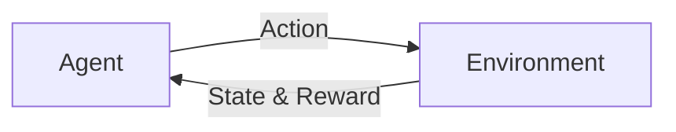
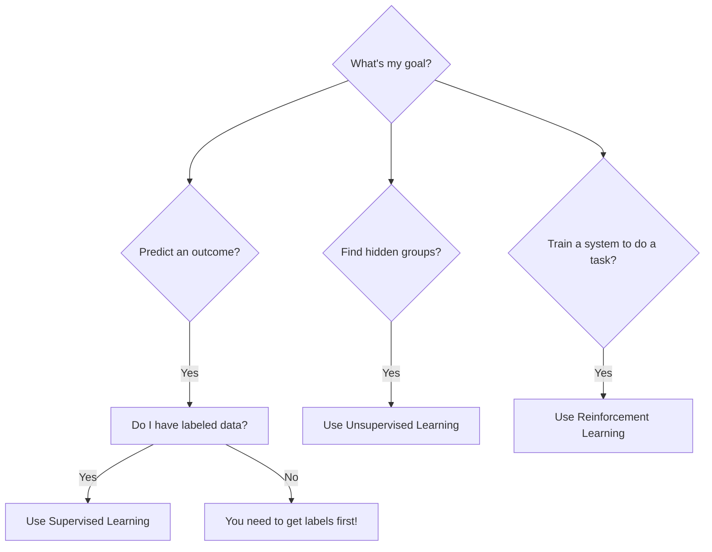

Machine learning isn't a single magic box. It's a field with different approaches for different problems. The three main styles of learning are Supervised, Unsupervised, and Reinforcement Learning. Understanding the difference is the first step to knowing how AI really works.

Think of it like learning in school. Sometimes you study with a teacher and an answer key (Supervised), sometimes you find patterns on your own in a library (Unsupervised), and sometimes you learn by playing a game and getting a score (Reinforcement).

## 1. Supervised Learning: Learning with an Answer Key

Supervised learning is the most common type of machine learning. The "supervised" part means we give the computer data that is already labeled with the correct answers. The model's job is to learn the relationship between the inputs and the correct outputs.

-   **The Goal:** Predict an outcome for new, unseen data.
-   **The Data:** Labeled data. For example, emails marked as `spam` or `not spam`.
-   **The Analogy:** Studying for a test with flashcards. Each card has a question (the input) and the answer on the back (the label). After seeing enough cards, you can correctly answer a new question you haven't seen before.

```mermaid
graph TD
    A[Labeled Data<br>(e.g., Cat & Dog photos with labels)] --> B{Train Model}
    B --> C[New Unlabeled Photo]
    C --> D{Model Predicts}
    D --> E[Output: "This is a Cat"]
```

#### Types of Supervised Learning

There are two main tasks in supervised learning:

1.  **Classification:** The goal is to predict a category. The output is a distinct class.
    -   *Is this email spam or not spam?*
    -   *Is this tumor malignant or benign?*
    -   *Which animal is in this photo: a cat, a dog, or a bird?*

2.  **Regression:** The goal is to predict a continuous value, like a number.
    -   *What will the price of this house be?*
    -   *How many customers will visit the store tomorrow?*
    -   *What will the temperature be at noon?*

#### Simple Code Example: Regression

Let's predict a value using Python's `scikit-learn` library. We'll train a simple model to learn that `y` is roughly `2 * x`.

```python
from sklearn.linear_model import LinearRegression
import numpy as np

# 1. Labeled Data (our "flashcards")
# Inputs are X, correct answers are y
X = np.array([[1], [2], [3], [4], [5]])
y = np.array([2.1, 3.9, 6.2, 7.8, 10.1])

# 2. Create and train the model
model = LinearRegression()
model.fit(X, y) # This is the "learning" step

# 3. Make a prediction on new, unseen data
new_X = np.array([[10]])
prediction = model.predict(new_X)

print(f"The model predicts that for an input of 10, the output is: {prediction[0]:.2f}")
# Expected output is around 20
```

**Important:** Supervised learning is powerful, but it completely depends on having high-quality, accurately labeled data. Bad labels will teach the model the wrong things.
{: .notice--warning}

## 2. Unsupervised Learning: Finding Hidden Patterns

Unsupervised learning is the opposite of supervised learning. We give the model data that has **no labels**. The model's task is to explore the data and find some kind of hidden structure or patterns on its own.

-   **The Goal:** Discover underlying groups or structures in the data.
-   **The Data:** Unlabeled data.
-   **The Analogy:** Being given a huge box of mixed Lego bricks and asked to sort them. You aren't told what the groups should be. You might sort them by color, by size, by shape, or some combination. You are finding the patterns yourself.

```mermaid
graph TD
    A[Unlabeled Data<br>(e.g., customer purchase histories)] --> B{Train Model}
    B --> C[Model finds patterns]
    C --> D[Output: Groups of similar customers]
```

#### Types of Unsupervised Learning

1.  **Clustering:** The goal is to group similar data points together.
    -   *Group similar customers together based on purchasing habits.*
    -   *Group similar news articles together by topic.*

2.  **Association:** The goal is to find rules that describe large portions of your data.
    -   *Find that customers who buy diapers also tend to buy beer (a famous, if apocryphal, example).*

#### Simple Code Example: Clustering

Here, we'll use `scikit-learn` to find clusters in some unlabeled data points.

```python
from sklearn.cluster import KMeans
import numpy as np

# 1. Unlabeled Data
# We can see two groups here, but the model doesn't know that.
X = np.array([
    [2, 2], [3, 3], [2, 4],  # Group 1
    [10, 10], [9, 11], [11, 9] # Group 2
])

# 2. Create and train the model to find 2 clusters
model = KMeans(n_clusters=2, n_init='auto', random_state=0)
model.fit(X) # The model finds the groups on its own

# 3. See the results
print("Cluster labels for each point:")
print(model.labels_)
# Expected output will be something like: [0 0 0 1 1 1] or [1 1 1 0 0 0]
```

## 3. Reinforcement Learning: Learning from Trial and Error

Reinforcement Learning (RL) is about training an `agent` to make decisions. The agent learns by performing actions in an `environment` and receiving `rewards` or `penalties`. It’s a continuous feedback loop.

-   **The Goal:** Learn the best sequence of actions to take to maximize a long-term reward.
-   **The Data:** There is no initial dataset. The agent generates its own data by interacting with the environment.
-   **The Analogy:** Training a dog. When it performs a good action (like "sit"), it gets a treat (reward). When it performs a bad action (like chewing your shoes), it gets a "No!" (penalty). Over time, it learns what to do to get the most treats.



#### Key Concepts of RL

-   **Agent:** The learner or decision-maker (e.g., the AI playing a game).
-   **Environment:** The world the agent interacts with (e.g., the game itself).
-   **Action:** A move the agent can make (e.g., "move left," "jump").
-   **Reward:** The feedback for performing an action (e.g., `+10` points for finding a coin, `-100` for dying).

#### Pseudo-code Example

RL code is often complex. Here is some simplified pseudo-code that shows the logical loop of an agent learning to play a game.

```python
# This is pseudo-code to illustrate the concept
agent = create_agent()
environment = create_game_environment()

total_reward = 0
for episode in range(1000):
    # Reset the game for a new try
    current_state = environment.reset()
    
    while not game_is_over(current_state):
        # 1. Agent chooses an action based on what it has learned
        action = agent.choose_action(current_state)
        
        # 2. The environment responds to the action
        next_state, reward, done = environment.step(action)
        
        # 3. The agent learns from the outcome
        agent.learn(current_state, action, reward, next_state)
        
        # 4. Update for the next step
        current_state = next_state
        total_reward += reward

print("Training complete!")
```

## Quick Comparison

| Feature         | Supervised Learning              | Unsupervised Learning         | Reinforcement Learning        |
|-----------------|----------------------------------|-------------------------------|-------------------------------|
| **Data Type**   | Labeled data                     | Unlabeled data                | No initial dataset; uses feedback |
| **Goal**        | Predict output / Classify        | Discover hidden structure     | Maximize long-term reward     |
| **Core Idea**   | Learn from examples with answers | Find patterns on your own     | Learn from trial and error    |
| **Analogy**     | Studying with flashcards         | Sorting Lego bricks           | Training a dog with treats    |

## Which One Should I Use?

Here's a simple way to think about which type of learning fits your problem.



By understanding these three fundamental types, you can start to see the logic behind many of the AI systems we use every day. Each one is a powerful tool designed for a different kind of job.
