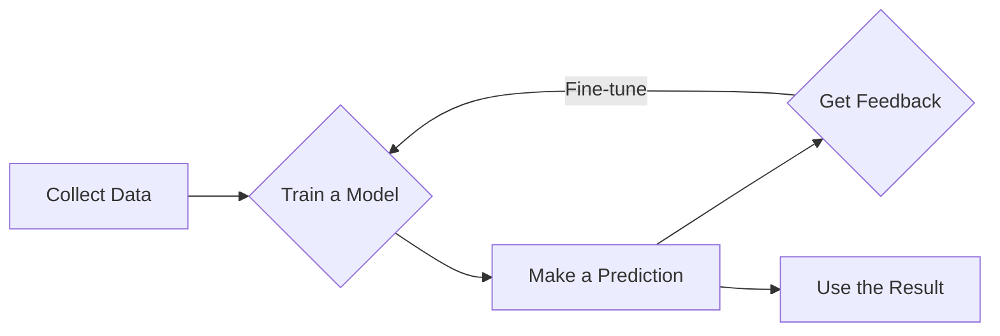

Machine learning helps computers learn from data without being explicitly programmed. It's the technology behind your email's spam filter, Netflix's show recommendations, and the way your phone's camera can find faces in a photo. It’s not magic; it’s just a different way of solving problems.

## The Old Way vs. The New Way

Imagine you want to write a program to identify spam emails.

**The old way (Traditional Programming):**
You would have to write hundreds of specific rules. For example:
- If the email contains "free money," mark as spam.
- If the email is from an unknown sender, mark as spam.
- If the email has lots of exclamation points, mark as spam.

This is brittle and hard to maintain. Spammers change their tactics, and you have to keep writing new rules forever.

**The new way (Machine Learning):**
You don't write rules. Instead, you show the computer thousands of emails that you've already marked as "spam" or "not spam." The computer then learns the patterns on its own. It figures out what features (words, senders, formatting) are common in spam and builds its own rules.

This approach is flexible and gets better over time as it sees more data.

## The Basic Machine Learning Process

The process generally follows a few key steps. A computer program, called a `model`, is trained on data to make predictions.

Here’s a simple visual of the workflow:

1.  **Collect Data:** You need lots of examples. For our spam filter, this is a large set of labeled emails.
2.  **Train a Model:** You feed the data to a machine learning algorithm. The algorithm "learns" the patterns in the data and creates a `model`.
3.  **Make a Prediction:** You give the model new, unseen data (a new email) and ask it to make a prediction ("spam" or "not spam").
4.  **Get Feedback:** You check if the prediction was right. This feedback helps the model get more accurate over time.

## The Main Types of Machine Learning

Machine learning isn't just one thing. It's a field with several different approaches. The three most common types are Supervised, Unsupervised, and Reinforcement Learning.

### 1. Supervised Learning

This is the most common type. It’s like learning with a teacher. You give the computer data that is already labeled with the correct answers.

-   **Analogy:** Teaching a child to identify fruits. You show them a picture of an apple and say "this is an apple." You show them a banana and say "this is a banana." After many examples, the child (the model) learns to identify fruits on its own.
-   **Example:** The spam filter we discussed is a classic example. The "teacher" is the dataset of emails already labeled as spam or not spam.

**Use cases:** Predicting house prices, identifying tumors in medical scans, and classifying customer support tickets.

### 2. Unsupervised Learning

This is like learning without a teacher. You give the computer data that has no labels or correct answers. The goal is to find hidden structures or patterns in the data on its own.

-   **Analogy:** Imagine giving someone a box of mixed Lego bricks and asking them to sort them. They might sort by color, size, or shape. They find the patterns themselves without you telling them what the groups should be.
-   **Example:** A company might use unsupervised learning to group customers into different segments based on their purchasing behavior. The algorithm finds the natural groupings without any predefined labels.

**Use cases:** Customer segmentation, finding abnormal network activity, and grouping news articles by topic.

### 3. Reinforcement Learning

This is about learning through trial and error. The computer, called an `agent`, learns to achieve a goal by performing actions in an environment. It gets rewards for good actions and penalties for bad ones.

-   **Analogy:** Training a dog. When the dog sits, you give it a treat (a reward). When it chews on the furniture, you say "No!" (a penalty). Over time, the dog learns which actions lead to treats.
-   **Example:** Training an AI to play a video game. The agent gets points (reward) for advancing in the game and loses points (penalty) for dying. It plays thousands of times, eventually figuring out the best strategies to maximize its score.

**Use cases:** Self-driving cars (reward for staying in the lane), robotics (reward for picking up an object), and managing stock portfolios.

## A Simple Example: Cat or Dog?

Let's walk through a supervised learning problem. We want to build a model that can look at a picture and tell us if it's a cat or a dog.

#### Step 1: Get Labeled Data

First, we need a lot of pictures of cats and dogs. Crucially, each picture must be labeled.

| Image       | Label |
|-------------|-------|
| image_001.jpg | Dog   |
| image_002.jpg | Cat   |
| image_003.jpg | Cat   |
| ...         | ...   |
| image_999.jpg | Dog   |

#### Step 2: Train the Model

We show these thousands of labeled images to our machine learning model. The model analyzes the pixels and starts to learn the features associated with "Cat" (pointy ears, whiskers) and "Dog" (floppy ears, longer snouts). It adjusts its internal parameters to get better at telling them apart.

#### Step 3: Make a Prediction

Now, we take a new picture the model has never seen before—one without a label. We show it to the model and ask, "What is this?"

The model analyzes the new image, compares its features to the patterns it learned, and makes a prediction: "I'm 92% sure this is a Dog."

## What Can Go Wrong?

Machine learning is powerful, but it's not perfect. The most common problem is the data itself.

**Important:** The quality of your machine learning model is completely dependent on the quality of your data. This is often summarized by the phrase: "Garbage In, Garbage Out."
{: .notice--warning}

If you train your model on bad data, you will get a bad model.
-   **Not enough data:** If you only show a model 10 pictures of dogs, it won't learn very well.
-   **Biased data:** If you train a facial recognition system only on pictures of one demographic, it will perform poorly on others.
-   **Incorrect labels:** If your cat and dog pictures are mislabeled, the model will learn the wrong things.

## Where to Go From Here

You now know the basic idea behind machine learning! It's not about computers becoming sentient. It's about using data to find patterns and make predictions.

From here, you could:
-   Look up a "Hello, World!" tutorial for a machine learning library like `scikit-learn` in Python.
-   Read about a famous algorithm like Linear Regression or Decision Trees.
-   Think about problems in your own work or life that could be framed as a prediction problem.
