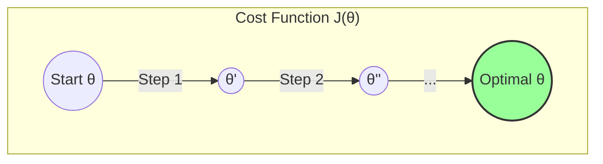

This guide will take you on a complete journey through the core concepts of supervised learning, using **Linear Regression** as our vehicle. We will start with a simple line and end with a robust, regularized model capable of handling complex data. Each step will build directly on the last, from basic intuition to the underlying mathematics.

## The Journey Ahead

1.  **Level 1: The Intuition** - Stating the problem and our intuitive goal.
2.  **Level 2: The Language of Models** - Formalizing our goal with a hypothesis.
3.  **Level 3: Measuring Failure** - Quantifying error with a cost function.
4.  **Level 4: The Path to Improvement** - Introducing the Gradient Descent algorithm.
5.  **Level 5: The Engine of Optimization** - Deriving the calculus for Gradient Descent.
6.  **Level 6: Scaling Up** - Moving from one feature to many with Linear Algebra (Vectorization).
7.  **Level 7: Beyond Straight Lines** - Handling non-linear data with Polynomial Regression.
8.  **Level 8: The Hero's Challenge** - Understanding and combating Overfitting with Regularization.

---

### Level 1: The Intuition - Drawing a Line

Our goal is simple: predict a house's price based on its size. We have data. Intuitively, we know we need to draw a line through the data points that is the "best fit."

```plotly
{
  "data": [
    {
      "x": [2104, 1600, 2400, 1416, 3000],
      "y": [400, 330, 369, 232, 540],
      "mode": "markers",
      "type": "scatter",
      "name": "Our Data"
    }
  ],
  "layout": {
    "title": "House Price vs. Size",
    "xaxis": {"title": "Size (sq. ft.)"},
    "yaxis": {"title": "Price ($1000s)"}
  }
}
```

This is our starting point. The rest of this guide is about rigorously defining "best fit" and finding a systematic way to achieve it.

### Level 2: The Language of Models - The Hypothesis Function

We formalize "drawing a line" with a mathematical equation. This is our **hypothesis function**, `h(x)`.

$$
h_\theta(x) = \theta_0 + \theta_1 x
$$

-   `h(x)` is our model's prediction.
-   `x` is our input feature (size).
-   `θ₀` and `θ₁` are the **parameters** (or weights) of our model. `θ₀` is the y-intercept (base price), and `θ₁` is the slope (price increase per sq. ft.).

**Our Goal:** Find the values of `θ₀` and `θ₁` that create the best line.

### Level 3: Measuring Failure - The Cost Function

To find the "best" line, we must first be able to measure how "bad" a given line is. We do this with a **cost function**, `J(θ)`. It calculates a single number representing the total error of our model for the current `θ` values. We will use **Mean Squared Error (MSE)**.

Let's build it logically:
1.  **The error for one example `i`** is the difference between the predicted price and the actual price: `h(x⁽ⁱ⁾) - y⁽ⁱ⁾`.
2.  **Square the error** to make it positive and to penalize large errors more: `(h(x⁽ⁱ⁾) - y⁽ⁱ⁾)²`.
3.  **Sum the squared errors** for all `m` examples in our dataset: `Σ (h(x⁽ⁱ⁾) - y⁽ⁱ⁾)²`.
4.  **Take the average** by dividing by `m` (and by `2` for later calculus convenience).

This gives us our final cost function:
$$
J(\theta_0, \theta_1) = \frac{1}{2m} \sum_{i=1}^{m} (h_\theta(x^{(i)}) - y^{(i)})^2
$$

**Our Goal, Refined:** Find the `θ₀` and `θ₁` that **minimize** `J(θ₀, θ₁)`.

### Level 4: The Path to Improvement - Gradient Descent

We have a cost function, which we can visualize as a 3D bowl. Our goal is to find the absolute bottom of this bowl. The **Gradient Descent** algorithm does this for us.

**The Analogy:** Imagine standing on a foggy hill. To get to the bottom, you check the slope of the ground where you are and take a step in the steepest downhill direction. Repeat until you reach the bottom.



The algorithm repeatedly performs the following update:
$$
\theta_j := \theta_j - \alpha \frac{\partial}{\partial \theta_j} J(\theta_0, \theta_1)
$$
-   `:=` means we are updating the value of `θⱼ`.
-   `α` (alpha) is the **learning rate**. It's a small number that controls how big our downhill steps are.
-   `∂/∂θⱼ J(...)` is the **partial derivative**, which tells us the slope of the cost function with respect to that specific parameter `θⱼ`.

### Level 5: The Engine of Optimization - The Calculus

To implement Gradient Descent, we must compute the partial derivatives. This requires the chain rule.

**1. Derivative with respect to `θ₀`:**
$$
\frac{\partial}{\partial \theta_0} J = \frac{1}{m} \sum_{i=1}^{m} (h_\theta(x^{(i)}) - y^{(i)})
$$
*(For a detailed derivation, see the previous response)*

**2. Derivative with respect to `θ₁`:**
$$
\frac{\partial}{\partial \theta_1} J = \frac{1}{m} \sum_{i=1}^{m} (h_\theta(x^{(i)}) - y^{(i)})x^{(i)}
$$
*(For a detailed derivation, see the previous response)*

With these derivatives, we have the complete algorithm for one feature:

**Gradient Descent for Linear Regression**
Repeat until convergence {
<br>
&nbsp;&nbsp;&nbsp;&nbsp;\\(\theta_0 := \theta_0 - \alpha \frac{1}{m} \sum_{i=1}^{m} (h_\theta(x^{(i)}) - y^{(i)})\\)
<br>
&nbsp;&nbsp;&nbsp;&nbsp;\\(\theta_1 := \theta_1 - \alpha \frac{1}{m} \sum_{i=1}^{m} (h_\theta(x^{(i)}) - y^{(i)})x^{(i)}\\)
<br>
}

### Level 6: Scaling Up - Vectorization

What if we have multiple features, like size, number of bedrooms, and age of the house? Our hypothesis becomes cumbersome: `h(x) = θ₀ + θ₁x₁ + θ₂x₂ + θ₃x₃ + ...`

This is where **Linear Algebra** makes our lives easier. We represent our parameters and features as **vectors**.

-   Let `θ` be a vector of our parameters:
    $$ \theta = \begin{bmatrix} \theta_0 \\ \theta_1 \\ \vdots \\ \theta_n \end{bmatrix} $$
-   Let `X` be a vector for one house's features (we add `x₀ = 1` for the intercept term):
    $$ X = \begin{bmatrix} x_0 \\ x_1 \\ \vdots \\ x_n \end{bmatrix} $$

Now, our hypothesis is simply the dot product:
$$
h_\theta(X) = \theta^T X
$$

Our cost function also becomes much cleaner:
$$
J(\theta) = \frac{1}{2m} \sum_{i=1}^{m} (\theta^T X^{(i)} - y^{(i)})^2
$$

This vectorized form is not just neater—it's computationally far more efficient. Libraries like NumPy and TensorFlow are optimized for these vector and matrix operations.

### Level 7: Beyond Straight Lines - Polynomial Regression

What if our data is clearly not linear?
We can still use linear regression to fit curves! The trick is **feature engineering**. We create new features by taking our existing features to a power.

For example, to fit a quadratic curve, our hypothesis becomes:
$$
h_\theta(x) = \theta_0 + \theta_1 x + \theta_2 x^2
$$
To fit a cubic curve:
$$
h_\theta(x) = \theta_0 + \theta_1 x + \theta_2 x^2 + \theta_3 x^3
$$

**Important:** This is still considered **Linear Regression**! Why? Because the function is linear *with respect to the parameters `θ`*. We are still just finding the optimal weights for a set of features. We simply created the new features (`x²`, `x³`) ourselves.
{: .notice--info}

### Level 8: The Hero's Challenge - Overfitting & Regularization

When we use high-degree polynomial features, we risk creating a model that is too complex. This leads to **overfitting**. The model learns the training data perfectly—including its noise—but fails to generalize to new, unseen data.

<details>
  <summary>Click to see a visual example of overfitting</summary>
  
  Imagine fitting a very high-degree polynomial to our simple house price data. The line would wiggle wildly to pass through every single point. This model would be useless for prediction.
  
  ```plotly
  {
    "data": [
      {
        "x": [2104, 1600, 2400, 1416, 3000],
        "y": [400, 330, 369, 232, 540],
        "mode": "markers", "type": "scatter", "name": "Data"
      },
      {
        "x": [1400, 1600, 1800, 2000, 2200, 2400, 2600, 2800, 3000],
        "y": [230, 335, 320, 410, 390, 360, 450, 480, 545],
        "mode": "lines", "type": "scatter", "name": "Overfit Model (wiggly)", "line": {"shape": "spline", "smoothing": 1.3}
      },
      {
        "x": [1400, 3000], "y": [250, 530], "mode": "lines", "type": "scatter", "name": "Good Fit Model"
      }
    ],
    "layout": { "title": "Overfitting vs. Good Fit" }
  }
  ```
</details>

**The Solution: Regularization**
Regularization is a technique to prevent overfitting by penalizing large parameter values. The intuition is that simpler models (with smaller `θ` values) generalize better. We add a **penalty term** to our cost function.

$$
J_{reg}(\theta) = \underbrace{\frac{1}{2m} \sum_{i=1}^{m} (h_\theta(x^{(i)}) - y^{(i)})^2}_{\text{Original Cost}} + \underbrace{\lambda \sum_{j=1}^{n} \theta_j^2}_{\text{Regularization Penalty}}
$$

-   `λ` (lambda) is the **regularization parameter**. It controls the strength of the penalty.
-   We sum the squares of the parameters `θ₁` through `θₙ` (we usually don't penalize `θ₀`).

This specific type is called **L2 Regularization** (or Ridge Regression). It forces the model to keep the weights small, resulting in a smoother, simpler function that generalizes better. Another type, **L1 Regularization** (Lasso), uses `λ Σ|θⱼ|` and can shrink some parameters all the way to zero, effectively performing feature selection.

### The Journey's End

Congratulations! You have journeyed from the simple idea of "drawing a line" to a complete, robust, and regularized regression framework. You now understand:
-   How to frame a problem with a **hypothesis**.
-   How to measure success with a **cost function**.
-   How to systematically improve with **Gradient Descent**.
-   How to handle complex problems with **vectorization** and **polynomial features**.
-   How to prevent the most common failure mode, **overfitting**, with **regularization**.

This deep understanding of Linear Regression provides the foundation for comprehending nearly every other supervised learning algorithm you will encounter.
