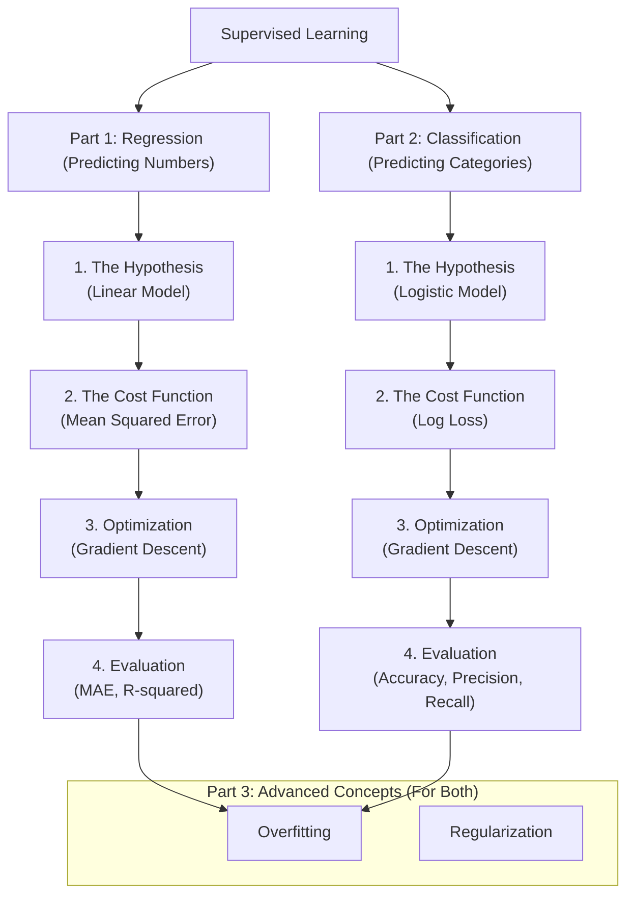

Supervised learning is the cornerstone of modern machine learning. It's the process of teaching a computer to make predictions by showing it examples where we already know the correct answer. The "supervision" comes from this labeled data, which acts as a teacher for our model.

At its core, all supervised learning boils down to two fundamental tasks:

1.  **Regression:** Predicting a continuous numerical value. (e.g., "How much will this house cost?")
2.  **Classification:** Predicting a discrete category or class. (e.g., "Is this email spam or not spam?")

While the goals are different, the underlying process for building these models is remarkably similar. This guide will provide a parallel, in-depth exploration of both worlds, taking you from the initial idea to the core mathematics and practical code.



---

## Part 1: The World of Regression (Predicting Numbers)

**The Goal:** To build a model that can predict a specific numerical value, like a price, temperature, or score.
**Our Example:** Predicting a house's price based on its size.

### Step 1: The Hypothesis - Defining the Model

We start by assuming a simple linear relationship between a house's size (`x`) and its price (`y`). We formalize this with a **hypothesis function**, `h(x)`, which is the equation for a line.

$$
h_\theta(x) = \theta_0 + \theta_1 x
$$

-   `h(x)`: The model's predicted price for a house of size `x`.
-   `θ₀` (theta-zero): The y-intercept. This is the base price of a house.
-   `θ₁` (theta-one): The slope. This is the weight of our feature—how much the price increases for each additional square foot.

Our task is to find the optimal values for the parameters `θ₀` and `θ₁` that create the best-fitting line.

### Step 2: The Cost Function - Quantifying Error

To find the "best" line, we must first measure how "bad" any given line is. We use a **cost function**, `J(θ)`, to calculate the total error. For regression, the standard is **Mean Squared Error (MSE)**.

Here's the logic:
1.  **The error for one house (`i`)** is the vertical distance between the actual price `y⁽ⁱ⁾` and our predicted price `h(x⁽ⁱ⁾)`.
2.  **We square this error:** `(h(x⁽ⁱ⁾) - y⁽ⁱ⁾)²`. This ensures errors are positive and that larger mistakes are penalized much more heavily.
3.  **We sum the squared errors** for all `m` houses in our dataset and take the average.

This results in our cost function:
$$
J(\theta_0, \theta_1) = \frac{1}{2m} \sum_{i=1}^{m} (h_\theta(x^{(i)}) - y^{(i)})^2
$$
*(The `2` in `2m` is a mathematical convenience for the next step).*

Our goal is now to **minimize this cost `J(θ)`**. A lower cost means our line is a better fit for the data.

### Step 3: Optimization - Finding the Best Parameters

We use an algorithm called **Gradient Descent** to find the values of `θ₀` and `θ₁` that minimize our cost function. It works by iteratively taking small steps in the steepest "downhill" direction of the cost function until it reaches the bottom.

The update rule for each parameter `θⱼ` is:
$$
\theta_j := \theta_j - \alpha \frac{\partial}{\partial \theta_j} J(\theta_0, \theta_1)
$$
-   `α` (alpha) is the **learning rate**, controlling the size of each step.
-   The partial derivative `∂/∂θⱼ J(...)` is the slope of the cost function. By subtracting it, we move downhill.

For our MSE cost function, the specific update rules are:
$$
\theta_0 := \theta_0 - \alpha \frac{1}{m} \sum_{i=1}^{m} (h_\theta(x^{(i)}) - y^{(i)})
$$
$$
\theta_1 := \theta_1 - \alpha \frac{1}{m} \sum_{i=1}^{m} (h_\theta(x^{(i)}) - y^{(i)})x^{(i)}
$$

The algorithm repeats these updates until the parameters converge to their optimal values.

### Step 4: Code & Evaluation

Let's see how this translates to code and how we evaluate the result.

```python
from sklearn.linear_model import LinearRegression
from sklearn.model_selection import train_test_split
from sklearn.metrics import mean_absolute_error, r2_score
import numpy as np

# Our data: [Size], [Price]
X = np.array([[1500], [2200], [1200], [1800], [2500], [1300]])
y = np.array([300, 450, 210, 370, 520, 240])

# Split data for fair evaluation
X_train, X_test, y_train, y_test = train_test_split(X, y, test_size=0.3, random_state=42)

# --- The Theory in Practice ---
# 1. The Hypothesis is encapsulated in the LinearRegression object.
model = LinearRegression()

# 2 & 3. The .fit() method applies an optimizer (like Gradient Descent)
# to minimize the cost function (MSE) and find the best theta values.
model.fit(X_train, y_train)

# --- Evaluation ---
predictions = model.predict(X_test)

# Mean Absolute Error (MAE): The average absolute difference between prediction and actual value.
mae = mean_absolute_error(y_test, predictions)
print(f"Mean Absolute Error: Our model is off by an average of ${mae:.2f}k")

# R-squared (R²): What percentage of the variance in the price is explained by our model?
r2 = r2_score(y_test, predictions)
print(f"R-squared: Our model explains {r2*100:.2f}% of the price variance.")
```

---

## Part 2: The World of Classification (Predicting Categories)

**The Goal:** To build a model that can predict a discrete class label.
**Our Example:** Predicting if a tumor is `Malignant` (1) or `Benign` (0) based on its size.

### Step 1: The Hypothesis - A Probabilistic Model

We can't use a simple line here. A line's output can be any number, but we need a probability between 0 and 1. To solve this, we use the **Sigmoid (or Logistic) function**.

$$
g(z) = \frac{1}{1 + e^{-z}}
$$

This function takes any real number `z` and squashes it into the range `(0, 1)`.

Our hypothesis for **Logistic Regression** is created by feeding our linear model into the sigmoid function:
$$
h_\theta(x) = g(\theta_0 + \theta_1 x) = \frac{1}{1 + e^{-(\theta_0 + \theta_1 x)}}
$$
The output `h(x)` is now interpreted as the **probability that `y=1`**. For example, if `h(x)=0.9`, our model is 90% confident the tumor is malignant.

### Step 2: The Cost Function - Penalizing Wrong Probabilities

MSE is a poor choice for classification because it leads to a "wavy" cost function that is hard to optimize. Instead, we use **Log Loss** (also called Binary Cross-Entropy).

Let's understand its logic:
-   **Case 1: The actual tumor is Malignant (`y=1`)**
    The cost for this single example is `−log(h(x))`. If our model correctly predicts a high probability (e.g., `h(x)=0.99`), the cost `−log(0.99)` is very small. If it wrongly predicts a low probability (e.g., `h(x)=0.01`), the cost `−log(0.01)` is huge.
-   **Case 2: The actual tumor is Benign (`y=0`)**
    The cost is `−log(1−h(x))`. If our model correctly predicts a low probability (e.g., `h(x)=0.01`), the cost `−log(0.99)` is very small. If it wrongly predicts a high probability (e.g., `h(x)=0.99`), the cost `−log(0.01)` is huge.

These two cases are combined into a single, elegant cost function:
$$
J(\theta) = -\frac{1}{m} \sum_{i=1}^{m} [y^{(i)}\log(h_\theta(x^{(i)})) + (1 - y^{(i)})\log(1 - h_\theta(x^{(i)}))]
$$
This function perfectly penalizes the model for being confident and wrong.

### Step 3: Optimization

Just like in regression, we use **Gradient Descent** to find the `θ` values that minimize this new Log Loss cost function. The update rule `θⱼ := θⱼ - α * (derivative)` is the same, but the derivative term is now calculated from the Log Loss function.

### Step 4: Code & Evaluation

Classification requires different evaluation metrics.

```python
from sklearn.linear_model import LogisticRegression
from sklearn.metrics import confusion_matrix, accuracy_score, precision_score, recall_score
import numpy as np

# Our data: [Tumor Size], [Is_Malignant (1=Yes, 0=No)]
X = np.array([[2], [3], [4], [5], [6], [7], [8], [9]])
y = np.array([0, 0, 0, 0, 1, 1, 1, 1]) # Smaller tumors are benign, larger are malignant

# --- The Theory in Practice ---
# 1. The Logistic Hypothesis is encapsulated here.
model = LogisticRegression()

# 2 & 3. The .fit() method minimizes the Log Loss cost function.
model.fit(X, y)

# --- Evaluation ---
predictions = model.predict(X)

# Accuracy: What fraction of predictions were correct?
accuracy = accuracy_score(y, predictions)
print(f"Accuracy: {accuracy*100:.2f}%")

# Precision: Of all tumors we predicted as Malignant, how many actually were?
# High precision means low false alarms.
precision = precision_score(y, predictions)
print(f"Precision: {precision*100:.2f}%")

# Recall: Of all the tumors that were actually Malignant, how many did we find?
# High recall means we miss very few actual cases.
recall = recall_score(y, predictions)
print(f"Recall: {recall*100:.2f}%")
```

---

## Part 3: Advanced Concepts for Both Worlds

### Overfitting: The Universal Enemy

Whether in regression or classification, if your model is too complex (e.g., a very high-degree polynomial), it may learn the training data perfectly but fail to generalize to new data. This is **overfitting**.

```plotly
{
  "data": [
    {
      "x": [2, 3, 4, 5, 6, 7, 8, 9],
      "y": [0.1, 0.1, 0.1, 0.1, 0.9, 0.9, 0.9, 0.9],
      "mode": "markers", "type": "scatter", "name": "Actual Data"
    },
    {
      "x": [1.5, 2.5, 3.5, 4.5, 5.5, 6.5, 7.5, 8.5, 9.5],
      "y": [0.05, 0.1, 0.15, 0.2, 0.5, 0.8, 0.85, 0.9, 0.95],
      "mode": "lines", "type": "scatter", "name": "Good Fit Model (Logistic Curve)"
    },
    {
      "x": [2, 3, 4, 5, 6, 7, 8, 9],
      "y": [0, 0, 0, 0, 1, 1, 1, 1],
      "mode": "lines", "type": "scatter", "name": "Overfit Model (Wiggly Line)", "line": {"shape": "spline", "smoothing": 0.5}
    }
  ],
  "layout": {
    "title": "Overfitting in a Classification Context",
    "xaxis": {"title": "Tumor Size"}, "yaxis": {"title": "Probability of Malignancy"}
  }
}
```

### Regularization: The Solution

To combat overfitting, we use **regularization**. We add a penalty to the cost function that discourages the model from having large parameter (`θ`) values. A simpler model with smaller weights often generalizes better.

The regularized cost function (using L2/Ridge regularization) looks like this:
$$
J_{reg}(\theta) = \text{Original Cost Function} + \frac{\lambda}{2m} \sum_{j=1}^{n} \theta_j^2
$$
-   `λ` (lambda) is the regularization parameter that controls the strength of the penalty.

This technique is used in both regression (Ridge Regression) and classification to create more robust models.

## Conclusion

You have now seen the complete supervised learning workflow for both of its major tasks. While the specific models and cost functions change, the core loop remains the same:
1.  **Define a Hypothesis** that is appropriate for your problem.
2.  **Define a Cost Function** that measures how well your model performs.
3.  **Use an Optimization Algorithm** like Gradient Descent to find the best parameters that minimize that cost.
4.  **Rigorously Evaluate** your model with metrics suited to the task.

This foundational knowledge is the key to understanding almost any supervised learning algorithm you will encounter.
