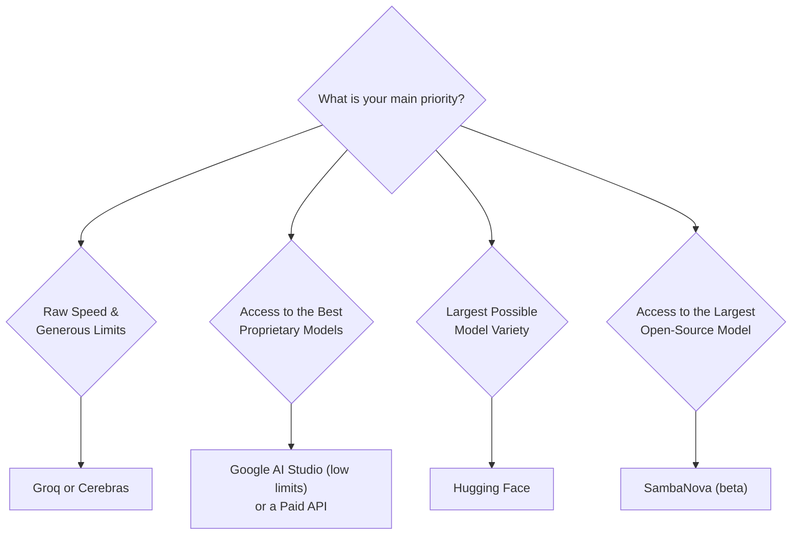

Finding a good, free Large Language Model (LLM) API can be difficult. Many options exist, but they come with different models, rate limits, and trade-offs. This guide breaks down the top providers to help you choose the right one for your project.

We will look at each provider's features, limitations, and best use cases, focusing on what matters most to developers: speed, model quality, and usage limits.

## The Top Free LLM API Providers

Here is an analysis of the most popular services offering free access to their models.

### 1. Groq

Groq is known for one thing: speed. It uses custom hardware called Language Processing Units (LPUs) to deliver extremely fast response times.

#### Key Features
-   **Exceptional Speed:** Often cited as the fastest inference provider, with speeds over 300 tokens per second.
-   **Generous Limits:** The free tier offers some of the best rate limits available, including 30 requests per minute and 1 million tokens per day.
-   **Easy Integration:** The API is compatible with the OpenAI SDK, making it simple to switch over.
-   **Data Privacy:** Groq states that it does not use your API data to train its models.

#### Limitations
-   **Limited Model Selection:** Only offers open-source models like Llama 3.1, Mixtral, and Gemma.
-   **No Proprietary Models:** You cannot access top-tier proprietary models like GPT-4 or Claude 3.5 Sonnet.

### 2. Cerebras

Cerebras is another hardware-focused company that uses its own large-scale chips to provide high-speed model inference.

#### Key Features
-   **High Speed:** Performance is very competitive and sometimes faster than Groq in certain benchmarks.
-   **High Rate Limits:** The free tier is comparable to Groq, with 30 requests per minute and 1 million tokens per day.
-   **Stable Performance:** The infrastructure is battle-tested and reliable.
-   **Simple Setup:** Getting an API key is a quick and easy process.

#### Limitations
-   **Very Few Models:** The free offering is currently limited to Llama 3.1 8B and 70B models.
-   **Context Window:** The 8,000-token context window is smaller than many competitors.

### 3. Google AI Studio (Gemini)

Google provides free access to its powerful Gemini family of models through the Google AI Studio.

#### Key Features
-   **Advanced Models:** Direct access to Google's latest models, including Gemini 2.5 Pro.
-   **Huge Context Window:** Gemini 2.5 Pro supports up to a 1 million token context window, ideal for long documents.
-   **Multimodal:** The models can process text, images, and code.
-   **No Expiration:** The free tier does not have a time limit.

#### Limitations
-   **Extremely Low Rate Limits:** The free tier is very restrictive, with as few as 5 requests per minute (RPM) and 100 requests per day (RPD) for Gemini 2.5 Pro.
-   **Complex Quotas:** The limits can be confusing, with overlapping RPM, RPD, and tokens-per-minute rules.
-   **Geographic Restrictions:** Not available in all countries and regions.

### 4. Anthropic Claude

Anthropic is an AI safety-focused company whose models are known for their strong reasoning capabilities. Free access is primarily through its web interface.

#### Key Features
-   **Superior Reasoning:** Claude 3.5 Sonnet is excellent for complex analysis, writing, and coding tasks.
-   **Safety-Focused:** The models are built with strong ethical guidelines to prevent harmful outputs.
-   **Large Context Window:** Supports up to 200,000 tokens.

#### Limitations
-   **No True Free API:** Meaningful API access requires a paid Pro subscription ($20/month). The free offering is a web chat interface.
-   **Severe Usage Limits:** The free web chat is limited to around 40 short messages per day, and this limit can change.

### 5. SambaNova

SambaNova is an AI infrastructure company that currently offers free beta access to several powerful models, including the largest free Llama model available.

#### Key Features
-   **Largest Free Model:** Provides free access to the Llama 3.1 405B parameter model.
-   **Excellent Speed:** Delivers very fast inference even on its largest model.
-   **No Current Limits:** The beta is currently free with no explicitly stated rate limits.

#### Limitations
-   **Uncertain Future:** The website states that pricing is "coming soon." The service will likely not remain free indefinitely.
-   **Beta Status:** As a beta product, service stability and availability are not guaranteed.

### 6. Hugging Face

Hugging Face is a community hub and platform that hosts tens of thousands of open-source models.

#### Key Features
-   **Massive Model Variety:** The largest possible selection of free, open-source models for any task.
-   **Transparency:** Full access to the code and weights for most models.
-   **Great for Learning:** An excellent resource for experimenting with different model architectures.

#### Limitations
-   **Inconsistent Quality:** The performance of community models varies widely.
-   **Complex Setup:** Using the models effectively can require more technical knowledge.
-   **Variable Rate Limits:** Limits differ by model, but are generally low for the free inference API.

## Key Takeaways and Comparisons

Choosing a provider depends entirely on your project's needs. Here is a summary to help you decide.

### How to Choose a Provider

This flowchart can help guide your decision based on your top priority.

### Rate Limit Comparison Table

This table highlights the stark differences in usage limits for the free tiers.

| Provider | Daily Requests | Requests/Min (RPM) | Key Limitation |
|--------------|----------------|--------------------|---------------------------------|
| **Groq** | 14,000 | 30 | Very generous |
| **Cerebras** | 14,000 | 30 | Very generous |
| **SambaNova**| Unlimited* | Unlimited* | Beta period, will change |
| **OpenRouter** | 200 | 20 | Free models only |
| **Google AI** | 100-250 | 5-15 | Extremely restrictive |
| **Cohere** | ~33 (1k/month) | 20 | Severe monthly cap |
| **Claude** | ~40 messages | N/A | Web interface only |

**Important:** The "unlimited" status for SambaNova is temporary. Do not build a production application assuming it will remain free.
{: .notice--warning}

## Best Practices for Using Free APIs

1.  **Start with a Backup:** Don't rely on a single free provider. Have a second or third option ready in case of downtime or policy changes.
2.  **Respect Rate Limits:** Implement logic in your application to avoid hitting rate limits, which could get your key suspended.
3.  **Cache Responses:** For common queries, store the results in a local database or cache to reduce the number of API calls you make.
4.  **Plan for Scale:** Treat free tiers as a starting point for development and prototyping. If your application gains users, you will need to move to a paid, reliable plan.
5.  **Use Appropriate Models:** Don't use a massive 70B parameter model for a simple text classification task. Choose the smallest model that gets the job done to conserve tokens and improve speed.

Free LLM APIs are excellent tools for learning, prototyping, and building personal projects. However, for any serious application, they should be seen as a stepping stone toward a more stable, paid service that can offer the reliability and scale you need.
