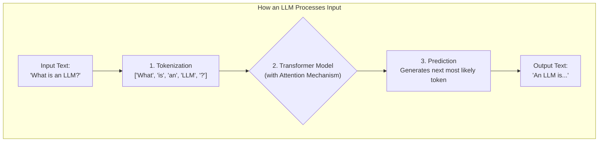
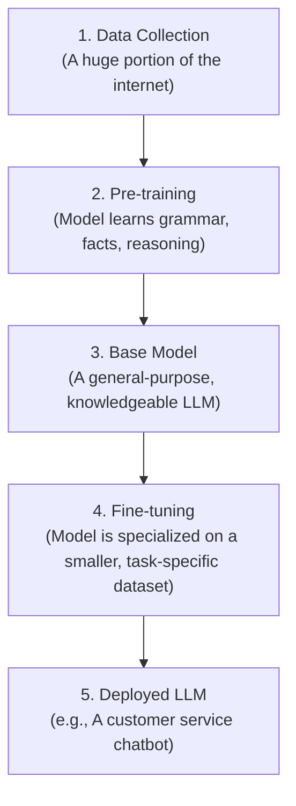

*(Estimated Reading Time: 18 minutes)*

### Table of Contents
1.  [Introduction: The AI You Already Use Every Day](#introduction-the-ai-you-already-use-every-day)
2.  [Breaking It Down: What is a "Large Language Model"?](#breaking-it-down-what-is-a-large-language-model)
3.  [How LLMs "Understand" Language: The Core Mechanics](#how-llms-understand-language-the-core-mechanics)
4.  [From Blank Slate to Brainiac: The Training Process](#from-blank-slate-to-brainiac-the-training-process)
5.  [Talking to an LLM: Prompts, APIs, and Text Generation](#talking-to-an-llm-prompts-apis-and-text-generation)
6.  [LLMs in the Wild: The Good, The Bad, and The Biased](#llms-in-the-wild-the-good-the-bad-and-the-biased)
7.  [The Future is Conversational](#the-future-is-conversational)
8.  [Your Next Steps](#your-next-steps)
9.  [Glossary of Terms](#glossary-of-terms)

---

### Introduction: The AI You Already Use Every Day

Have you ever marveled at how your phone can finish your sentences? Or asked a chatbot a complex question and received a surprisingly coherent answer? If so, you've already interacted with a Large Language Model, or LLM.

These powerful AI systems are quietly reshaping our digital world, moving from science fiction to everyday tools. But what are they, really? Are they truly "thinking"? And how do they work their magic with words?

This guide is for anyone who has asked these questions. We'll demystify LLMs from the ground up, with no prior AI knowledge required. By the end, you'll not only understand what LLMs are but also why they represent one of the most significant technological shifts of our time.

### Breaking It Down: What is a "Large Language Model"?

The name itself is a great starting point. Let's break it down word by word.

-   **Large:** This refers to the sheer scale of the model. We're talking about two things: the enormous amount of text data it's trained on (think a significant chunk of the internet) and the massive number of internal "knobs," called **parameters**, it has. These parameters, often numbering in the billions, are what the model adjusts during training to capture the patterns of language.

-   **Language:** This is its domain. Unlike other types of AI that might recognize images or drive cars, an LLM's world is text. It's designed to understand, generate, summarize, translate, and manipulate human language.

-   **Model:** In this context, "model" is short for "mathematical model." It's a complex system of numbers and equations that represents the patterns and relationships found in the training data. It's not a physical object, but rather a sophisticated program that has learned to predict the next most likely word in a sequence.

**Analogy:** Think of an LLM as a super-powered librarian who has read every book in a colossal library. This librarian doesn't just know where the books are; they've internalized the grammar, style, facts, and relationships from every single page. When you ask a question, they don't just retrieve a passage; they synthesize a brand-new answer based on their vast knowledge.

### How LLMs "Understand" Language: The Core Mechanics

LLMs don't "understand" text in the human sense. Instead, they are masters of pattern recognition. They achieve this through a few key mechanics.

#### Tokens: The Building Blocks of Language

Before an LLM can process a sentence, it must break it down into smaller pieces called **tokens**. A token can be a whole word, part of a word, or even just a punctuation mark.

For example, the sentence "LLMs are fascinating!" might be tokenized into:
`["LLMs", "are", "fascin", "ating", "!"]`

Notice how "fascinating" is split into two tokens. This allows the model to handle complex words and variations it may not have seen before.

<details>
  <summary>Click to see clean pseudocode for tokenization</summary>
  
  ```
  // Function to break a sentence into tokens
  function tokenize(sentence_text):
    
    // Assume we have a predefined list of known words/sub-words
    known_vocabulary = ["the", "quick", "brown", "fox", "jump", "s", "over", ...]
    
    // Start with the full text
    remaining_text = sentence_text
    list_of_tokens = []
    
    while remaining_text is not empty:
      // Find the longest known token at the start of the remaining text
      longest_match = ""
      for token in known_vocabulary:
        if remaining_text starts with token:
          if length of token > length of longest_match:
            longest_match = token
            
      // Add the found token to our list
      add longest_match to list_of_tokens
      
      // Remove the matched part from the remaining text
      remaining_text = remove_prefix(remaining_text, longest_match)
      
    return list_of_tokens
  ```
</details>

This token distribution is fundamental to how the model processes language.

```plotly
{
  "data": [
    {
      "x": ["The", "quick", "brown", "fox", "jumps", "over", "the", "lazy", "dog"],
      "y": [2, 1, 1, 1, 1, 1, 2, 1, 1],
      "type": "bar",
      "name": "Token Frequency"
    }
  ],
  "layout": {
    "title": "Token Frequency in a Sample Sentence",
    "xaxis": {"title": "Tokens"},
    "yaxis": {"title": "Count"}
  }
}
```
*Caption: A Plotly chart showing the frequency of each token in the sentence "The quick brown fox jumps over the lazy dog." The token "the" appears twice.*

#### The Transformer: The Engine Room

The core innovation that made modern LLMs possible is the **Transformer architecture**, introduced in 2017. Before the Transformer, models struggled to keep track of context in long sentences. The Transformer solved this with a powerful mechanism.


*Caption: A Mermaid diagram showing the high-level flow from text input to text output in an LLM.*

#### The Attention Mechanism: The Secret Sauce

The Transformer's secret weapon is the **attention mechanism**. It allows the model to weigh the importance of different tokens in the input text when producing an output token.

**Analogy:** Imagine you're summarizing a long article. As you write each word of your summary, you "pay attention" to the most relevant words in the original article. If you're writing about the article's conclusion, you'll focus more on the final paragraphs than the introduction. The attention mechanism lets an LLM do this mathematically.

When generating the next word, the model looks back at all the previous words and asks, "Which of these are most important for predicting what comes next?"

<details>
  <summary>Click to see a clean conceptual algorithm for attention</summary>
  
  ```
  // Function to decide the next word based on the context
  function calculate_next_word(previous_words):
    
    list_of_attention_scores = []
    
    // 1. Calculate a relevance score for every word in the context
    for each word in previous_words:
      // How relevant is this 'word' to the word we are about to generate?
      relevance_score = calculate_relevance_to_next_word(word)
      add relevance_score to list_of_attention_scores
      
    // 2. Normalize scores into weights (percentages)
    // This turns scores like [10, 50, 5] into weights like [0.15, 0.77, 0.08]
    attention_weights = convert_scores_to_percentages(list_of_attention_scores)
    
    // 3. Create a "weighted context"
    // This emphasizes the words with higher attention weights
    weighted_context = create_summary_from_weights(previous_words, attention_weights)
    
    // 4. Use this focused context to predict the most likely next word
    next_word = predict_from_weighted_context(weighted_context)
    
    return next_word
  ```
</details>

### From Blank Slate to Brainiac: The Training Process

An LLM isn't born smart. It starts as a massive, untrained neural network—a blank slate. It becomes intelligent through a multi-stage training process.


*Caption: The training pipeline of a Large Language Model, from data collection to deployment.*

#### Pre-training: Learning the World

This is the most resource-intensive phase. The model is fed trillions of words from books, articles, websites, and code. Its only goal during this phase is incredibly simple: **predict the next word**. Given the sentence "The cat sat on the...", it tries to predict "mat."

By doing this billions of times, the model is forced to learn grammar, facts, context, and even rudimentary reasoning to make accurate predictions. This is where it learns that "sky" is associated with "blue" and that Paris is the capital of France.

#### Parameters: The Knobs of Knowledge

The "knowledge" the model gains is stored in its **parameters**. You can think of these as billions of tiny, adjustable knobs. During training, the model constantly adjusts these knobs to minimize its prediction error. The more parameters a model has, the more nuance and information it can store.

```plotly
{
  "data": [
    {
      "x": ["2018 (GPT-1)", "2019 (GPT-2)", "2020 (GPT-3)", "2023 (GPT-4)"],
      "y": [117000000, 1500000000, 175000000000, 1760000000000],
      "type": "bar",
      "name": "Model Parameters"
    }
  ],
  "layout": {
    "title": "The Explosive Growth of Model Size (Parameters)",
    "xaxis": {"title": "Model Release Year"},
    "yaxis": {"title": "Number of Parameters (Log Scale)", "type": "log"}
  }
}
```
*Caption: A Plotly bar chart showing the exponential growth in the number of parameters in flagship LLM models over time.*

#### Fine-tuning: Specializing for a Job

After pre-training, we have a general-purpose "base model." To make it useful for a specific task, like being a helpful chatbot or a code generator, it undergoes **fine-tuning**. It's trained on a smaller, high-quality dataset tailored to that task. This is like sending our super-librarian to medical school to become a doctor. They already have the general knowledge; now they are specializing.

### Talking to an LLM: Prompts, APIs, and Text Generation

#### Prompt Engineering: The Art of Asking

How you ask a question dramatically affects the quality of the anwser. **Prompt engineering** is the skill of crafting inputs (prompts) to get the most accurate and relevant outputs from an LLM.

-   **Be Specific:** Instead of "Write about dogs," try "Write a short, playful poem about a golden retriever chasing a ball."
-   **Provide Context:** Give the model information to work with. "I'm a beginner programmer. Explain Python dictionaries using a simple analogy."
-   **Assign a Persona:** Tell the model how to act. "You are an expert travel agent. Plan a 3-day itinerary for a trip to Rome focusing on history and food."

#### Interacting via an API

For developers, the most common way to integrate an LLM is through an **API (Application Programming Interface)**. This is a gateway that lets your application send a prompt to the LLM provider and receive the response.

Here’s a simple Python example of how to talk to an LLM using an API:

```python
import requests
import json

# This is a conceptual example. You would need a real API key and endpoint.
API_URL = "https://api.example-llm-provider.com/v1/chat/completions"
API_KEY = "YOUR_API_KEY_HERE"

headers = {
    "Authorization": f"Bearer {API_KEY}",
    "Content-Type": "application/json"
}

data = {
    "model": "example-model-v1",
    "messages": [
        {"role": "user", "content": "Explain the concept of tokenization in one sentence."}
    ]
}

# Send the request to the LLM
response = requests.post(API_URL, headers=headers, data=json.dumps(data))

# Print the LLM's response
if response.status_code == 200:
    result = response.json()
    print(result['choices'][0]['message']['content'])
else:
    print(f"Error: {response.status_code}")
    print(response.text)
```

#### The Text Generation Process

When an LLM writes a response, it doesn't plan the whole thing out. It generates text one token at a time in a loop.

1.  The model takes your prompt and all the text generated so far.
2.  It predicts the most likely next token.
3.  It appends that token to the sequence.
4.  It repeats this process until it reaches a stop condition (like generating a special "end of text" token or hitting a length limit).

### LLMs in the Wild: The Good, The Bad, and The Biased

LLMs are incredibly powerful, but they are not perfect. It's crucial to understand both their benefits and their limitations.

**Benefits:**
-   **Creativity & Content Generation:** Drafting emails, writing code, creating marketing copy, brainstorming ideas.
-   **Information Synthesis:** Summarizing long documents, research papers, and articles in seconds.
-   **Accessibility:** Breaking down complex topics into simple terms, acting as a personal tutor.
-   **Efficiency:** Automating repetitive language-based tasks.

**Limitations and Challenges:**
-   **Hallucinations:** LLMs can confidently make up facts and sources that are completely false.
-   **Bias:** Since they are trained on human-written text from the internet, they can inherit and amplify societal biases related to race, gender, and culture.
-   **Lack of True Understanding:** They manipulate patterns in text but do not possess consciousness, beliefs, or true comprehension.
-   **Cost & Environmental Impact:** Training large models requires immense computational power, which is expensive and consumes significant energy.

**Important:** Always fact-check critical information generated by an LLM. Do not treat it as an infallible source of truth.
{: .notice--danger}

```plotly
{
  "data": [
    {"x": ["Reasoning", "Coding", "Math"], "y": [95, 90, 75], "name": "Advanced Model (e.g., GPT-4)", "type": "bar"},
    {"x": ["Reasoning", "Coding", "Math"], "y": [80, 75, 60], "name": "Mid-Tier Model (e.g., Llama 3 70B)", "type": "bar"},
    {"x": ["Reasoning", "Coding", "Math"], "y": [65, 55, 40], "name": "Smaller Model (e.g., Mixtral 8x7B)", "type": "bar"}
  ],
  "layout": {
    "title": "Illustrative LLM Performance Across Tasks",
    "yaxis": {"title": "Relative Performance Score"}
  }
}
```
*Caption: A conceptual bar chart comparing the relative performance of different tiers of LLMs on tasks like reasoning, coding, and math.*

### The Future is Conversational

The field of LLMs is moving at an incredible pace. Here's a glimpse of what's next:
-   **Multimodality:** Models that can understand not just text, but also images, audio, and video simultaneously.
-   **AI Agents:** LLMs that can take action, such as booking appointments, browsing the web, or managing your calendar.
-   **Efficiency:** The development of smaller, highly efficient models that can run on personal devices like your phone.

### Your Next Steps

You've just completed a deep dive into the world of Large Language Models. You've gone from a simple user to an informed observer who understands the core mechanics behind this transformative technology.

So, what's next?
1.  **Experiment:** Go to a free chatbot service like Google's Gemini or Poe and try out different prompting techniques. See if you can spot its strengths and weaknesses.
2.  **Read More:** Explore resources like the blogs from OpenAI, Google AI, or Anthropic to stay updated on the latest developments.
3.  **Stay Critical:** As you see LLMs integrated into more products, think critically about their outputs. Remember the limitations we discussed, especially bias and hallucinations.

LLMs are not magic; they are the result of clever engineering, massive datasets, and powerful computation. By understanding how they work, you are better equipped to use them effectively, appreciate their capabilities, and navigate the future they are helping to create.

---

### Glossary of Terms

-   **API (Application Programming Interface):** A set of rules and tools that allows different software applications to communicate with each other.
-   **Attention Mechanism:** The part of the Transformer architecture that allows the model to weigh the importance of different words in the input when generating an output.
-   **Fine-tuning:** The process of taking a pre-trained base model and further training it on a smaller, specialized dataset to adapt it for a specific task.
-   **Hallucination:** An instance where an LLM generates text that is factually incorrect, nonsensical, or not grounded in its training data, yet presents it as factual.
-   **LLM (Large Language Model):** A type of AI model trained on vast amounts of text data to understand and generate human-like language.
-   **Parameters:** The internal variables or "knobs" of a model that are adjusted during training. The number of parameters is a common measure of a model's size and complexity.
-   **Pre-training:** The initial, resource-intensive training phase where a model learns general patterns of language from a massive, diverse dataset.
-   **Prompt:** The input text, such as a question or instruction, given to an LLM to elicit a response.
-   **Tokens:** The small pieces of text (words, parts of words, or punctuation) that an LLM processes.
-   **Transformer:** A neural network architecture that is the foundation for most modern LLMs, notable for its use of the attention mechanism.
