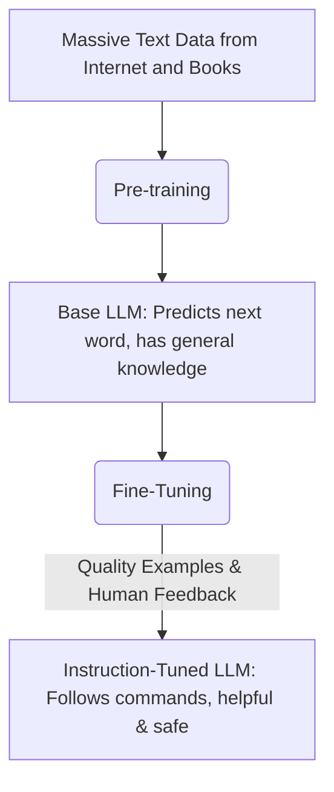

You've probably heard the term "Large Language Model" or "LLM" but might not know what it means. Here's a simple explanation of what they are, how they work, and how you can use them effectively.

## What is a Large Language Model?

A Large Language Model (LLM) is a type of artificial intelligence that's been trained to understand and generate human-like text. If you've ever used a chatbot like ChatGPT, you've interacted with an LLM. At its core, an LLM is a prediction machine. It takes your input and predicts what the next most likely word should be to form a coherent response.

This allows them to do a lot of useful things, like answer questions, summarize long documents, translate languages, and even write code.

## How Do They Learn?

LLMs learn by being trained on enormous amounts of text data from the internet, books, and other sources. This training process helps the model learn the patterns, grammar, context, and nuances of human language. It's not about memorizing sentences, but about understanding the statistical relationships between words.

Think of it like a student who has read almost every book in a giant library. They haven't memorized every single word, but they've learned how sentences are structured, how ideas connect, and can use that knowledge to have a conversation or write a new story.

### The Building Blocks: Tokens and Parameters

Two key concepts help LLMs work: tokens and parameters.

*   **Tokens**: An LLM doesn't see words the way we do. It breaks text down into smaller pieces called tokens. A token can be a whole word, a part of a word (like "un-" or "-able"), or even just punctuation. This process, called tokenization, allows the model to handle a massive vocabulary and understand grammar more effectively. Think of tokens as the Lego bricks of language for the AI.

*   **Parameters**: Parameters are the internal variables that the model learns during training. They are like billions of adjustable dials that define the model's understanding of language. The more parameters a model has, the more complex the patterns it can learn.

## Two Main Flavors of LLMs

Not all LLMs are the same. They generally come in two types: base models and instruction-tuned models.

### 1. Base Models

A base model is the direct result of the initial, massive training process. It's incredibly knowledgeable and excellent at predicting the next word in a sequence. However, it's not designed to be a helpful assistant. If you give it a question, it might just continue the question or write another similar one, because that's a common pattern it learned from the internet.

### 2. Instruction-Tuned Models

This is the type of LLM most of us use. An instruction-tuned model is a base model that has gone through a second phase of training called fine-tuning. In this stage, it's trained on high-quality examples of how to follow instructions, answer questions, and have helpful conversations. This is what makes the model feel like a collaborative assistant instead of just a text-completion engine.

## How to Get Better Answers (Prompting)

The instructions you give to an LLM are called "prompts." Writing a good prompt is the key to getting a good response. This skill is often called "prompt engineering."

Here are a few simple tips:

*   **Be Specific and Clear**: Vague prompts lead to vague answers. Instead of "Tell me about dogs," try "List five common dog breeds suitable for apartment living and describe their temperament."
*   **Provide Context**: Give the model all the information it needs. If you want it to summarize an email, paste the whole email into the prompt.
*   **Tell It What to Do (Not What Not to Do)**: Positive instructions work better. Instead of "Don't use technical jargon," say "Explain this in simple terms that a beginner can understand."
*   **Give It a Persona**: You can tell the model who to be. For example, starting your prompt with "Act as an expert copywriter..." or "Explain this to me like I'm ten years old..." can dramatically change the tone and style of the response.

**A good prompt gives the model clear direction.**
{: .notice--info}

## What Are Their Limitations?

It's important to remember that LLMs aren't perfect.

*   **They Can Be Wrong**: An LLM can confidently generate incorrect or nonsensical information. This is often called "hallucination." Always verify important facts.
*   **Knowledge Cutoff**: Models are trained on data up to a certain date. They don't know about any events that have happened since their last training.
*   **Bias**: If the training data contains biases, the LLM can reproduce and even amplify them in its responses.
*   **They Don't "Understand"**: While they are excellent at pattern matching, they don't possess true consciousness or understanding of the world.
*   **Potential for Misuse**: Because they are so good at generating text, LLMs can be used to create misinformation or spam.

## What's Next for LLMs?

The field of AI is moving quickly, and LLMs are constantly improving. Here are a few things to look out for:

*   **Multimodality**: Future models will be able to understand and generate not just text, but also images, audio, and video. You could give it a picture and ask it to write a story about it.
*   **Better Reasoning**: Researchers are working to improve the logical reasoning skills of LLMs so they make fewer mistakes on complex problems.
*   **More Efficiency**: Models will likely become smaller and faster, allowing them to run on personal devices like your phone instead of just in the cloud.

LLMs are powerful tools that are changing how we interact with information. By understanding the basics of how they work, you can better appreciate both their amazing capabilities and their current limitations.
