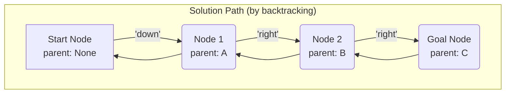
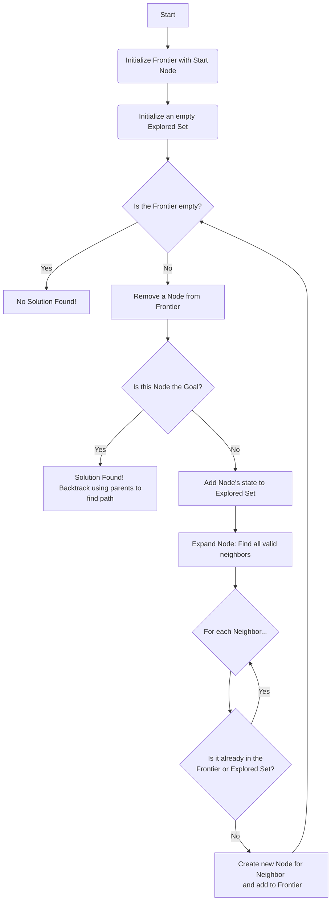
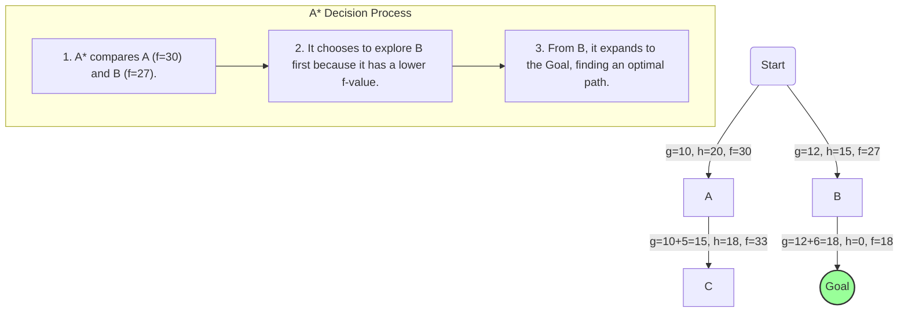
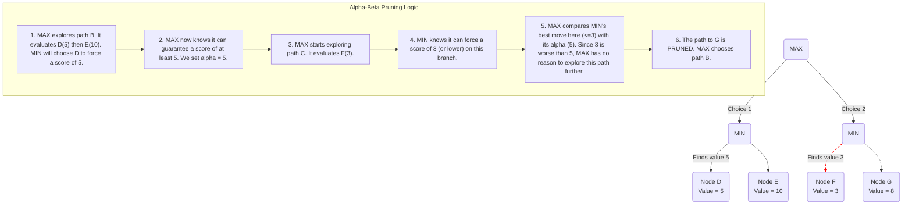

Artificial intelligence can often seem like a black box, but when you look inside, you find a world of elegant and powerful algorithms. At the very foundation of AI's ability to reason and plan are **search algorithms**. Whenever an AI needs to find a solution from a vast sea of possibilities—like calculating the best route for a GPS, solving a complex puzzle, or planning a winning move in a game—it's using a search algorithm.

This guide provides a comprehensive, beginner-friendly tour of AI search. We'll break down the concepts from the ground up, using clear explanations, detailed diagrams, and commented code to demystify how AI explores, plans, and makes intelligent decisions.

## Part 1: How an AI "Sees" a Problem (Problem Formulation)

Before an AI can solve a problem, we must first frame it in a language it can understand. This process, known as **problem formulation**, breaks down any search challenge into a few core components. Let's use the simple example of finding a path through a maze.

*   **State**: A specific configuration of the problem. In our maze, a state is simply the agent's current coordinates (e.g., Row 3, Column 5).
*   **Initial State**: The state where the agent begins. This is the entrance of the maze.
*   **Actions**: The set of possible moves the agent can make. From any square in the maze, the actions are `up`, `down`, `left`, and `right` (as long as there isn't a wall).
*   **Transition Model**: A rule that describes the result of an action. If the agent is in state (3, 5) and performs the action `up`, the transition model tells us the new state is (2, 5).
*   **Goal Test**: A function that checks if a state is the solution. In our maze, this test is true if the agent's coordinates match the exit.
*   **Path Cost**: A numerical value assigned to a path. For a simple maze, the cost is just the number of steps taken. The best solution—the **optimal solution**—is the one with the lowest cost.

We can visualize the entire maze as a graph where each square is a **node** and each possible move is an **edge** connecting two nodes.

### The Search Toolkit: The `Node`

To keep track of its progress, the AI uses a simple but powerful data structure for each step of its exploration. We'll call it a `Node`. A `Node` stores not just the state, but also the information needed to reconstruct the path later.

```python
# A simple Node class to track search progress
class Node():
    """A node in a search tree. Contains a pointer to the parent (the node
    that this is a successor to) and to the state for this node. Also
    contains the action that got us to this state, and the total path_cost
    from the start to this node.
    """
    def __init__(self, state, parent, action, path_cost=0):
        self.state = state
        self.parent = parent # The node that generated this node
        self.action = action # The action applied to the parent to get here
        self.path_cost = path_cost # Cost from initial state to this node
```

The `parent` pointer is the key. Once the AI finds the goal, it can trace its way backward from the goal `Node` to its parent, then to that node's parent, and so on, all the way back to the start. This chain of parents *is* the solution path.



## Part 2: The Search Algorithm's Engine Room

All search algorithms are powered by the same engine. They systematically explore the state graph using two essential lists:

1.  **The Frontier**: Contains all the nodes the algorithm has discovered but has not yet explored. Think of it as the algorithm's "to-do" list.
2.  **The Explored Set**: Stores all the states that have already been visited. This is crucial to prevent the algorithm from getting stuck in infinite loops.

This process can be visualized as a simple, powerful loop.



The fundamental difference between search algorithms comes down to one critical step: **how is a node removed from the frontier?** This single choice defines the entire search strategy.

## Part 3: Uninformed Search (Exploring with a Blindfold)

**Uninformed search** algorithms have no extra information about the problem besides its definition. They are "blind" because they don't know if one state is better or closer to the goal than another. They just explore systematically.

### Depth-First Search (DFS)

DFS is an aggressive algorithm that always explores the deepest unvisited node. It picks a single path and follows it as far as possible. If it hits a dead end, it backtracks to the last choice it made and tries the next available option.

To achieve this "deepest-first" behavior, DFS uses a **Stack** data structure for its frontier. A stack operates on a **Last-In, First-Out (LIFO)** principle. The last node added is the first one out.

```python
# A simple Stack Frontier implementation
class StackFrontier():
    def __init__(self):
        # Use a Python list to simulate a stack
        self.frontier = []

    def add(self, node):
        # Add a new node to the "top" of the stack
        self.frontier.append(node)

    def remove(self):
        if self.empty():
            raise Exception("Frontier is empty")
        # pop() with no arguments removes from the end (the "top")
        return self.frontier.pop()

    def empty(self):
        return len(self.frontier) == 0
```
**Why this works**: By always removing the last node added, DFS immediately explores the children of the node it just came from, effectively "diving deeper" into the search tree.

### Breadth-First Search (BFS)

BFS is a more cautious and systematic algorithm. It explores the graph layer by layer, expanding all nodes at the current depth before moving on to the next level. This is like the ripples spreading out from a stone dropped in a pond.

To achieve this "shallowest-first" behavior, BFS uses a **Queue** data structure for its frontier. A queue operates on a **First-In, First-Out (FIFO)** principle.

```python
# A simple Queue Frontier implementation
class QueueFrontier():
    def __init__(self):
        # Use a Python list to simulate a queue
        self.frontier = []

    def add(self, node):
        # Add a new node to the end of the line
        self.frontier.append(node)

    def remove(self):
        if self.empty():
            raise Exception("Frontier is empty")
        # Remove from the beginning of the line (FIFO)
        node = self.frontier
        self.frontier = self.frontier[1:]
        return node

    def empty(self):
        return len(self.frontier) == 0
```
**Why this works**: By removing the oldest node, BFS guarantees that it explores all nodes at depth 1 before any at depth 2, and so on, ensuring a level-by-level search.

| Feature | Depth-First Search (DFS) | Breadth-First Search (BFS) |
|---|---|---|
| **Strategy** | Explores as deep as possible | Explores layer by layer |
| **Frontier** | Stack (LIFO) | Queue (FIFO) |
| **Optimality**| Not optimal | Optimal (for unweighted graphs) |
| **Memory** | Generally lower | Generally higher |

## Part 4: Informed Search (Searching with a Map and Compass)

Uninformed search can waste a lot of time. **Informed search** algorithms are much smarter because they use a **heuristic**—an educated guess or rule of thumb—to guide them toward the goal. A heuristic function, `h(n)`, estimates the cost from the current node `n` to the goal.

A good heuristic must be **admissible**, meaning it **never overestimates** the true cost. This is a critical property for ensuring optimality in algorithms like A*.

### Greedy Best-First Search

This "greedy" algorithm always expands the node that it *estimates* is closest to the goal, based *only* on the heuristic `h(n)`.

*   **Performance**: Often finds a solution quickly, but its greed can mislead it. It is **not optimal**.

### A* Search: The Gold Standard of Pathfinding

A* (pronounced "A-star") search is one of the most effective search algorithms ever devised. It cleverly combines the known cost of the past with an estimate of the future.

For each node `n`, A* calculates an evaluation function `f(n)`:

`f(n) = g(n) + h(n)`

*   `g(n)`: The *actual* cost of the path from the start to node `n` (the past).
*   `h(n)`: The *estimated* cost from `n` to the goal (the future).

A* always expands the node with the **lowest `f(n)` value**. This brilliantly balances the cost already traveled with the estimated cost remaining, allowing it to find the best path without exploring every possibility.


Even if another path looks shorter initially (lower `g(n)` or `h(n)` alone), A* considers the whole picture, making it both **complete and optimal**.

## Part 5: Adversarial Search for Game Playing

When the environment includes an opponent trying to win, we need **adversarial search**.

### The Minimax Algorithm

Minimax is the classic algorithm for two-player, zero-sum games (like Tic-Tac-Toe). It operates on a simple principle: choose the move that minimizes your maximum possible loss.

*   The **MAX** player (our AI) tries to get the highest score possible.
*   The **MIN** player (the opponent) tries to get the lowest score possible.

The algorithm explores a tree of future game states.

```python
def minimax(board):
    """Returns the optimal action for the current player."""
    if terminal(board): # If game is over
        return None

    # Determine whose turn it is
    if player(board) == MAX:
        # Find the move that leads to the highest possible value from MIN's response
        # The 'key' argument tells max() to use the result of the min_value function
        # to compare actions, instead of the actions themselves.
        return max(actions(board), key=lambda action: min_value(result(board, action)))
    else: # Player is MIN
        # Find the move that leads to the lowest possible value from MAX's response
        return min(actions(board), key=lambda action: max_value(result(board, action)))

# max_value and min_value are recursive helper functions
def max_value(board):
    """Calculates the max utility from a state."""
    if terminal(board):
        return utility(board)
    v = -float("inf")
    # For every possible action, find the value of the resulting state when MIN plays
    for action in actions(board):
        v = max(v, min_value(result(board, action)))
    return v

def min_value(board):
    """Calculates the min utility from a state."""
    if terminal(board):
        return utility(board)
    # For every possible action, find the value of the resulting state when MAX plays
    v = float("inf")
    for action in actions(board):
        v = min(v, max_value(result(board, action)))
    return v
```
**Code Explained**: The `minimax` function is the entry point. It checks whose turn it is and then uses Python's built-in `max()` or `min()` functions with a clever `key`. This `key` is a small, anonymous `lambda` function that tells Python *how* to compare each possible `action`: by first calculating the value that would result from that action. The `max_value` and `min_value` functions call each other recursively, simulating the game until an end-state is found.

### Making Minimax Practical

For complex games, the Minimax tree is astronomically large. We need optimizations:

*   **Alpha-Beta Pruning**: A massive improvement that "prunes" (ignores) branches of the game tree that are irrelevant. It keeps track of the best score MAX can currently guarantee (`alpha`) and the best score MIN can currently guarantee (`beta`). If it finds a branch where MIN can force a score that is worse than MAX's current guarantee, it doesn't bother exploring that branch any further.


*   **Depth-Limited Search & Evaluation Functions**: Instead of searching to the end of the game, the AI only looks a few moves ahead. When it hits this depth limit, it uses an **evaluation function** to estimate the quality of the board position. This function is the "secret sauce" of a strong game AI.

From simple pathfinding to grandmaster-level chess, search algorithms provide the fundamental logic that allows AI to reason, plan, and find optimal solutions in a world of endless possibilities.
