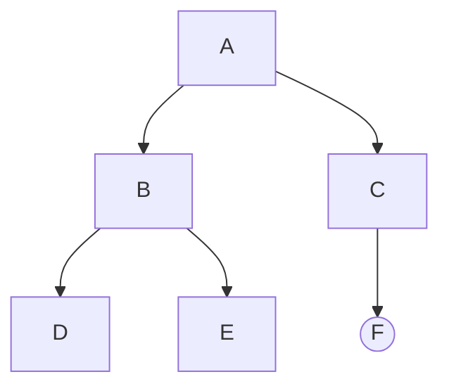
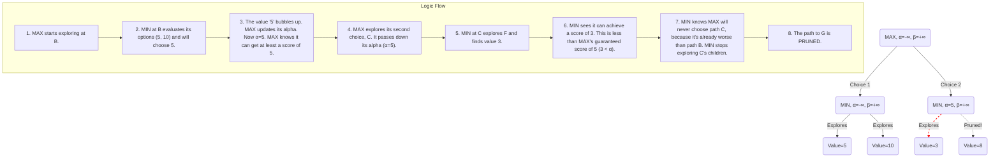

Artificial intelligence can often seem like a black box, but its powerful capabilities are built on a bedrock of elegant and understandable algorithms. Among the most fundamental are **search algorithms**. Think of them as the AI's ability to reason, plan, and find its way through a problem. Whenever an AI needs to find an optimal solution from a vast number of possibilities—like a GPS navigating a city, a logistics program optimizing deliveries, or a game bot planning its next move—it's using a search algorithm.

This guide provides a comprehensive, beginner-friendly deep dive into AI search. We'll build your understanding from first principles, using clear explanations, detailed diagrams, and commented code to demystify how AI explores, plans, and makes intelligent decisions.

## Part 1: The Anatomy of a Search Problem

Before an AI can solve a problem, we must first frame it in a structured way. This process, known as **problem formulation**, is the crucial first step. Let's use a consistent example: helping an agent find the shortest path through this maze from `A` to `B`.

```
#################
# A #   #       #
#   # # # # ### #
#     #   # #   #
# ### # ### # # #
#   # #     # # B
#################
```

We define this problem with a few key components:

*   **State**: A specific configuration of the problem. In our maze, a state is the agent's current `(row, col)` coordinate. The initial state is the location of `A`.
*   **Actions**: The set of possible moves the agent can make from a state. Typically, this would be `UP`, `DOWN`, `LEFT`, `RIGHT`. The `actions(state)` function would return only the valid moves (i.e., not into a wall).
*   **Transition Model**: The rule that describes the result of an action. If the agent is in state `(1, 1)` and performs the action `RIGHT`, the transition model tells us the new state is `(1, 2)`.
*   **Goal Test**: A function that checks if a state is the solution. Here, `goal_test(state)` is true if the state's coordinates match the location of `B`.
*   **Path Cost**: A numerical value assigned to a path. For our maze, the cost of each step is 1. The total path cost is the number of steps. An **optimal solution** is one with the lowest path cost.

### The Search Toolkit: Nodes as Breadcrumbs

As the AI explores, it needs to remember how it got to each location. For this, it uses a `Node` structure, which acts like a digital breadcrumb.

```python
# A Node represents a single point in the search tree
class Node():
    """
    A node in a search tree. It contains:
    - A pointer to the parent (the node that this is a successor to).
    - The state for this node.
    - The action that was applied to the parent to get to this node.
    - The total path cost from the start node to this node.
    """
    def __init__(self, state, parent, action, path_cost=0):
        self.state = state
        self.parent = parent # Essential for reconstructing the final path
        self.action = action
        self.path_cost = path_cost
```
By following the chain of `parent` nodes from the goal, we can reconstruct the exact sequence of actions that constitutes the solution.

## Part 2: The General Search Algorithm Framework

All the search algorithms we'll discuss are built on the same foundational process. This process uses two key data structures to manage the search:

1.  **The Frontier**: A data structure holding all the nodes the algorithm has found but not yet explored. Think of it as the boundary between the known and the unknown.
2.  **The Explored Set**: A data structure storing all the states that have already been visited. This is vital to prevent the algorithm from getting stuck in cycles and re-doing work.

Here is the master plan for how a search algorithm operates:

```mermaid
graph TD
    A[Start] --> B(1. Initialize Frontier with the Start Node);
    B --> C(2. Initialize an empty Explored Set);
    C --> D{3. Is the Frontier empty?};
    D -- Yes --> E[No Solution Found!];
    D -- No --> F[4. Remove a Node from the Frontier <br> **(This is where algorithms differ!)**];
    F --> G{5. Is this Node the Goal?};
    G -- Yes --> H[Solution Found! <br> Backtrack using parent pointers to find the path.];
    G -- No --> I[6. Add the Node's state to the Explored Set];
    I --> J[7. Expand the Node: Find all valid neighbors];
    J --> K{For each Neighbor...};
    K --> L{Is it already in the <br> Frontier or the Explored Set?};
    L -- No --> M[8. Create a new Node for the Neighbor <br> and add it to the Frontier];
    L -- Yes --> K[Ignore it];
    M --> D;
```

The magic—and the entire strategic difference between algorithms—happens in **Step 4**. The rule used to pick the next node from the frontier dictates how the search space is explored.

## Part 3: Uninformed Search (The "Blind" Explorers)

**Uninformed search** algorithms are "blind" because they have no extra information to guide them. They don't know if one state is more promising than another. They just explore systematically.

### Depth-First Search (DFS)

DFS is the aggressive explorer. It always expands the deepest node in the frontier, going all-in on one path until it hits a dead end, at which point it backtracks.

*   **Frontier Implementation**: A **Stack (Last-In, First-Out)**. The newest node added is the first one to be explored.

```python
class StackFrontier():
    def __init__(self):
        self.frontier = [] # Use a Python list as a simple stack

    def add(self, node):
        # Adds a new node to the "top" of the stack
        self.frontier.append(node)

    def remove(self):
        # Removes and returns the node from the "top" of the stack (LIFO)
        if self.empty():
            raise Exception("Cannot remove from an empty frontier.")
        return self.frontier.pop()
```

### Breadth-First Search (BFS)

BFS is the cautious explorer. It explores the graph layer by layer, checking all nodes at a certain depth before moving on to the next level.

*   **Frontier Implementation**: A **Queue (First-In, First-Out)**. The oldest node in the frontier is the first one to be explored.

```python
class QueueFrontier():
    def __init__(self):
        self.frontier = [] # Use a Python list as a simple queue

    def add(self, node):
        # Adds a new node to the end of the queue
        self.frontier.append(node)

    def remove(self):
        # Removes and returns the node from the beginning of the queue (FIFO)
        if self.empty():
            raise Exception("Cannot remove from an empty frontier.")
        node = self.frontier
        self.frontier = self.frontier[1:]
        return node
```

### Algorithm in Action: DFS vs. BFS

Let's trace their exploration of a simple maze to see the difference.
**Goal:** Find a path from `A` to `F`.


**Depth-First Search (Stack):**
1.  **Frontier**: `[A]`
2.  **Remove A**. Expand, add neighbors. **Frontier**: `[B, C]`
3.  **Remove C** (last one in). Expand. **Frontier**: `[B, F]`
4.  **Remove F**. **Goal Found!** Path: `A -> C -> F`.

*Note: If B had been added last, DFS would have explored the entire B-D-E branch first.*

**Breadth-First Search (Queue):**
1.  **Frontier**: `[A]`
2.  **Remove A**. Expand, add neighbors. **Frontier**: `[B, C]`
3.  **Remove B** (first one in). Expand. **Frontier**: `[C, D, E]`
4.  **Remove C**. Expand. **Frontier**: `[D, E, F]`
5.  **Remove D**. No new neighbors. **Frontier**: `[E, F]`
6.  **Remove E**. No new neighbors. **Frontier**: `[F]`
7.  **Remove F**. **Goal Found!** Path: `A -> C -> F`.

Notice that BFS explored more nodes but was guaranteed to find the shortest path.

## Part 4: Informed Search (The "Smart" Explorers)

Informed algorithms are much more efficient because they use a **heuristic**—a problem-specific "rule of thumb"—to guide their search. A heuristic function, `h(n)`, estimates the cost from the current node `n` to the goal.

A great heuristic for our maze is the **Manhattan Distance**: the distance in rows plus the distance in columns to the goal, ignoring walls. It's an optimistic, straight-line estimate.

### Greedy Best-First Search

This "greedy" algorithm always expands the node that it estimates is closest to the goal, based *only* on the heuristic `h(n)`.

*   **Why it Fails**: It's short-sighted. A path might look close initially but lead into a long detour. It is **not optimal**.

### A* Search: The Gold Standard of Pathfinding

A* (A-star) is the brilliant combination of blind diligence and smart guessing. For each node `n`, it calculates an evaluation function `f(n)`:

`f(n) = g(n) + h(n)`

*   `g(n)`: The *actual past cost* from the start to node `n`.
*   `h(n)`: The *estimated future cost* from `n` to the goal.

A* always expands the node with the **lowest `f(n)` value**. It uses a **Priority Queue** for its frontier to efficiently manage this.

**Why A* is Optimal**: A* is **complete and optimal** if its heuristic is *admissible*. An admissible heuristic **never overestimates** the true cost. This crucial property ensures that A* will never be permanently lured away from the true best path by an overly optimistic (but wrong) estimate.

**A* in Action:**
Imagine two paths from the start `S`:
*   Path 1: `S -> A`. `g(A) = 10` (a long, costly road). `h(A) = 2` (looks very close). `f(A) = 12`.
*   Path 2: `S -> B`. `g(B) = 3` (a short, cheap road). `h(B) = 10` (looks far). `f(B) = 13`.

Greedy search would foolishly pick A. A* would initially pick A, but as the `g(n)` cost for paths extending from A grows, the `f(n)` value for the path through B will quickly become more attractive, guiding the search back to the truly optimal path.

## Part 5: Adversarial Search (AI for Game Playing)

When the environment includes an opponent, the AI must plan against their moves.

### The Minimax Algorithm

Minimax is the classic algorithm for two-player, zero-sum games (like Tic-Tac-Toe). It assumes your opponent will also play perfectly.

*   The **MAX** player (our AI) tries to maximize the final score.
*   The **MIN** player (the opponent) tries to minimize the final score.

The algorithm recursively explores the game tree, with MAX and MIN taking turns to choose moves that are best for them.

```python
# The entry point for the algorithm
def minimax(board):
    """Returns the optimal action for the current player on the board."""
    if terminal(board):
        return None

    if player(board) == MAX:
        # Find the action that leads to the state with the highest possible value
        # The key tells Python's max() to compare actions based on the value
        # returned by min_value (since MIN plays next).
        return max(actions(board), key=lambda action: min_value(result(board, action)))
    else: # Player is MIN
        # Find the action that leads to the state with the lowest possible value
        return min(actions(board), key=lambda action: max_value(result(board, action)))

# Recursive helper functions
def max_value(board):
    """Returns the highest utility achievable from this state."""
    if terminal(board):
        return utility(board)
    v = -float("inf")
    for action in actions(board):
        v = max(v, min_value(result(board, action)))
    return v

def min_value(board):
    """Returns the lowest utility achievable from this state."""
    if terminal(board):
        return utility(board)
    v = float("inf")
    for action in actions(board):
        v = min(v, max_value(result(board, action)))
    return v
```

### Making Minimax Practical: Alpha-Beta Pruning

For any complex game, the full Minimax tree is too vast. **Alpha-Beta Pruning** is a critical optimization that dramatically reduces the search space. It works by ignoring branches of the tree that it knows are irrelevant.

*   **Alpha**: The best score (highest value) that the **MAX** player can currently guarantee on the path so far.
*   **Beta**: The best score (lowest value) that the **MIN** player can currently guarantee on the path so far.

**Pruning Rule**:
*   When it's MIN's turn, if it finds a move that leads to a value less than or equal to `alpha`, it can stop searching that branch. Why? Because MAX already has a better option (`alpha`) elsewhere and would never let the game proceed down this worse path.
*   The reverse is true for MAX's turn with `beta`.



By intelligently pruning these dead-end branches, Alpha-Beta Pruning allows AI to search much deeper into a game tree in the same amount of time, leading to vastly superior play.

This journey, from blind exploration to guided pathfinding to strategic adversarial planning, forms the powerful and versatile foundation of how artificial intelligence navigates and conquers complex problems.
