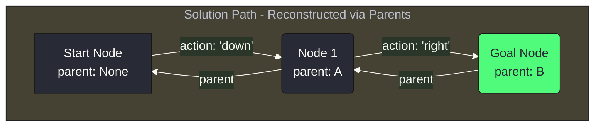
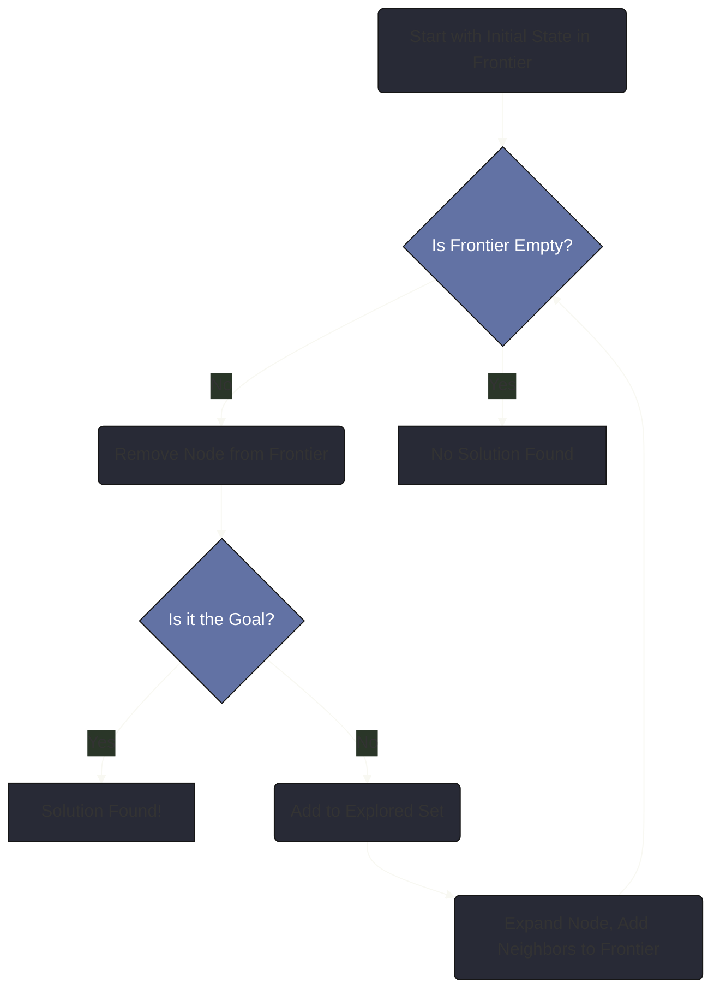
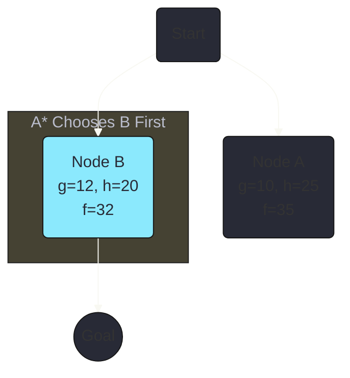
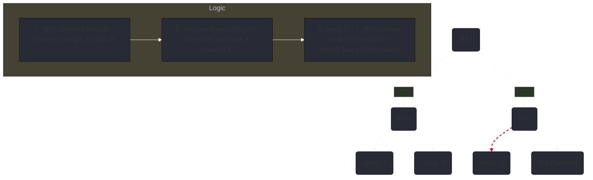

Artificial intelligence can often seem like a black box, but when you look inside, you find a world of elegant and powerful algorithms. At the very foundation of AI's ability to reason and plan are **search algorithms**. Whenever an AI needs to find a solution from a vast sea of possibilities—like calculating the best route for a GPS, solving a complex puzzle, or planning a winning move in a game—it's using a search algorithm.

This guide provides a comprehensive, beginner-friendly tour of AI search. We'll break down the concepts from the ground up, using clear explanations, minimalist diagrams, and commented code to demystify how AI explores, plans, and makes intelligent decisions.

## Part 1: How an AI "Sees" a Problem (Problem Formulation)

Before an AI can solve a problem, we must first frame it in a language it can understand. This process, known as **problem formulation**, breaks down any search challenge into a few key components. Let's use the simple example of finding a path through a maze.

*   **State**: A specific configuration of the problem. In our maze, a state is simply the agent's current coordinates (e.g., Row 3, Column 5).
*   **Initial State**: The state where the agent begins. This is the entrance of the maze.
*   **Actions**: The set of possible moves the agent can make. From any square in the maze, the actions are `up`, `down`, `left`, and `right` (as long as there isn't a wall).
*   **Transition Model**: A rule that describes the result of an action. If the agent is in state (3, 5) and performs the action `up`, the transition model tells us the new state is (2, 5).
*   **Goal Test**: A function that checks if a state is the solution. In our maze, this test is true if the agent's coordinates match the exit.
*   **Path Cost**: A numerical value assigned to a path. For a simple maze, the cost is just the number of steps taken. The best solution—the **optimal solution**—is the one with the lowest cost.

### The Search Toolkit: The `Node`
To keep track of its progress, the AI uses a `Node` object. A `Node` stores not just the state, but also how we got there. The `parent` pointer is the key: once the AI finds the goal, it can trace its way backward from the goal `Node` to its parent, then to that node's parent, and so on. This chain of parents *is* the solution path.

```python
# A simple Node class to track search progress
class Node():
    """A node in a search tree. Contains a pointer to the parent (the node
    that this is a successor to) and to the state for this node. Also
    contains the action that got us to this state, and the total path_cost
    from the start to this node.
    """
    def __init__(self, state, parent, action, path_cost=0):
        self.state = state
        self.parent = parent # The node that generated this node
        self.action = action # The action applied to the parent to get here
        self.path_cost = path_cost # Cost from initial state to this node
```



## Part 2: The General Search Algorithm

All search algorithms are powered by the same engine. They systematically explore the state graph using two essential lists:

1.  **The Frontier**: Contains all the nodes the algorithm has discovered but has not yet explored. It's the algorithm's "to-do" list.
2.  **The Explored Set**: Stores all the states that have already been visited. This is crucial to prevent the algorithm from wasting time or getting stuck in infinite loops.

Here is the high-level process:


The fundamental difference between search algorithms comes down to one critical step: **how is a node removed from the frontier?**

## Part 3: Uninformed Search (Exploring with a Blindfold)

**Uninformed search** algorithms have no extra information about the problem. They are "blind" because they don't know if one state is better than another.

### Depth-First Search (DFS)

DFS is an aggressive algorithm that always explores the deepest unvisited node. It uses a **Stack** for its frontier, which operates on a **Last-In, First-Out (LIFO)** principle.

```python
# A simple Stack Frontier implementation
class StackFrontier():
    def __init__(self):
        self.frontier = [] # Use a Python list as a stack

    def add(self, node):
        self.frontier.append(node) # Adds to the "top" of the stack

    def remove(self):
        # pop() removes from the "top" of the stack (the last item)
        return self.frontier.pop()
```

### Breadth-First Search (BFS)

BFS is a cautious algorithm that explores layer by layer. It uses a **Queue** for its frontier, which operates on a **First-In, First-Out (FIFO)** principle.

```python
# A simple Queue Frontier implementation
class QueueFrontier():
    def __init__(self):
        self.frontier = [] # Use a Python list as a queue

    def add(self, node):
        self.frontier.append(node) # Add to the end of the line

    def remove(self):
        # Remove from the beginning of the line
        node = self.frontier
        self.frontier = self.frontier[1:]
        return node
```

### DFS vs. BFS: A Visual Comparison
Imagine searching the tree below for the goal `G`. The numbers show the order of exploration.

```mermaid
%%{ init: { 'theme': 'base', 'themeVariables': { 'primaryColor': '#282a36', 'lineColor': '#f8f8f2', 'textColor': '#f8f8f2' } } }%%
graph TD
    subgraph DFS (Stack - Deepest First)
        A1(A - 1) --> B2(B - 2)
        B2 --> D4(D - 4)
        B2 --> E5(E - 5)
        A1 --> C3(C - 3)
        C3 --> F6(F - 6)
        C3 --> G7((G - 7))
    end
    subgraph BFS (Queue - Shallowest First)
        A1b(A - 1) --> B2b(B - 2)
        A1b --> C3b(C - 3)
        B2b --> D4b(D - 4)
        B2b --> E5b(E - 5)
        C3b --> F6b(F - 6)
        C3b --> G7b((G - 7))
    end
    classDef goal fill:#50fa7b,color:#282a36;
    class G7,G7b goal;
```
*   **DFS** dives deep into the `B` branch before ever exploring `C`.
*   **BFS** explores all nodes at depth 1 (`B`, `C`) before moving to depth 2, guaranteeing it finds the shortest path.

## Part 4: Informed Search (Searching with a Map)

**Informed search** algorithms are much smarter because they use a **heuristic**—an educated guess—to guide them. A heuristic function, `h(n)`, estimates the cost from the current node `n` to the goal.

### A* Search: The Gold Standard
A* (A-star) search combines the known cost of the past with an estimate of the future. For each node `n`, A* calculates:

`f(n) = g(n) + h(n)`

*   `g(n)`: The *actual* cost from the start to node `n`.
*   `h(n)`: The *estimated* cost from `n` to the goal.

A* always expands the node with the **lowest `f(n)` value**. It is **complete and optimal** as long as its heuristic is **admissible** (it never overestimates the true cost).


A* chooses to explore **Node B** first. Although getting to A is cheaper (`g=10`), Node B is estimated to be on a better overall path to the goal (`f=32` is less than `f=35`).

## Part 5: Adversarial Search (AI in Games)

When an AI plays against an opponent, it needs **adversarial search**.

### The Minimax Algorithm
Minimax is designed for two-player games. It assumes your opponent will always make the move that is best for them.

*   The **MAX** player (our AI) tries to maximize the final score.
*   The **MIN** player (the opponent) tries to minimize the final score.

The algorithm explores a tree of future game states, propagating values up from the end of the game.

```mermaid
%%{ init: { 'theme': 'base', 'themeVariables': { 'primaryColor': '#282a36', 'lineColor': '#f8f8f2', 'textColor': '#f8f8f2' } } }%%
graph TD
    A("MAX <br> Chooses 7");
    
    A --> B("MIN <br> Value=7");
    A --> C("MIN <br> Value=3");
    
    B -- Chooses min --> E("Value: 7");
    B --> D("Value: 8");

    C -- Chooses min --> F("Value: 3");
    C --> G("Value: 9");
    
    linkStyle 0 stroke-width:4px,stroke:#50fa7b;
    linkStyle 2 stroke-width:2px,stroke:#ff5555;
    
    classDef max fill:#8be9fd,color:#282a36;
    classDef min fill:#ffb86c,color:#282a36;
    class A max;
    class B,C min;
```
*   The MIN nodes at the second level choose the *minimum* of their children's values.
*   The MAX node at the top chooses the *maximum* of its children's values. MAX chooses the path through B, guaranteeing a score of at least 7.

### Alpha-Beta Pruning: The Smart Optimization
Exploring the entire game tree is impossible for complex games. **Alpha-Beta Pruning** is a huge optimization that safely ignores parts of the tree.

**The core idea:** If a player has already found a move that guarantees a certain outcome, they won't bother exploring another move if they realize it will lead to a worse outcome.



This simple trick dramatically reduces the size of the search space, allowing game AIs to think many more moves ahead.
