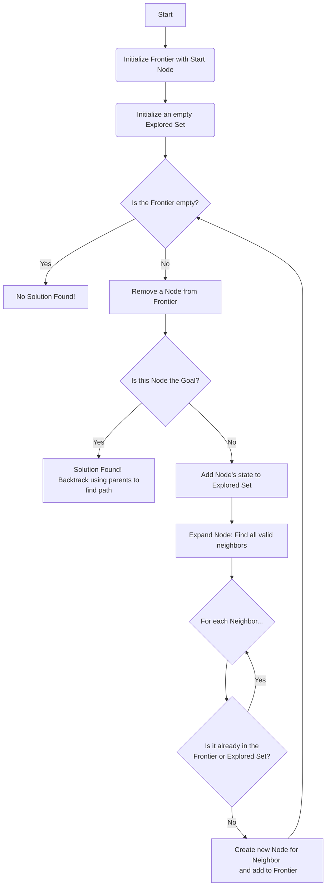
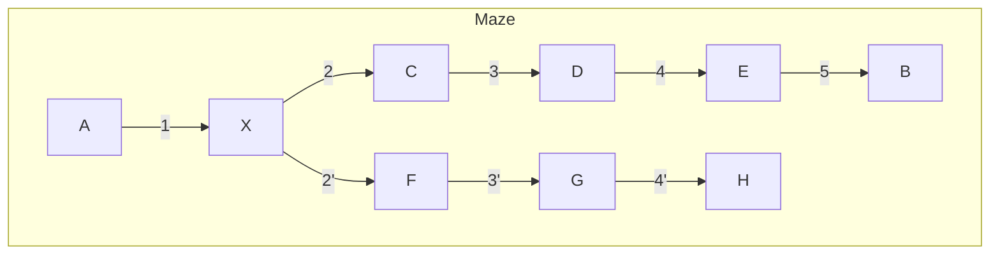
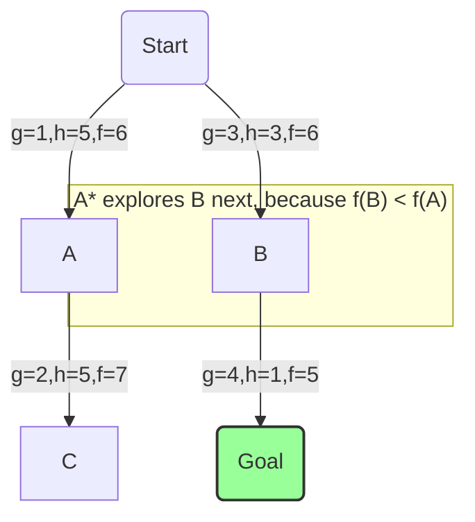

Artificial intelligence can often seem like magic, but at its core, it relies on powerful, well-defined algorithms to solve problems. Among the most fundamental of these are **search algorithms**. Whenever an AI needs to find a solution from a vast number of possibilities—like calculating the best route for a GPS, solving a complex puzzle, or planning a winning move in a game—it's using a search algorithm.

This guide provides a comprehensive, beginner-friendly tour of AI search. We'll break down the concepts from the ground up, using clear explanations, diagrams, and code to demystify how AI explores, plans, and makes decisions.

## Part 1: The Anatomy of a Search Problem

Before an AI can find a solution, we must first frame the problem in a way it can understand. This process, known as **problem formulation**, breaks down any search challenge into a few key components. Let's use the simple example of finding a path through a maze.

*   **State**: A specific configuration of the problem. In our maze, a state is simply the agent's current coordinates (e.g., Row 3, Column 5).
*   **Initial State**: The state where the agent begins. This is the entrance of the maze.
*   **Actions**: The set of possible moves the agent can make. From any square in the maze, the actions are `up`, `down`, `left`, and `right` (as long as there isn't a wall).
*   **Transition Model**: A rule that describes the result of an action. If the agent is in state (3, 5) and performs the action `up`, the transition model tells us the new state is (2, 5).
*   **Goal Test**: A function that checks if a state is the solution. In our maze, this test is true if the agent's coordinates match the exit.
*   **Path Cost**: A numerical value assigned to a path. For a simple maze, the cost is just the number of steps taken. The best solution—the **optimal solution**—is the one with the lowest cost.

We can visualize the entire maze as a graph where each square is a **node** and each possible move is an **edge** connecting two nodes.

### The Search Toolkit: Nodes

To keep track of its progress, the AI uses a simple data structure for each step of its exploration. We'll call it a `Node`. A `Node` stores not just the state, but also the information needed to reconstruct the path later.

```python
# A simple Node class to track search progress
class Node():
    """A node in a search tree. Contains a pointer to the parent (the node
    that this is a successor to) and to the state for this node. Also
    contains the action that got us to this state, and the total path_cost
    from the start to this node.
    """
    def __init__(self, state, parent, action, path_cost=0):
        self.state = state
        self.parent = parent
        self.action = action
        self.path_cost = path_cost
```

**Code Explained**:
*   `self.state`: The actual position in the maze (e.g., `(3, 5)`).
*   `self.parent`: A reference to the previous `Node` on the path. This is how we can backtrack.
*   `self.action`: The action taken to get from the `parent` to this `Node` (e.g., `"up"`).
*   `self.path_cost`: The total number of steps taken from the start to reach this `Node`.

## Part 2: The General Search Algorithm

All search algorithms are powered by the same engine. They systematically explore the state graph using two essential data structures:

1.  **The Frontier**: Contains all the nodes the algorithm has discovered but not yet explored. This is the algorithm's "to-do" list.
2.  **The Explored Set**: Stores all the states that have already been visited. This is crucial to prevent the algorithm from wasting time or getting stuck in infinite loops.

This process can be visualized as a simple, powerful loop.



The fundamental difference between search algorithms comes down to one critical step: **how is a node removed from the frontier?** This single choice defines the entire search strategy.

## Part 3: Uninformed Search (The "Blind" Explorers)

**Uninformed search** algorithms have no extra information about the problem besides its definition. They are "blind" because they don't know if one state is better or closer to the goal than another. They just explore systematically.

### Depth-First Search (DFS)

DFS is an aggressive algorithm that always explores the deepest unvisited node. It picks a single path and follows it as far as possible. If it hits a dead end, it backtracks to the last choice it made and tries the next available option.

To achieve this "deepest-first" behavior, DFS uses a **Stack** data structure for its frontier. A stack operates on a **Last-In, First-Out (LIFO)** principle.

```python
# A simple Stack Frontier implementation
class StackFrontier():
    def __init__(self):
        self.frontier = [] # Use a Python list as a stack

    def add(self, node):
        self.frontier.append(node) # append() adds to the end (top of stack)

    def remove(self):
        if self.empty():
            raise Exception("Frontier is empty")
        # pop() with no arguments removes from the end (top of stack)
        return self.frontier.pop()

    def empty(self):
        return len(self.frontier) == 0
```
**Code Explained**:
The `remove` method uses `pop()`, which removes and returns the *last* item added to the list. This ensures the algorithm always works on the "newest" or "deepest" node it has found.

*   **Performance**: DFS is not optimal, as it might find a long, winding path before a shorter one. However, it can be very memory-efficient compared to BFS.

### Breadth-First Search (BFS)

BFS is a more cautious and systematic algorithm. It explores the graph layer by layer, expanding all nodes at the current depth before moving on to the next level. This is like the ripples spreading out from a stone dropped in a pond.

To achieve this "shallowest-first" behavior, BFS uses a **Queue** data structure for its frontier. A queue operates on a **First-In, First-Out (FIFO)** principle.

```python
# A simple Queue Frontier implementation
class QueueFrontier():
    def __init__(self):
        self.frontier = [] # Use a Python list as a queue

    def add(self, node):
        self.frontier.append(node) # Add to the end

    def remove(self):
        if self.empty():
            raise Exception("Frontier is empty")
        # Remove from the beginning (FIFO)
        node = self.frontier
        self.frontier = self.frontier[1:]
        return node

    def empty(self):
        return len(self.frontier) == 0
```
**Code Explained**:
The `remove` method now takes the *first* item from the list (`self.frontier[0]`). This guarantees that nodes are processed in the order they were discovered, ensuring a layer-by-layer search.

*   **Performance**: BFS is **optimal** for finding the shortest path in terms of the number of steps. Its main downside is that it often requires more memory than DFS.

### DFS vs. BFS: A Visual Comparison

Consider this maze where the goal is `B`.


*   **DFS** might dive deep down the wrong path: `A -> X -> F -> G -> H` (dead end), before backtracking and finally finding `A -> X -> C -> D -> E -> B`.
*   **BFS** would explore layer by layer. It would eventually find the path `A -> X -> C -> D -> E -> B` and is guaranteed to find this shortest path first.

| Feature | Depth-First Search (DFS) | Breadth-First Search (BFS) |
|---|---|---|
| **Strategy** | Explores as deep as possible | Explores layer by layer |
| **Frontier** | Stack (LIFO) | Queue (FIFO) |
| **Optimality**| Not optimal | Optimal (for step cost) |
| **Completeness**| Yes (in finite graphs) | Yes |
| **Memory** | Generally lower | Generally higher |

## Part 4: Informed Search (The "Smart" Explorers)

Uninformed search can be very inefficient. **Informed search** algorithms are much smarter because they use a **heuristic**—an educated guess or rule of thumb—to guide them toward the goal. A heuristic function, `h(n)`, estimates the cost from the current node `n` to the goal.

### Greedy Best-First Search

This "greedy" algorithm is simple: it always expands the node that it *estimates* is closest to the goal, based only on the heuristic `h(n)`. It completely ignores the cost it took to get there (`g(n)`).

*   **Performance**: It's often much faster than blind search, but its greed can mislead it. It is **not optimal**.

### A* Search: The Gold Standard of Pathfinding

A* (pronounced "A-star") is one of the most effective search algorithms ever devised. It cleverly combines the strengths of BFS (path cost) and Greedy Search (heuristic estimate).

For each node `n`, A* calculates an evaluation function `f(n)`:

`f(n) = g(n) + h(n)`

*   `g(n)`: The *actual* cost of the path from the start to node `n`.
*   `h(n)`: The *estimated* cost from node `n` to the goal (the heuristic).

A* always expands the node with the **lowest `f(n)` value**. This brilliantly balances the cost already traveled with the estimated cost remaining.

**Why A* is Optimal**: A* is **complete and optimal**, on one condition: its heuristic must be *admissible*. An admissible heuristic **never overestimates** the true cost. This ensures A* won't be permanently misled by a bad estimate. The Manhattan distance, for example, is admissible because it's the distance without walls—the true path can only be longer or equal, never shorter.


Even though Node A is physically closer, A* explores Node B first because its combined cost (`f(n)`) suggests it's on a more promising overall path.

## Part 5: Adversarial Search for Game Playing

When the environment includes an opponent trying to win, we need **adversarial search**.

### The Minimax Algorithm

Minimax is the classic algorithm for two-player, zero-sum games (like Tic-Tac-Toe). It operates on a simple principle: choose the move that minimizes your maximum possible loss.

*   The **MAX** player (our AI) tries to get the highest score possible.
*   The **MIN** player (the opponent) tries to get the lowest score possible.

The algorithm explores a tree of future game states.

```python
def minimax(board):
    """Returns the optimal action for the current player."""
    if terminal(board): # If game is over
        return None

    # Determine whose turn it is
    if player(board) == MAX:
        # Find the move that leads to the highest possible min_value
        # We use a lambda function to get the value for each action
        return max(actions(board), key=lambda action: min_value(result(board, action)))
    else: # Player is MIN
        # Find the move that leads to the lowest possible max_value
        return min(actions(board), key=lambda action: max_value(result(board, action)))

def max_value(board):
    """Calculates the max utility of a state."""
    if terminal(board):
        return utility(board)
    # Find the highest value among all possible next states
    v = -float("inf")
    for action in actions(board):
        v = max(v, min_value(result(board, action)))
    return v

def min_value(board):
    """Calculates the min utility of a state."""
    if terminal(board):
        return utility(board)
    # Find the lowest value among all possible next states
    v = float("inf")
    for action in actions(board):
        v = min(v, max_value(result(board, action)))
    return v
```
**Code Explained**:
The `minimax` function determines if it's MAX's or MIN's turn. If it's MAX's turn, it looks at all possible `actions`. For each action, it calculates the outcome by calling `min_value` (since MIN will play next). It then chooses the action that resulted in the highest score. `min_value` and `max_value` call each other recursively, building the game tree until a terminal state (win, lose, or draw) is reached, at which point a numerical `utility` is returned.

### Making Minimax Practical

For complex games, the Minimax tree is astronomically large. We need optimizations:

*   **Alpha-Beta Pruning**: A massive improvement that "prunes" (ignores) branches of the game tree that are irrelevant. If MAX finds a move that guarantees a score of 5, it can stop evaluating any other branch where MIN can force a score of 4 or less. It's like saying, "I already have a good option, so I won't waste time exploring options I know will be worse."

```mermaid
graph TD
    A(MAX) --> B(MIN);
    A --> C(MIN);
    B --> D;
    B --> E;
    C --> F;
    
    subgraph Pruning
        C --> G;
    end
    
    style G fill:#f66,stroke:#333,stroke-width:2px

    linkStyle 3 stroke-dasharray: 5 5;

    %% Explanation
    % 1. MAX explores left branch via B. MIN will choose 5. So MAX knows it can get at least 5.
    % 2. MAX explores right branch via C. It sees MIN can choose G to force a score of 3.
    % 3. Since 3 is worse than the 5 MAX can already guarantee, MAX doesn't need to check any other children of C.
    %    It "prunes" the exploration of F.
```

*   **Depth-Limited Search & Evaluation Functions**: Instead of searching to the end of the game, the AI only looks a few moves ahead. When it hits this depth limit, it uses an **evaluation function** to estimate how good the current board position is. This function is the "secret sauce" of a strong game AI.

From simple pathfinding to grandmaster-level chess, search algorithms provide the fundamental logic that allows AI to reason, plan, and find optimal solutions in a world of endless possibilities.
