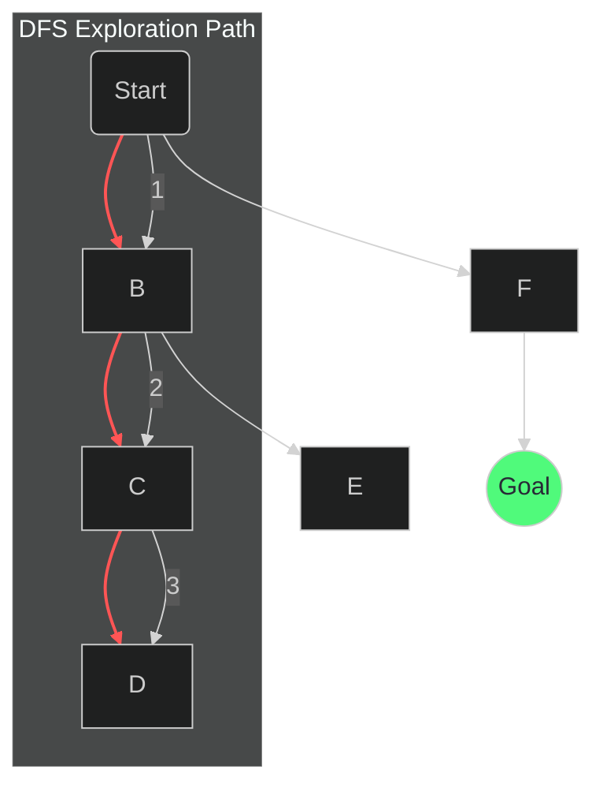
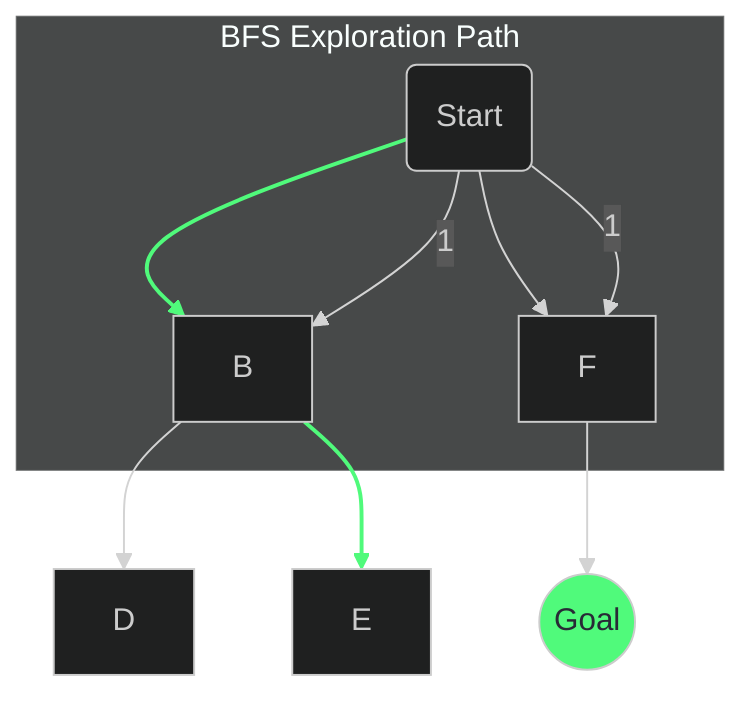
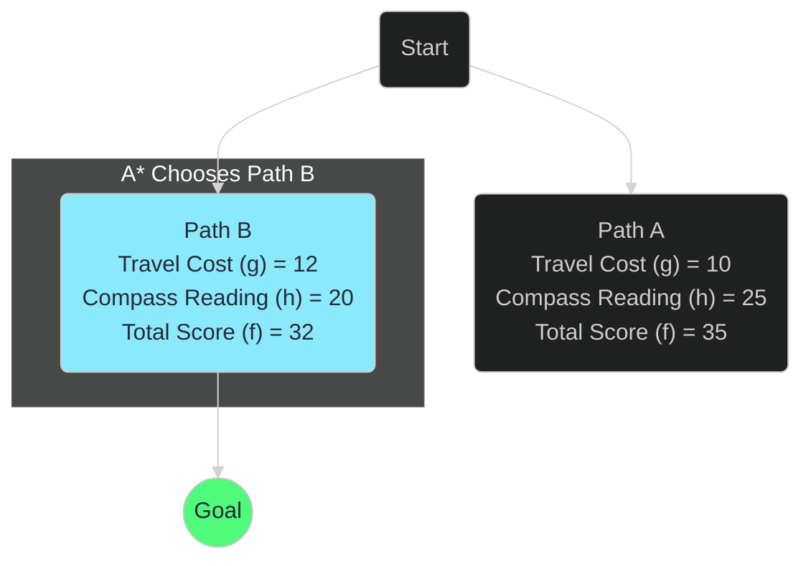
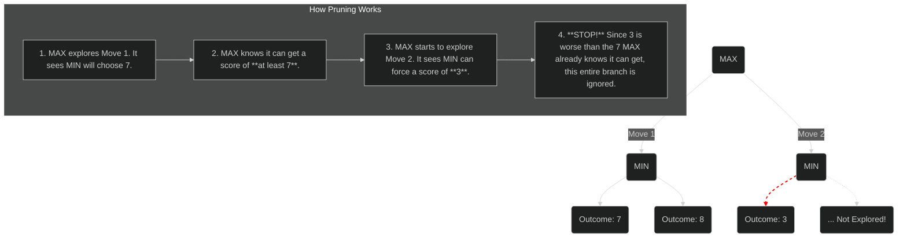

Have you ever wondered how your GPS finds the fastest route, or how a computer opponent in a game seems to anticipate your every move? The answer lies in a core concept of Artificial Intelligence: **search algorithms**. These are the step-by-step recipes AI uses to find solutions to complex problems.

This guide will walk you through these powerful ideas in a simple, visual way. No jargon, no confusing diagrams—just the fundamentals of how an AI learns to think.

## The Basic Idea: A Treasure Map

Imagine we have a treasure map. Our goal is to get from our starting point to the 'X' that marks the treasure. This is exactly what a search algorithm does. To get started, we just need to define a few things for our AI:

1.  **The Initial State**: Where we are right now (our starting point).
2.  **Possible Actions**: The moves we can make from any spot (e.g., `North`, `South`, `East`, `West`).
3.  **A Goal Test**: A way to know if we've found the treasure (i.e., "Are we at the 'X'?").
4.  **Cost**: The effort each move takes (e.g., each step costs 1 minute).

With these rules, our AI can start its quest. Its main challenge is deciding *how* to explore the map.

## Part 1: The Blind Explorers (Uninformed Search)

These first two methods are "blind" because they don't have any extra clues. They don't know if a path is getting them "warmer" or "colder." They just explore systematically.

### The "Go-For-It" Strategy: Depth-First Search (DFS)

Imagine an impatient explorer. They pick a path and follow it as deep as they possibly can until they hit a dead end. Only then do they backtrack to the last junction and try a different path. This is DFS.

It uses a **Stack** (Last-In, First-Out) to keep track of where to go next. Think of it like a stack of plates—you always take the one from the top.


**Result**: DFS can be fast if it gets lucky and picks the right path first. But as you can see, it might explore a very long, useless path before finding a much shorter one. It's **not optimal**.

### The "Cautious" Strategy: Breadth-First Search (BFS)

Now, imagine a more careful explorer. They check *all* the paths that are one step away. Then they check *all* the paths that are two steps away, and so on. This is BFS.

It uses a **Queue** (First-In, First-Out) to manage its exploration. Like a line at a store, the first one in is the first one out.


**Result**: BFS explores in expanding circles. It's guaranteed to find the shortest possible path first. It is **optimal**, but it can use more memory than DFS because it has to keep track of many paths at once.

## Part 2: The Smart Explorer (Informed Search)

What if we gave our explorer a compass that always pointed roughly toward the treasure? This "compass" is what we call a **heuristic** in AI. It's an educated guess that helps the AI make smarter choices.

### The Smartest Explorer: A* Search

The A* (A-star) algorithm is the gold standard for pathfinding. It combines the best of both worlds:
1.  It knows the cost of the path it has already traveled (`g(n)`).
2.  It uses a heuristic to estimate the distance remaining to the goal (`h(n)`).

It combines these two values into a single score: `f(n) = g(n) + h(n)`. A* always chooses to explore the path with the **lowest `f(n)` score**.


**Result**: Even though Path A is cheaper so far (cost of 10), Path B is more promising overall because its total score is lower. A* intelligently balances past cost with future estimates to find the **best path without wasting time**.

## Part 3: Playing to Win (Adversarial Search)

What happens when the AI isn't just navigating a map, but playing against a thinking opponent? This is **adversarial search**.

### The "Thinking Ahead" Strategy: Minimax

The Minimax algorithm is perfect for two-player games like Tic-Tac-Toe. It works by "thinking ahead" and assuming your opponent will always make the best possible move for themselves.

*   The **MAX** player (our AI) wants to maximize the score.
*   The **MIN** player (the opponent) wants to minimize the score.

The AI looks at the game tree and works backward from the outcomes.

```mermaid
%%{ init: { 'theme': 'dark' } }%%
graph TD
    A("MAX's Turn <br> Chooses 7");
    
    A --> B("MIN's Turn <br> Value = 7");
    A --> C("MIN's Turn <br> Value = 3");
    
    B -- Chooses min --> E("Outcome: 7");
    B --> D("Outcome: 8");

    C -- Chooses min --> F("Outcome: 3");
    C --> G("Outcome: 9");
    
    linkStyle 0 stroke-width:4px,stroke:#50fa7b;
    linkStyle 2 stroke-width:2px,stroke:#ff5555;
    
    classDef max fill:#8be9fd,color:#282a36;
    classDef min fill:#ffb86c,color:#282a36;
    class A max;
    class B,C min;
```
*   **Bottom-Up Logic**: If MIN has a choice between an outcome of 7 and 8, it will choose 7. If it has a choice between 3 and 9, it will choose 3.
*   **MAX's Choice**: MAX now looks at its two options: one leads to a guaranteed score of 7, the other to a score of 3. It chooses the path that gives it the maximum value, guaranteeing a score of 7.

### The "Don't Waste Time" Trick: Alpha-Beta Pruning

For complex games, the Minimax tree is enormous. **Alpha-Beta Pruning** is a genius trick to make it faster by ignoring branches that don't matter.

**The Logic**: If you have already found a move that guarantees a good outcome, why waste time analyzing a different move if you can see right away it will lead to something worse?


This simple optimization lets game AIs "think" many more moves ahead, making them formidable opponents. From blindly stumbling through a maze to strategically outwitting a human player, search algorithms are the engine that drives artificial intelligence.
