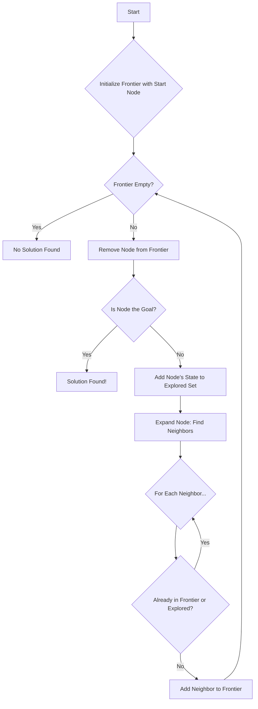
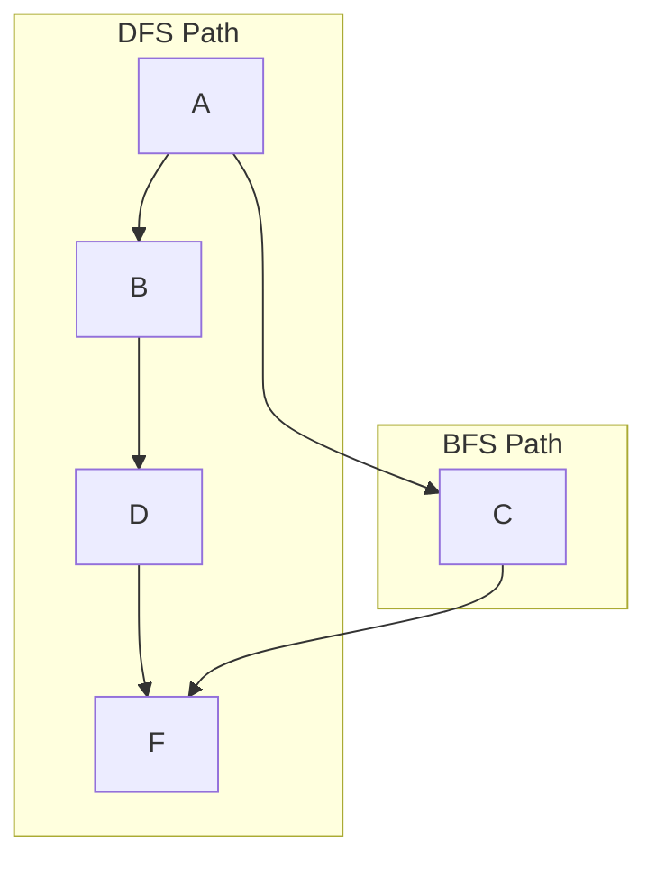
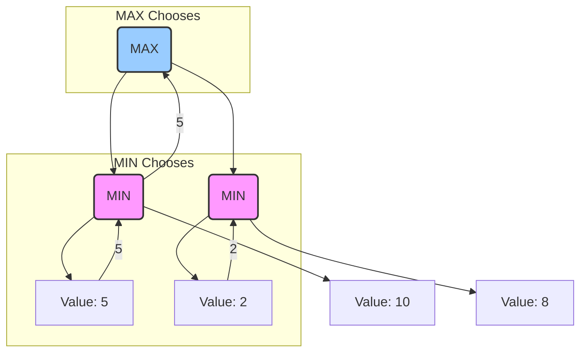

Search is a foundational pillar of artificial intelligence. Whenever an AI needs to find a solution from a vast set of possibilities—like calculating the quickest driving route, solving a puzzle, or determining the winning move in a game—it's using a search algorithm. This guide provides an in-depth exploration of these algorithms, complete with explanations, diagrams, and code, to show you how an AI finds its way in a complex world.

## Part 1: Formalizing a Search Problem

Before an AI can solve a problem, we must first define it in a structured way. This process, known as problem formulation, breaks any search challenge down into a few core components.

*   **Agent**: The entity performing the search.
*   **State**: A specific configuration of the problem. For a 15-puzzle, any arrangement of the tiles is a single state.
*   **Initial State**: The state where the agent's journey begins.
*   **Actions**: The set of possible moves the agent can make in a given state.
*   **Transition Model**: A function that takes a state and an action and returns the resulting state. E.g., `result(state, action) -> new_state`.
*   **Goal Test**: A function that determines if a given state is the final goal.
*   **Path Cost**: A numerical value assigned to a sequence of actions. An optimal solution has the lowest path cost.

Imagine this entire problem space as a massive graph. Each state is a node, and each action is an edge connecting one node to another. The AI's task is to navigate this graph from the initial state to a goal state.


To manage this navigation, we use a simple data structure for each point in our search, which we'll call a `Node`. This `Node` keeps track of not just the state, but also how we got there.

```python
# A simple Node class to track search progress
class Node():
    def __init__(self, state, parent, action, path_cost=0):
        self.state = state
        self.parent = parent # The node that generated this node
        self.action = action # The action applied to the parent to get here
        self.path_cost = path_cost # Cost from initial state to this node
```
This `Node` structure allows us to retrace our steps once we find the goal, letting us reconstruct the solution path.

## Part 2: The General Search Algorithm

All search algorithms share a common underlying process. They systematically explore the state graph using two key data structures:

1.  **The Frontier**: This contains all the nodes the algorithm has discovered but has not yet explored. It's the "to-do" list.
2.  **The Explored Set**: This stores all the states that have already been visited. This is crucial to prevent the algorithm from getting stuck in infinite loops.

The fundamental search loop works like this:



The magic of different search algorithms lies in a single step: **how a node is removed from the frontier**. This choice dictates the entire search strategy.

## Part 3: Uninformed Search Strategies

Uninformed (or "blind") search algorithms operate with no information about the problem other than its basic definition. They don't know if one state is better or closer to the goal than another.

### Depth-First Search (DFS)

DFS is an aggressive algorithm that always explores the deepest node in the frontier. It picks a path and follows it to its end. If it hits a dead end, it backtracks and tries the next available path.

This strategy is implemented by using a **Stack** (Last-In, First-Out) for the frontier.

```python
class StackFrontier():
    def __init__(self):
        self.frontier = []

    def add(self, node):
        self.frontier.append(node) # Add to the end

    def remove(self):
        if self.empty():
            raise Exception("Frontier is empty")
        # Remove from the end (LIFO)
        node = self.frontier[-1]
        self.frontier = self.frontier[:-1]
        return node

    def empty(self):
        return len(self.frontier) == 0
```
*   **Performance**: DFS is not optimal; it can find a long, winding path when a short one exists. It's also not complete in infinite search spaces. However, it can be very memory-efficient.

### Breadth-First Search (BFS)

BFS is a more cautious algorithm. It explores the graph layer by layer, expanding all nodes at the current depth before moving to the next level.

This is implemented using a **Queue** (First-In, First-Out) for the frontier.

```python
class QueueFrontier(StackFrontier): # Inherits from StackFrontier
    def remove(self):
        if self.empty():
            raise Exception("Frontier is empty")
        # Remove from the beginning (FIFO)
        node = self.frontier
        self.frontier = self.frontier[1:]
        return node
```

*   **Performance**: BFS is guaranteed to find the shortest path (in terms of the number of steps), making it **optimal** for unweighted graphs. It is also complete. Its main drawback is memory usage, as it must store all nodes at each layer.

Here's how they differ visually on a simple graph (Goal is F):


DFS might dive down the A-B-D path first, while BFS would explore A's immediate neighbors (B and C) and find the shorter path to F via C.

## Part 4: Informed Search Strategies

Informed search algorithms are much more efficient because they use a **heuristic**—a problem-specific, educated guess—to guide them toward the goal. A heuristic function, `h(n)`, estimates the cost from the current node `n` to the goal.

### Greedy Best-First Search

This "greedy" algorithm always expands the node that it estimates is closest to the goal, based *only* on the heuristic `h(n)`. It's fast but can be shortsighted.

*   **Performance**: It often finds a solution quickly, but it is **not optimal**. It can be tricked into following a path that looks good at first but ultimately leads to a longer route.

### A* Search: The Best of Both Worlds

A* (A-star) search is the gold standard for pathfinding. It combines the strengths of BFS (which considers the path cost so far) and Greedy search (which estimates the future cost).

For each node `n`, A* calculates an evaluation function `f(n)`:

`f(n) = g(n) + h(n)`

*   `g(n)`: The actual cost of the path from the start to node `n`.
*   `h(n)`: The heuristic's estimated cost from `n` to the goal.

A* always expands the node with the lowest `f(n)` value, perfectly balancing the cost already traveled with the estimated cost remaining. It is **complete and optimal**, provided its heuristic is *admissible* (it never overestimates the true cost). For implementation, A* uses a Priority Queue for its frontier, always removing the node with the lowest `f(n)`.

## Part 5: Adversarial Search for Games

When the environment includes an opponent who is actively working against you, we need a different approach: adversarial search.

### The Minimax Algorithm

Minimax is the classic algorithm for two-player, deterministic games like Tic-Tac-Toe. It assumes your opponent will also play optimally.

*   The **MAX** player (our AI) aims to maximize the score.
*   The **MIN** player (the opponent) aims to minimize the score.

The algorithm builds a game tree and recursively calculates the utility of each state.

```python
def minimax(board):
    """
    Returns the optimal action for the current player on the board.
    """
    if terminal(board):
        return None

    if player(board) == MAX:
        # Find the move that gives the highest value
        best_value = -float("inf")
        best_move = None
        for action in actions(board):
            val = min_value(result(board, action))
            if val > best_value:
                best_value = val
                best_move = action
        return best_move
    else: # Player is MIN
        # Find the move that gives the lowest value
        best_value = float("inf")
        best_move = None
        for action in actions(board):
            val = max_value(result(board, action))
            if val < best_value:
                best_value = val
                best_move = action
        return best_move

# max_value and min_value are recursive helper functions
def max_value(board):
    if terminal(board):
        return utility(board)
    v = -float("inf")
    for action in actions(board):
        v = max(v, min_value(result(board, action)))
    return v

def min_value(board):
    if terminal(board):
        return utility(board)
    v = float("inf")
    for action in actions(board):
        v = min(v, max_value(result(board, action)))
    return v
```

The functions `max_value` and `min_value` call each other, descending the game tree until a terminal state is reached. The utility then "bubbles up" the tree, allowing the initial call to `minimax` to choose the best possible move.


In this example, MAX chooses the left path because it guarantees a score of 5, which is better than the guaranteed score of 2 on the right path.

### Optimizing Minimax

For complex games like chess, the full Minimax tree is too large to explore. We need optimizations:

*   **Alpha-Beta Pruning**: A massive improvement that allows the algorithm to "prune" branches of the tree it knows are irrelevant. If MAX has already found a move that guarantees a score of 5, it can stop evaluating any other branch where MIN can force a score of 4 or less.
*   **Depth-Limited Search & Evaluation Functions**: Instead of searching to the end of the game, the AI only looks a few moves ahead. When it hits this depth limit, it uses an **evaluation function** to estimate the quality of the board position. The sophistication of this function is what separates a novice AI from a grandmaster.

From finding the shortest path to plotting a winning game strategy, search algorithms are a powerful and essential component of artificial intelligence, providing the logic needed to navigate complex decisions and find order in a world of possibilities.
