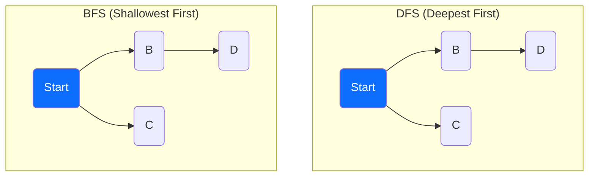
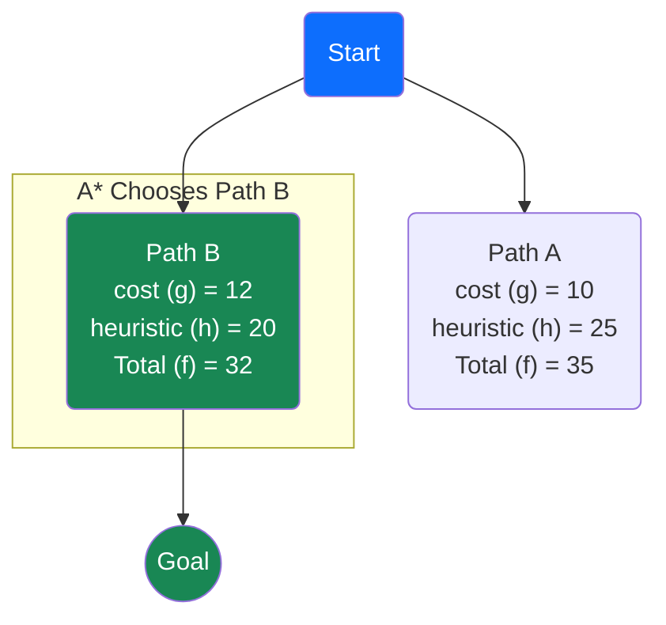

Have you ever wondered how your GPS finds the fastest route, or how a computer opponent in a game seems to anticipate your every move? The answer lies in a core concept of Artificial Intelligence: **search algorithms**. These are the step-by-step recipes AI uses to navigate a vast landscape of possibilities and find a solution.

This guide will walk you through these powerful ideas in a simple, visual way. No jargon, no confusing diagrams—just the fundamentals of how an AI learns to think.

## The Basic Idea: A Digital Maze

Imagine an AI trying to solve a maze. To get started, we just need to give it a few simple rules:

1.  **The Initial State**: The agent's starting position.
2.  **Possible Actions**: The moves it can make (e.g., `Up`, `Down`, `Left`, `Right`).
3.  **A Goal Test**: A way for the AI to know when it has reached the exit.

With these rules, our AI can start its quest. Its main challenge is deciding *how* to explore the maze without getting lost. To do this, it keeps two lists:

*   **The Frontier**: A "to-do" list of all the promising paths it has found but hasn't explored yet.
*   **The Explored Set**: A list of all the squares it has already visited, so it doesn't waste time checking them again.

The AI's strategy—the very thing that defines its intelligence—comes down to one question: **From all the paths on my to-do list, which one should I explore next?**

## Part 1: The Blindfolded Explorers (Uninformed Search)

These first two methods are "blind" because they don't have any clues about the maze's layout. They just explore systematically until they stumble upon the goal.

### The Impatient Explorer: Depth-First Search (DFS)

Imagine an explorer who is incredibly impatient. They pick a path at random and run down it as far as they can, only turning back when they hit a dead end. This is DFS.

Its strategy is to always explore the **newest path** it has found. To do this, it uses a **Stack** data structure for its frontier—a Last-In, First-Out (LIFO) list.

```python
# A Stack data structure for the DFS frontier
class Stack:
    def __init__(self):
        # Use a simple Python list to act as a stack
        self.frontier = []

    def add(self, node):
        # Add a new path to the "top" of the stack
        self.frontier.append(node)

    def remove(self):
        # Remove and return the newest path from the "top"
        return self.frontier.pop()
```
**The Verdict**: DFS can be fast if it gets lucky, but it's **not optimal**. It might find a ridiculously long route before it finds a much shorter one.

### The Cautious Explorer: Breadth-First Search (BFS)

Now, imagine a more careful explorer. They take one step down *every* possible path. Then they take a second step down *every* path, and so on. This is BFS.

Its strategy is to always explore the **oldest path** it has found. It uses a **Queue** for its frontier—a First-In, First-Out (FIFO) list.

```python
# A Queue data structure for the BFS frontier
class Queue:
    def __init__(self):
        self.frontier = []

    def add(self, node):
        self.frontier.append(node) # Add to the end of the line

    def remove(self):
        # Remove and return the oldest path from the front
        return self.frontier.pop(0)
```
**The Verdict**: BFS is guaranteed to find the shortest possible path. It's **optimal**, but it often uses more memory because it has to keep track of so many paths at once.

### DFS vs. BFS: A Visual Showdown

Let's see how they explore the same maze differently.


*   **DFS** dives deep into the `B -> D` path before even considering `C`.
*   **BFS** explores its immediate neighbors `B` and `C` before going any deeper.

## Part 2: The Smart Explorer with a Compass (Informed Search)

What if we gave our explorer a magic compass that always pointed roughly toward the exit? This "compass" is what we call a **heuristic** in AI. It's an educated guess that helps the AI make smarter choices.

### The Ultimate Explorer: A* Search

The A* (A-star) algorithm is the gold standard for pathfinding. It combines two pieces of knowledge:
1.  **The Past**: The actual cost of the path it has already traveled (`g(n)`).
2.  **The Future**: The heuristic's estimated distance from the current spot to the goal (`h(n)`).

It combines these into a single score: `f(n) = g(n) + h(n)`. A* always chooses to explore the path with the **lowest `f(n)` score**.


**The Verdict**: Even though Path A is cheaper so far (cost of 10), Path B is more promising overall because its total score is lower. A* intelligently balances past cost with future estimates to find the **best path without wasting time**.

## Part 3: Playing to Win (Adversarial Search)

What happens when the AI isn't just navigating a map, but playing against a thinking opponent? This is **adversarial search**.

### The Chess Master's Logic: Minimax

The Minimax algorithm is perfect for two-player games like Tic-Tac-Toe or chess. It works by "thinking ahead" and assuming your opponent will always make the best possible move for themselves.

*   The **MAX** player (our AI) wants to maximize the final score.
*   The **MIN** player (the opponent) wants to minimize the final score.

The AI looks at the game tree and works backward from the potential outcomes.

```mermaid
graph TD
    A("MAX<br>Chooses 7");
    
    A --> B("MIN<br>Value: 7");
    A --> C("MIN<br>Value: 3");
    
    B -- "Chooses min" --> E("Outcome: 7");
    B --> D("Outcome: 8");

    C -- "Chooses min" --> F("Outcome: 3");
    C --> G("Outcome: 9");
    
    classDef maxNode style "fill:#0d6efd,color:white";
    classDef minNode style "fill:#ffc107,color:black";
    class A maxNode;
    class B,C minNode;
```
*   **MIN's Logic**: At node `B`, MIN has a choice between an outcome of 7 or 8. It will choose 7 to minimize the score. At node `C`, it will choose 3.
*   **MAX's Logic**: MAX now looks at its two options: one leads to a guaranteed score of 7, the other to a score of 3. It chooses the path that gives it the maximum value, guaranteeing a score of 7.

### The "Don't Waste Time" Trick: Alpha-Beta Pruning

For complex games, the Minimax tree is enormous. **Alpha-Beta Pruning** is a genius trick to make it faster by safely ignoring branches that don't matter.

**The Core Idea**: If you have already found a move that guarantees a good outcome, why waste time analyzing a different move if you can see right away it will lead to something worse?

```mermaid
graph TD
    A("MAX") -- "Move 1" --> B("MIN");
    A -- "Move 2" --> C("MIN");
    
    B --> D("Outcome: 7");
    
    C --> F("Outcome: 3");
    C -.-> G("... Not Explored!");

    subgraph "How Pruning Works"
        L1["1. MAX explores Move 1. It sees MIN can be forced to a score of 7."] -->
        L2["2. MAX now knows it can get a score of **at least 7**."] -->
        L3["3. MAX explores Move 2. It sees MIN can force a score of **3**."] -->
        L4["4. **STOP!** Since 3 is worse than the 7 MAX already knows it can get, this entire branch is ignored."]
    end
    
    linkStyle 3 stroke-dasharray: 5 5;
    classDef maxNode style "fill:#0d6efd,color:white";
    classDef minNode style "fill:#ffc107,color:black";
    class A maxNode;
    class B,C minNode;
```
This simple optimization lets game AIs "think" many more moves ahead, making them formidable opponents. From blindly stumbling through a maze to strategically outwitting a human player, search algorithms are the engine that drives artificial intelligence.
