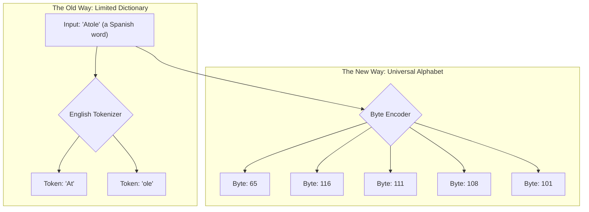

To build the next generation of AI, top researchers are ditching a flawed foundation called "tokens" and going deeper to the raw fabric of information: **bytes**. This isn't just a small change; it's a fundamental shift in how we teach machines to understand the world.

This post explains why this is happening and how we can use visualization and a branch of math called topology to find the hidden geometric structure of language.

<iframe width="100%" height="315" src="https://www.youtube-nocookie.com/embed/MlBBSUT5X3A?si=fW7NV0mClxwnxW_p" title="YouTube video player" frameborder="0" allow="accelerometer; autoplay; clipboard-write; encrypted-media; gyroscope; picture-in-picture; web-share" referrerpolicy="strict-origin-when-cross-origin" allowfullscreen></iframe>

## Why Tokens Are Holding AI Back

Most AIs today see language through a process called tokenization. You can think of it like giving the AI a fixed dictionary of about 50,000 words and word fragments.

This works fine for common English, but it fails at the edges. Rare words, scientific terms, other languages, or even simple code gets broken into awkward, meaningless pieces. It's a crutch that prevents a true understanding of the data.

The solution is to use **bytes**. Bytes are the universal alphabet for all digital information—a sequence of numbers from 0 to 255. An AI that reads bytes could process any language or data type perfectly, without a dictionary.



The challenge is that byte sequences are much longer than token sequences. To build a byte-level AI, we first need to prove that a meaningful structure exists in the raw bytes themselves.

## Seeing the Hidden Shape of Language

Let's run a simple experiment. We can take a piece of text, convert it to bytes, and plot every consecutive byte pair as an (x, y) coordinate. If the data were random, we'd see a noisy mess, like TV static.

Instead, we see a hidden galaxy of structure.

Here is an interactive plot of the byte-pairs from the first paragraph of this post. You can hover over the points to see which character pairs they represent.

```plotly
{
  "data": [
    {
      "x":,
      "y":,
      "mode": "markers",
      "type": "scatter",
      "text": ["T->o", "o-> ", " ->b", "b->u", "u->i", "i->l", "l->d", "d-> ", " ->t", "t->h", "h->e", "e-> ", " ->n", "n->e", "e->x", "x->t", "t-> ", " ->g", "g->e", "e->n", "n->e", "e->r", "r->a", "a->t", "t->i", "i->o", "o->n", "n-> ", " ->o", "o->f", "f-> ", " ->A", "A->I", "I->,", ",-> ", " ->t", "t->o", "o->p", "p-> ", " ->r", "r->e", "e->s", "s->e", "e->a", "a->r", "r->c", "c->h", "h->e", "e->r", "r->s", "s-> ", " ->a", "a->r", "r->e", "e-> ", " ->d", "d->i", "i->t", "t->c", "c->h", "h->i", "i->n", "n->g", "g-> ", " ->a", "a-> ", " ->f", "f->l", "l->a", "a->w", "w->e", "e->d", "d-> ", " ->f", "f->o", "o->u", "u->n", "n->d", "d->a", "a->t", "t->i", "i->o", "o->n", "n-> ", " ->c", "c->a", "a->l", "l->l", "l->e", "e->d", "d-> ", " ->\"", "\")->t", "t->o", "o->k", "k->e", "e->n", "n->s", "s->\"", "\")-> ", " ->a", "a->n", "n->d", "d-> ", " ->g", "g->o", "o->i", "i->n", "n->g", "g-> ", " ->d", "d->e", "e->e", "e->p", "p->e", "e->r", "r-> ", " ->t", "t->o", "o-> ", " ->t", "t->h", "h->e", "e-> ", " ->r", "r->a", "a->w", "w-> ", " ->f", "f->a", "a->b", "b->r", "r->i", "i->c", "c-> ", " ->o",", "o->f", "f-> ", " ->i", "i->n", "n->f", "f->o", "o->r", "r->m", "m->a", "a->t", "t->i", "i->o", "o->n", "n->:", ":-> ", " ->b", "b->y", "y->t", "t->e", "e->s", "s->."],
      "marker": {"size": 8, "color": "rgb(0, 153, 255)"}
    }
  ],
  "layout": {
    "title": "Byte-Pair Plot of Text",
    "xaxis": {"title": "First Byte Value"},
    "yaxis": {"title": "Second Byte Value"}
  }
}
```

This isn't random. The dense clusters, clear lines, and large empty zones prove that language has a deep geometric structure at the byte level. This is the first clue that there's a "deep grammar" in the byte-verse waiting to be decoded.

## Measuring the Unseen with Math

Knowing a shape exists is one thing; measuring its important features is another. For this, we use a mathematical tool called **Persistent Homology**.

Imagine our plot of points is a map of stars. The process works like this:
1.  We start to grow a circular "nebula" around every single star, all at the same rate.
2.  As the nebulae expand, they eventually touch and merge.
3.  Persistent homology tracks how long each separate nebula or cluster of nebulae "lives" before it gets swallowed by a bigger one.

```mermaid
graph LR
    A[Start with Points] --> B(Grow Nebulae);
    B --> C{Nebulae Merge};
    C --> D[Track Lifespans];
    D --> E[Short-Lived <br> (Noise)];
    D --> F[Long-Lived <br> (Real Structure)];
```
This technique lets us mathematically distinguish the real, "persistent" structures (the long-lived nebulae) from random noise (the short-lived ones). We can find the byte patterns that are truly fundamental.

## Blueprints for the Next AI

This topological analysis gives us a measurable "fingerprint" of text's byte structure. This allows us to form concrete hypotheses for building better, more efficient LLMs.

**The core discovery is that byte-level data has a measurable geometric structure.**
{: .notice--success}

This leads to new research directions:
-   **Hypothesis 1: Topological Grouping.** Can we replace static tokenizers with dynamic systems that group bytes based on these natural geometric clusters?
-   **Hypothesis 2: Hierarchical Models.** Can we design new AI architectures that mirror the natural hierarchy of language (bytes forming clusters, clusters forming words, etc.)?

This is the frontier of AI research. By moving beyond the convenience of tokens and analyzing the fundamental structure of raw data, we can design a new class of universal AI—one that understands any data, in any form, without ever needing a dictionary again.
