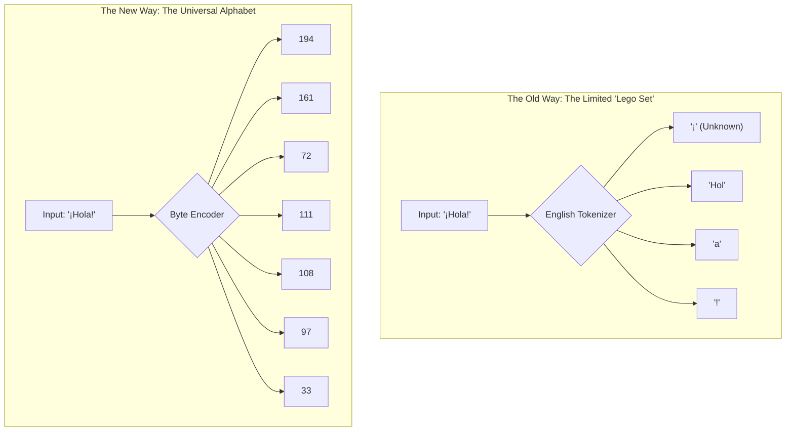
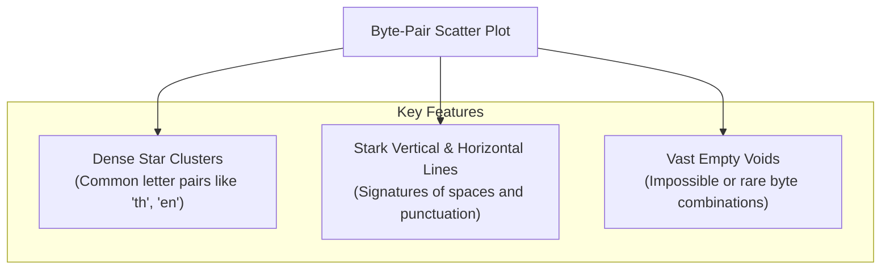
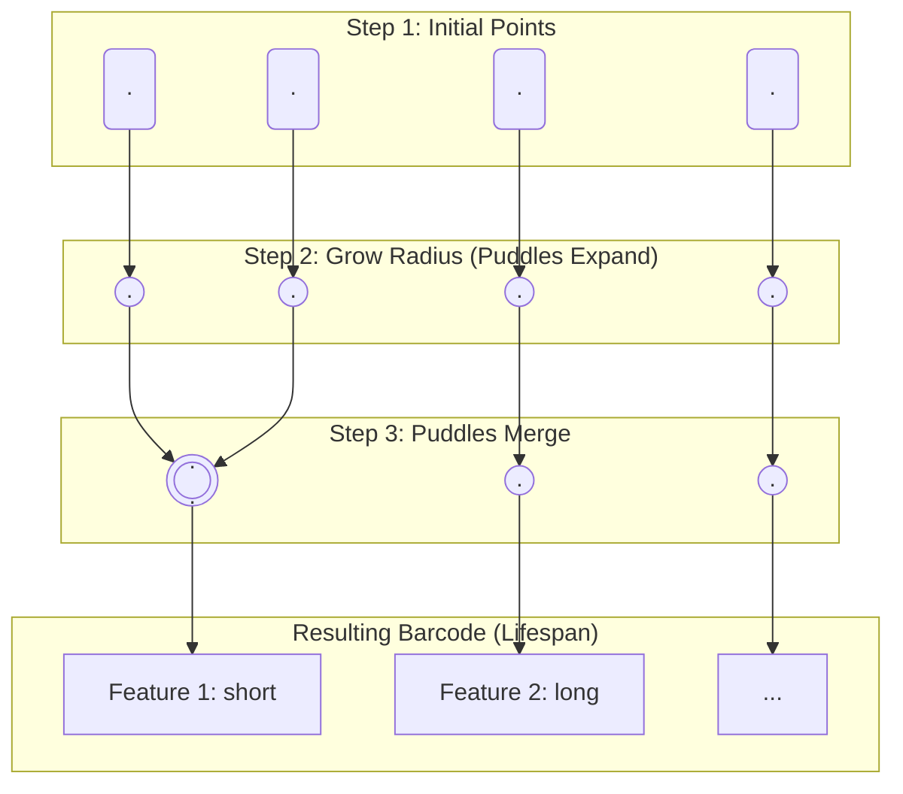
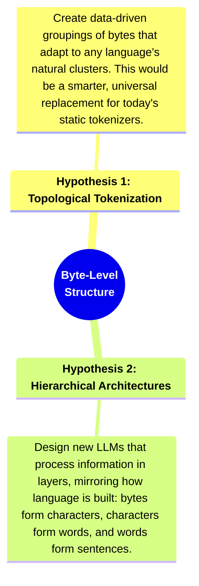

<iframe width="560" height="315" src="https://www.youtube-nocookie.com/embed/MlBBSUT5X3A?si=UMVMOSxurKrKoe_Q" title="YouTube video player" frameborder="0" allow="accelerometer; autoplay; clipboard-write; encrypted-media; gyroscope; picture-in-picture; web-share" referrerpolicy="strict-origin-when-cross-origin" allowfullscreen></iframe>

---
In the world's most advanced AI labs, a quiet revolution is underway. For years, Large Language Models (LLMs) have been built on a convenient but flawed foundation: **tokens**. But to unlock the next level of artificial intelligence, researchers are going deeper, to the raw, universal fabric of digital information—**the byte**.

This isn't just a technical tweak; it's a paradigm shift. It’s about teaching AI to read the universe in its native language. This guide is an expedition into that frontier. We will use visualization and a branch of mathematics called topology to uncover the hidden geometric structure of language and sketch a blueprint for the future of AI.

## Chapter 1: The Dictionary and the Dead End - The Limits of Tokenization

Most of today's AIs see language through a process called **tokenization**. Think of it as giving the AI a pre-made, 50,000-piece Lego set, where each piece is a common word or part of a word.

This approach is efficient for building common sentences in English. But it's fundamentally a crutch, and it's holding AI back:
*   **It's Brittle**: What happens when the AI encounters a word not in its Lego set, like a rare name or a new technical term? It panics and breaks the word into awkward, meaningless fragments.
*   **It's Biased**: Most tokenizers are designed around English and Latin scripts, making them inefficient and often biased when handling other languages.
*   **It's Inflexible**: A tokenizer for language can't understand code or musical notes. Each new data type requires a new, custom-built Lego set.

The new frontier is to use **bytes**. Bytes are the universal alphabet. Every character, in every language, is simply a sequence of numbers from 0 to 255. An AI that understands raw bytes could be truly universal.

The challenge? Byte sequences are incredibly long, and current AI architectures aren't built to handle them efficiently. To solve this, we must first prove that a deep, usable structure exists within the bytes themselves.

## Chapter 2: The First Clue - Visualizing the "Byte-Verse"

Let's run an experiment. We'll take a piece of text, convert it to bytes, and plot the consecutive byte pairs as (x, y) coordinates. If the data were random, we'd see TV static. Instead, we see something that looks like a galaxy.

**This is a profound discovery.** Language is not just a one-dimensional sequence; it has a "shape." The relationships between characters create distinct geometric patterns. We have found the first clue that there is a hidden grammar in the byte-verse, waiting to be decoded.

## Chapter 3: Mapping the Shape of Thought with Topology

Knowing a shape exists is one thing; measuring it is another. For this, we use a powerful mathematical lens called **Persistent Homology**.

Let's use an analogy. Imagine our plot of points is a field of tiny springs bubbling up from the ground.
1.  We start to slowly **let the water rise**. As the water level increases, the puddle around each spring grows.
2.  Eventually, the puddles **touch and merge**. When two puddles merge, we say the smaller one has "died," as it's now part of a larger lake.

Persistent homology tracks the "lifespan" of each puddle.
*   **Short-Lived Puddles**: These are points that merge into a nearby cluster almost instantly. They are just "noise."
*   **Long-Lived Puddles**: These are major clusters that stay separate for a long time before merging. They are the significant, "persistent" structures in our data—the great lakes of our landscape.

This technique allows us to mathematically filter out the noise and identify the byte patterns that are truly fundamental.

## Chapter 4: The Blueprint for a New AI

This deep topological analysis gives us a clear "fingerprint" of text's byte structure. It's no longer an abstract idea; it's a measurable phenomenon. This allows us to form concrete, testable hypotheses for building better, more efficient LLMs.

This is the cutting edge of AI research. By moving beyond the convenience of tokens and analyzing the fundamental, topological structure of raw data, researchers are uncovering the building blocks of language itself. The insights gained from this byte-level expedition aren't just about making current models better; they're about designing a new class of universal AI that can understand any data, in any modality, without ever needing a dictionary again.
