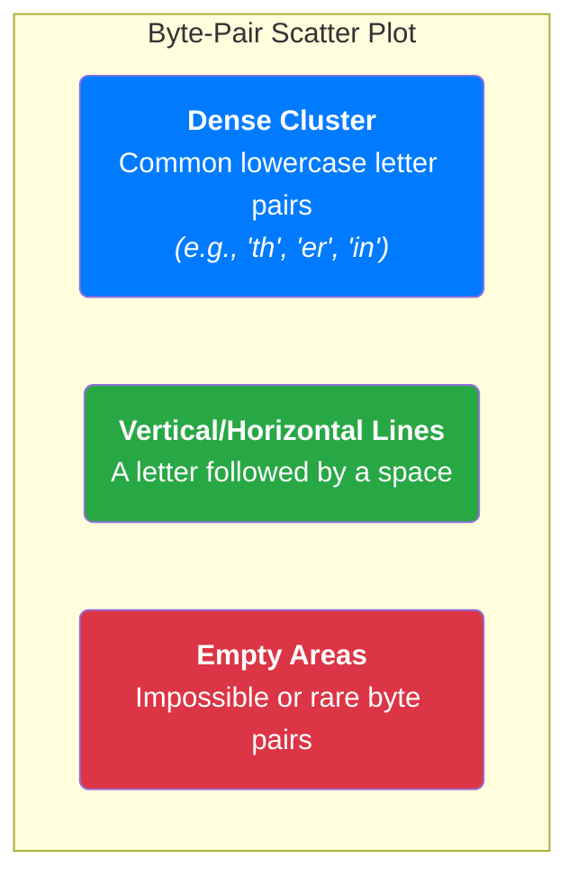
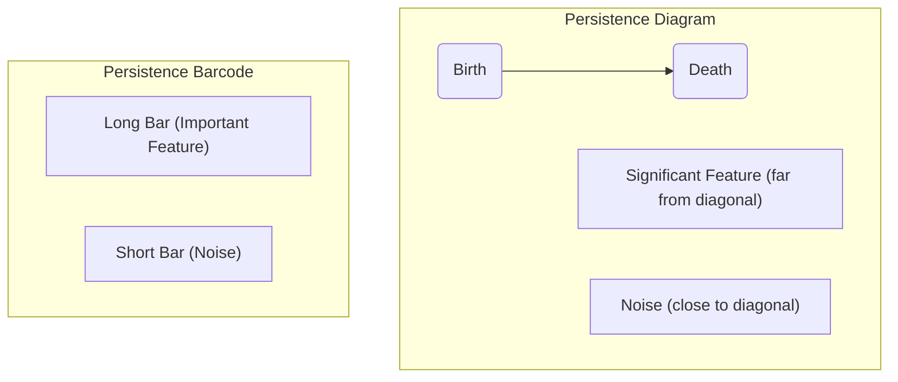

<iframe width="500" height="300" src="https://www.youtube-nocookie.com/embed/MlBBSUT5X3A?si=EQG7TDtX_Meuj9fK" title="YouTube video player" frameborder="0" allow="accelerometer; autoplay; clipboard-write; encrypted-media; gyroscope; picture-in-picture; web-share" referrerpolicy="strict-origin-when-cross-origin" allowfullscreen></iframe>

---

You've probably interacted with Large Language Models (LLMs) like ChatGPT. They seem to understand language, but under the hood, they don't see words or sentences. They see **tokens**. For years, this has been the standard, but it has limitations. Now, top AI labs like Google DeepMind and OpenAI are exploring a more fundamental level of data that could change everything: **raw bytes**.

This guide will take you on a research journey to understand why this is such a big deal. We'll start with a simple question and use data visualization and advanced math—explained simply—to uncover the hidden structure of language and discover how the next generation of AI might be built.

## Chapter 1: The Problem with Tokens (And Why Bytes Are the Future)

When you give an LLM a sentence, it first breaks it down into pieces called tokens. Think of tokens as a special set of Lego bricks.

*   **Tokens are like Lego Bricks**: You might have a brick for `the`, another for `cat`, and a special one for `ing`. It's efficient because you can build common words quickly. But what if you need a rare word or a new one? You might not have the right brick, so you have to approximate. This is why LLMs sometimes struggle with specific names, technical jargon, or multiple languages.

Now, imagine building with raw clay instead of Lego bricks.

*   **Bytes are like Raw Clay**: Bytes are the universal atoms of all digital information. Every character, every pixel, every sound is made of bytes (numbers from 0 to 255). Using bytes, you could represent *any* text, in *any* language, perfectly. No more missing pieces. An LLM trained on bytes could be truly universal.

So why don't we already do this? Because a single character can be one or more bytes, a text becomes a *much* longer sequence. For current AI architectures (Transformers), longer sequences mean exponentially higher computational costs.

To solve this, we first need to understand if there's a hidden structure in byte data that we can use.

## Chapter 2: The Experiment - Can We "See" Language in Bytes?

Let's run a simple experiment to see what text looks like at the byte level.

**The Process:**
1.  **Take Text**: We'll grab a 500-character snippet of text.
2.  **Convert to Bytes**: We convert each character into its numerical byte value (a number from 0-255). This gives us a long list of numbers.
3.  **Create Coordinates**: We group the numbers into pairs. The first and second byte become point (x1, y1), the third and fourth become (x2, y2), and so on.
4.  **Plot the Points**: We plot these pairs on a 2D graph.

If language were random, the dots would be scattered like static on a TV screen. But this is what we get:

**The "Aha!" Moment**: The data isn't random at all! It's highly structured. Common English text lives in very specific "neighborhoods" of the byte space. This proves there are deep patterns we can analyze.

## Chapter 3: Seeing the "Shape" of Language with Topology

Now that we know there's a structure, how can we describe its shape? For this, we use a powerful mathematical tool called **Persistent Homology**.

Don't worry about the name. The concept is intuitive.

Imagine our scatter plot of byte-pairs is a set of islands in an ocean. We're going to slowly raise the water level. As the water rises, the islands get bigger. When the shores of two islands touch, they merge into one larger island.

Persistent homology tracks two key events for each island:
*   **Birth**: The moment an island appears (at water level 0).
*   **Death**: The moment an island merges with a larger one and loses its separate identity.

The **persistence** of an island is its lifespan (`Death - Birth`). Islands that "live" for a long time before merging are like significant mountain ranges. Islands that merge instantly are like tiny, insignificant hills.

This tells us which clusters of data are truly distinct and important.

## Chapter 4: Decoding the Results

This topological analysis gives us a "fingerprint" of our text's byte structure, often shown in two key charts:

1.  **Persistence Diagram**: This chart plots the "death" of each feature against its "birth."
    *   **Points near the diagonal line** are the "tiny hills"—noise that appeared and disappeared quickly.
    *   **Points far from the diagonal** are the "mountain ranges"—structurally important features that persisted for a long time. These are the patterns we care about.

2.  **Persistence Barcode**: This shows the same information in a different way. Each bar represents one feature, and its length shows how long it "lived."

These charts give us a mathematical way to identify the most important byte-level patterns in any text.

## Chapter 5: The Grand Vision - Building Better LLMs

This deep analysis isn't just a math exercise. It lets us form concrete hypotheses for building the next generation of AI.

#### **Hypothesis 1: Find Better Ways to Group Bytes**
Our analysis shows that text creates natural, clustered groups in the byte space. Current tokenizers use fixed rules, but what if we could create a dynamic "tokenizer" that learns to group bytes based on these natural topological structures? This could be far more efficient and adaptable to any language.

#### **Hypothesis 2: Create Hierarchical Models**
We saw that byte structures are hierarchical (e.g., lowercase letters form one big cluster, uppercase another). This mirrors the structure of language itself: `characters -> words -> sentences`. What if we designed LLMs with a hierarchical architecture that processes data in the same way? The model could learn low-level features (like characters) in its early layers and build up to high-level concepts (like sentences and ideas) in its later layers.

This is the frontier of AI research. By moving beyond the convenience of tokens and daring to analyze the fundamental, topological structure of raw data, researchers are uncovering the building blocks of language. This approach promises not just more efficient models, but a new class of universal AI that can understand any data, in any modality, without ever needing a tokenizer again.
