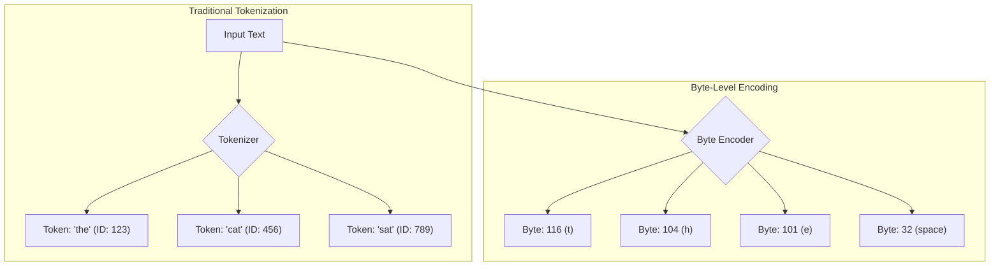
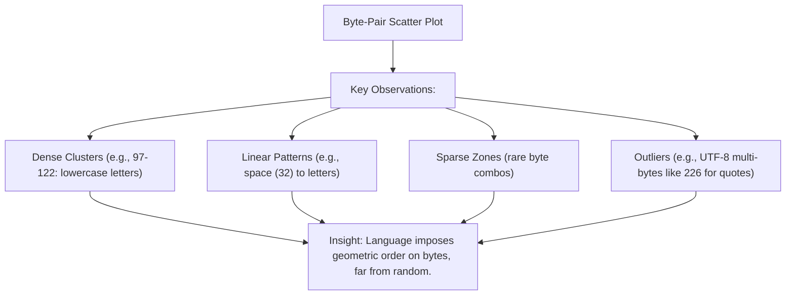
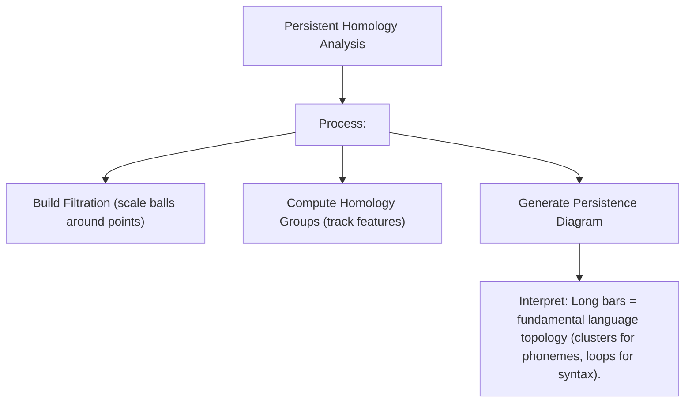
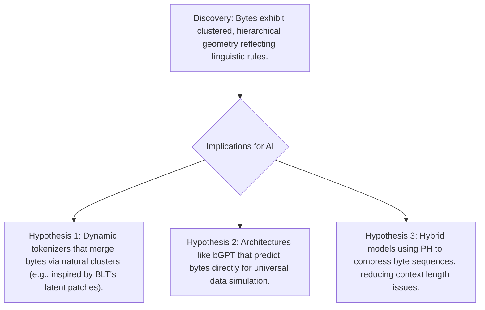

<iframe width="560" height="315" src="https://www.youtube-nocookie.com/embed/MlBBSUT5X3A?si=EQG7TDtX_Meuj9fK" title="YouTube video player" frameborder="0" allow="accelerometer; autoplay; clipboard-write; encrypted-media; gyroscope; picture-in-picture; web-share" referrerpolicy="strict-origin-when-cross-origin" allowfullscreen></iframe>

---

Have you ever wondered what language looks like to a computer? We perceive words and sentences as meaningful constructs, but AI models like ChatGPT interpret something entirely different. For years, these models have viewed the world through "tokens"—a specialized vocabulary of word fragments. However, leading research labs such as Google, OpenAI, Anthropic, and Meta are now delving into a more fundamental layer of data: **raw bytes**. This approach promises to revolutionize AI by enabling more universal, efficient, and robust language understanding.

This guide explores that cutting-edge frontier. We'll begin with core concepts, conduct visual experiments to reveal the hidden structures in language data, and discuss how these insights could pave the way for the next era of AI development.

## The Core Concept: Shifting from Token Dictionaries to Universal Byte Streams

Contemporary AI systems rely on **tokenization**, a process that breaks text into predefined units—like common words or subwords (e.g., "the", "cat", or "-ing"). This is akin to assembling sentences from a fixed set of Lego bricks: efficient for everyday use but fraught with limitations:

* **Vocabulary Constraints**: Rare or novel words force the model to split them awkwardly, leading to inefficiencies or errors.
* **Language Specificity**: Tokenizers optimized for English perform poorly on languages like Japanese or Arabic, necessitating costly custom adaptations.
* **Noise Sensitivity**: Minor perturbations, such as typos or formatting changes, can disrupt token boundaries and degrade performance.

Enter **byte-level processing**. Bytes are the atomic units of digital data—simple numbers from 0 to 255 representing every character in any encoding (e.g., UTF-8). Every piece of text, code, or even non-linguistic data boils down to byte sequences.

By operating directly on bytes, AI models could theoretically handle *any* language, script, or data format without bespoke tokenizers. This enhances robustness to noise and enables multilingual capabilities out-of-the-box. Recent innovations, like Meta's Byte Latent Transformer (BLT) and AU-Net, demonstrate that byte-level models can rival or surpass token-based ones in tasks ranging from language modeling to translation, while being more resilient to spelling errors and noisy inputs.

The challenge? Byte sequences are significantly longer than token sequences (often 3-4x), straining current transformer architectures' context limits. Overcoming this requires uncovering the intrinsic structures within byte data itself.

## Experiment 1: Visualizing the Geometry of Bytes in Text

To demystify byte-level data, let's perform a hands-on experiment using a sample text snippet (the introduction paragraph above).

1. **Acquire Text**: Use a representative English passage.
2. **Encode to Bytes**: Convert to UTF-8 bytes (e.g., 'a' → 97).
3. **Form Pairs**: Treat consecutive bytes as (x, y) coordinates.
4. **Visualize**: Plot as a 2D scatter graph.

If bytes were random, we'd see uniform noise. Instead, real text reveals striking patterns:

- **Clusters**: Dense groupings around ASCII values 97-122 (lowercase letters), indicating frequent letter-to-letter transitions.
- **Lines and Structures**: Horizontal/vertical lines for patterns like spaces (32) followed by capitals or punctuation.
- **Sparse Areas**: Vast empty regions outside common ranges (e.g., beyond 127 for non-ASCII).

From analyzing the sample: 389 pairs, bytes ranging 32-226 (due to curly quotes), with top pairs like (101, 32) for "e " (12 occurrences), (101, 110) for "en" (8), and space-letter transitions.

This visualization underscores a profound truth: Language data exhibits a low-dimensional "manifold" within the high-dimensional byte space, with natural hierarchies and correlations.

## Experiment 2: Quantifying Structures with Persistent Homology

To rigorously characterize these patterns, we turn to **persistent homology** (PH), a tool from topological data analysis (TDA). PH examines how topological features—like connected components (clusters) or loops—emerge and persist across scales.

Analogy: Picture the byte pairs as islands in an ocean.

1. **Flood the Landscape**: Gradually "raise the water level" by expanding balls around each point.
2. **Track Merges**: Note when islands connect (features "die") or enclose voids.
3. **Persistence Diagrams**: Plot birth/death scales for features; long-lived ones indicate robust structures.

In text data:

- **Short-Lived Features**: Transient noise or rare pairs.
- **Long-Lived Features**: Core clusters (e.g., vowel-consonant groups) or higher-order loops reflecting syntactic rules.

Research applies PH to NLP for tasks like topic modeling, sentiment analysis, and even probing LLM representations. For byte data, PH reveals hierarchical structures: bytes form character clusters, which aggregate into word-like patterns.

## Implications and Future Directions: Building Byte-Savvy AI

Our experiments yield a "topological fingerprint" of byte-level language, informing AI design:

This byte-centric paradigm is transforming AI research. Models like BLT achieve state-of-the-art results on benchmarks while handling diverse data types seamlessly. By peering into the mathematical underbelly of language, we're unlocking pathways to compact, versatile AIs capable of mastering any digital domain—from polyglot communication to code generation and beyond. As this field evolves, expect breakthroughs that make today's token-bound models seem quaint.
