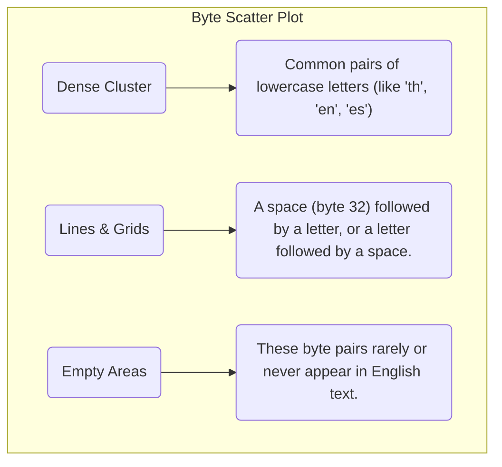
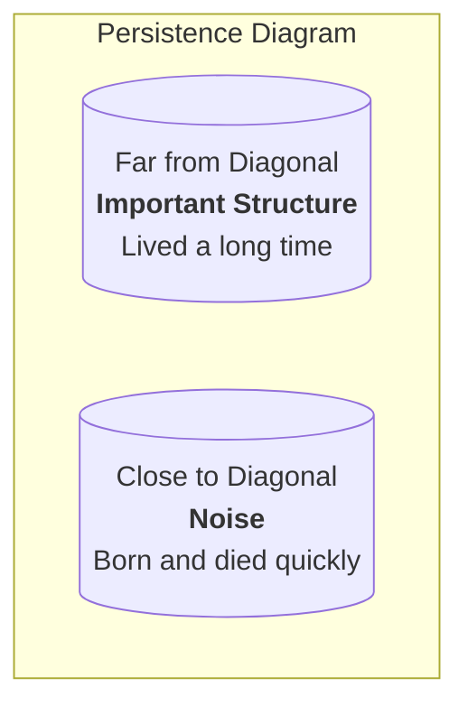

<iframe width="560" height="315" src="https://www.youtube-nocookie.com/embed/MlBBSUT5X3A?si=EQG7TDtX_Meuj9fK" title="YouTube video player" frameborder="0" allow="accelerometer; autoplay; clipboard-write; encrypted-media; gyroscope; picture-in-picture; web-share" referrerpolicy="strict-origin-when-cross-origin" allowfullscreen></iframe>

Have you ever wondered how AI models like ChatGPT can understand language so well? The secret lies in how they see the world. Currently, most models don't read words; they read "tokens." But top AI labs are exploring a deeper, more fundamental level of data that could unlock the next generation of AI: **raw bytes**.

This is the story of that exploration. We'll start with a simple question and use visual analysis to uncover a hidden structure in data, leading us to powerful new ideas for building smarter, more efficient AI.

### The Challenge: Why Not Just Use Bytes?

Every piece of digital information—text, images, sound—is ultimately just a sequence of bytes. A byte is a number between 0 and 255. Using bytes directly would create a truly universal language for AI.

So why don't we? Because byte sequences are incredibly long. A modern LLM's attention mechanism scales quadratically, meaning a sequence that's 10 times longer is **100 times harder** to process. Training on raw bytes is computationally impossible with today's technology.

To solve this, we can't just build bigger computers. We need to be smarter. We need to understand the *structure* of byte data first.

## Step 1: Visualizing the Unseen - The Byte Scatter Plot

Our journey begins with a simple experiment. Let's take a piece of text and turn it into a picture to see if we can find any patterns.

1.  **Convert Text to Numbers**: We take every character in a text and convert it to its byte value (a number from 0-255).
2.  **Create Coordinates**: We group the byte numbers into pairs. The first two numbers become point (x, y), the next two become the next point, and so on.
3.  **Plot the Points**: We draw these points on a 2D graph.

If text were random noise, the dots would look like TV static, scattered evenly everywhere. But when we plot real text, we see this:

**The first "Aha!" moment:** The data isn't random at all. It has a hidden shape. English text lives in specific "neighborhoods" in the vast universe of all possible byte combinations. This structure is our first clue.

## Step 2: A New Tool for a Deeper Look - Persistent Homology

The scatter plot shows us there are clusters, but it doesn't tell us much about their shape or importance. For that, we need a more advanced tool from a field of math called topology. The tool is called **Persistent Homology**.

Don't let the name scare you. The concept is incredibly intuitive.

Imagine each point in our scatter plot is a tiny island. We're going to slowly raise the sea level. As the water rises, islands that are close to each other will merge into larger landmasses.

Persistent Homology tracks two key events:
*   **Birth**: When an island first appears (or when two islands merge to form a brand new, bigger one).
*   **Death**: When an island gets completely swallowed by a larger, older one.

The **persistence** of an island is its lifespan (`Death` - `Birth`). Islands that survive for a long time before being swallowed are structurally important. Islands that appear and are immediately swallowed by a neighbor are just noise.

This gives us two powerful new ways to visualize our data's "shape."

### The Lifespan Chart (Persistence Diagram)

This chart plots the birth time versus the death time for every "island" (or cluster) in our data.

### The Importance Ranking (Persistence Barcode)

This is the easiest way to see what matters. It's the same information as the diagram, but shown as bars. Each bar is the lifespan of a feature.

**Long bars represent the most important, persistent structures in our data.**

## Step 3: The Payoff - New Ideas for Building AI

This deep, topological analysis isn't just a math exercise. It's a roadmap that allows us to form concrete, testable hypotheses about how to build better and more efficient LLMs.

**Hypothesis 1: Byte Frequency Manifolds**
*   **The Idea**: What if the clusters we see are not just blobs, but have specific shapes (manifolds) that correspond to linguistic concepts like "vowels" or "punctuation"?
*   **The Goal**: If we can identify these core shapes, we could create incredibly efficient ways to represent language, far better than current tokenizers.

**Hypothesis 2: Cross-Lingual Topological Invariants**
*   **The Idea**: What if every language has its own unique topological "fingerprint" in the byte space? The clusters for English will look different from those for Mandarin or Arabic.
*   **The Goal**: We could use these signatures to build a truly universal, tokenizer-free model that understands the fundamental structure of any language it sees, simply by analyzing its byte patterns.

**Hypothesis 3: Hierarchical Byte Structures**
*   **The Idea**: The analysis shows that some clusters are small and tight, while others are broad and sparse. This suggests a natural hierarchy, just like in language (characters -> morphemes -> words).
*   **The Goal**: We could design a new LLM architecture that processes bytes in a hierarchical way, allowing it to learn these linguistic levels naturally instead of being forced to guess them from a flat sequence of tokens.

This is the frontier of AI research. By moving beyond surface-level tokens and analyzing the fundamental, topological structure of raw data, we can uncover the building blocks of language itself. This journey from a simple scatter plot to deep topological insights shows us the path toward creating the next generation of truly intelligent systems.
