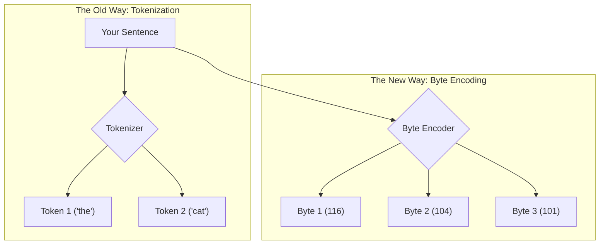
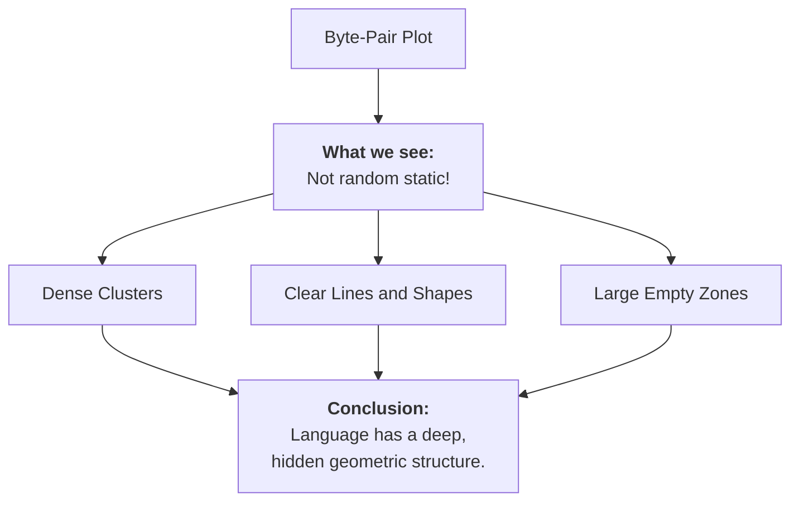
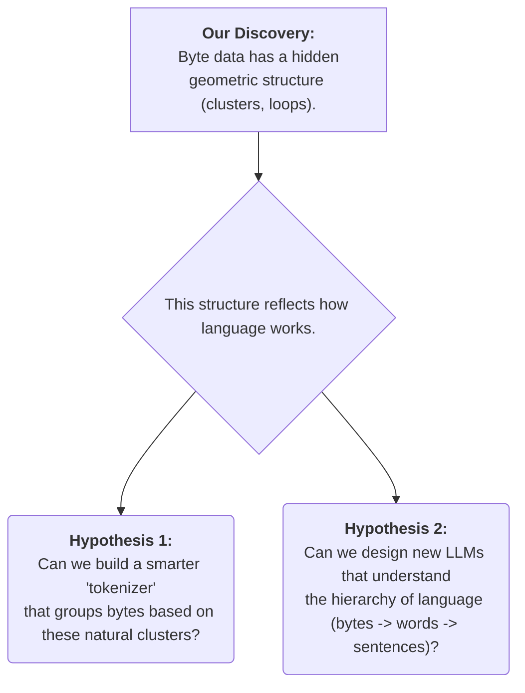

<iframe width="560" height="315" src="https://www.youtube-nocookie.com/embed/MlBBSUT5X3A?si=EQG7TDtX_Meuj9fK" title="YouTube video player" frameborder="0" allow="accelerometer; autoplay; clipboard-write; encrypted-media; gyroscope; picture-in-picture; web-share" referrerpolicy="strict-origin-when-cross-origin" allowfullscreen></iframe>

---

Have you ever wondered what language looks like to a computer? We see words and sentences, but AI models like ChatGPT see something different. For years, they've seen the world through "tokens"—a sort of specialized vocabulary. But top labs at Google, OpenAI, and Anthropic are now exploring a deeper, more fundamental level of data that could unlock the next generation of AI: **raw bytes**.

This is a guide to that frontier. We'll start with a simple idea, use visual experiments to uncover the hidden structure of language, and explore how this knowledge could be used to build smarter, more efficient AI.

## The Big Idea: From a Clunky Dictionary to a Universal Language

Most of today's AIs use a process called **tokenization**. Think of it like giving the AI a big box of Lego bricks, where each brick is a common word or part of a word (like `the`, `cat`, or `-ing`). This is efficient for building common sentences, but it has problems:
*   **Limited Vocabulary**: What if you need a word that's not in the box? The AI has to improvise, often poorly.
*   **Language Barriers**: A tokenizer built for English won't work for Japanese. Each language needs its own custom, expensive set of "Lego bricks."

The new idea is to use **bytes**. Bytes are the universal atoms of all digital information. Every character you're reading right now is just a sequence of numbers from 0 to 255.

An AI that understands raw bytes could, in theory, understand *any* language or data type without needing a special dictionary. The problem? Byte sequences are very long, and current AI architectures struggle with them. To solve this, we must first find a hidden structure in the bytes themselves.

## Our First Experiment: Can We "See" Language in Bytes?

Let's run an experiment to visualize what text looks like at the byte level.

1.  **Take Text**: We'll grab a snippet of text from a dataset.
2.  **Convert to Bytes**: Each character becomes a number (e.g., 'a' becomes 97).
3.  **Create Coordinates**: We group the numbers into pairs. The first and second bytes become point (x, y), the third and fourth become the next point, and so on.
4.  **Plot the Points**: We plot these pairs on a 2D graph.

If language were random, the graph would look like TV static. But it doesn't. It looks like this:

**This is a huge discovery!** It proves that language isn't just a sequence; it has a "shape." The way characters follow each other creates distinct patterns. For example, a dense cluster might represent all the common pairs of lowercase letters, while a straight line might represent a letter followed by a space.

## A Deeper Look: Finding the "Mountains" in the Data

Now that we know there's a shape, we need a way to measure it. For this, we use a powerful mathematical tool called **Persistent Homology**.

Let's use an analogy. Imagine our plot of points is a group of islands.
1.  We start to slowly **grow a circle** around every single island at the same time.
2.  As the circles expand, they eventually **touch and merge**. When two islands merge, we consider the smaller one to have "died," as it's now part of a larger continent.

Persistent homology tracks the "lifespan" of each island.
*   **Short-Lived Islands**: These are points that merge into a nearby cluster almost instantly. They are just "noise."
*   **Long-Lived Islands**: These are major clusters that stay separate for a long time before merging. They are the significant, "persistent" structures in our data—the mountain ranges of our map.

This tells us which byte patterns are truly fundamental and which are just random fluff.

## The Final Clues: What This Research Tells Us

This analysis gives us a clear "fingerprint" of our text's byte structure. We can now form concrete, testable ideas for building better AI.

This is the frontier of AI research. By looking past the surface level of words and tokens, researchers are starting to understand the deep, mathematical patterns that form the foundation of language. The insights we gain from this byte-level analysis could be the key to creating smaller, faster, and truly universal AI models that can understand any language or data type thrown their way.
