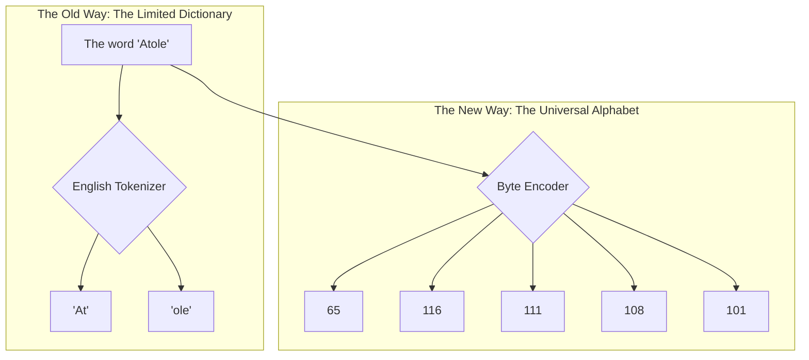
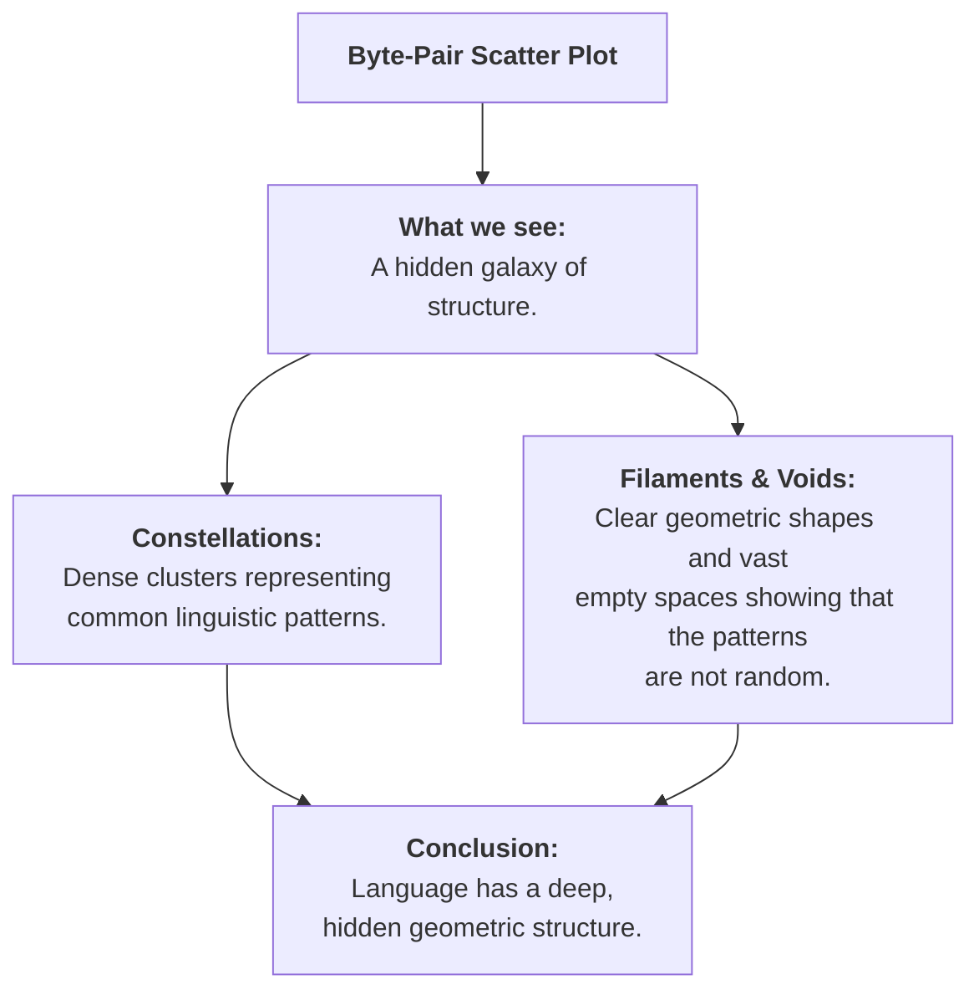
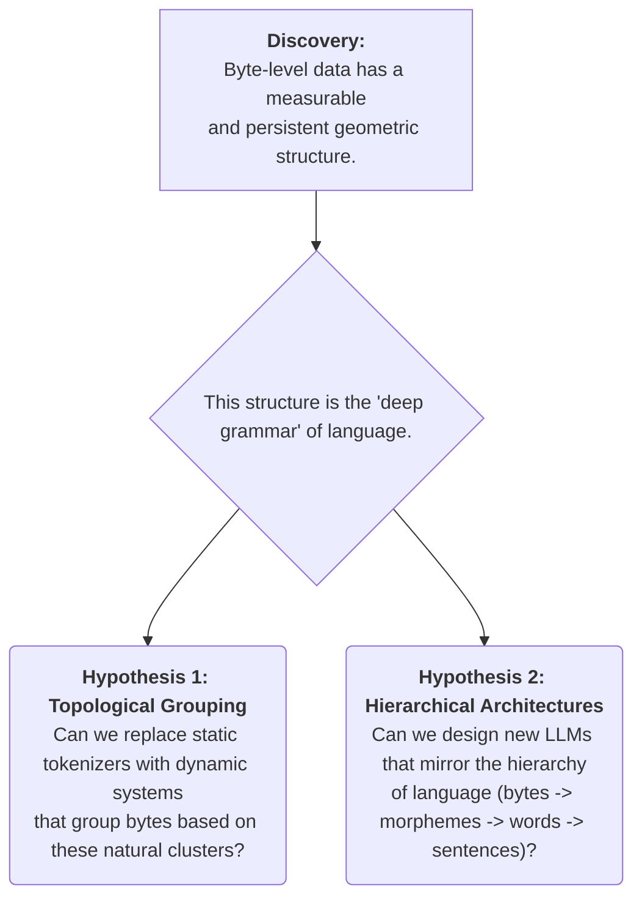

<iframe width="500" height="300" src="https://www.youtube-nocookie.com/embed/MlBBSUT5X3A?si=UMVMOSxurKrKoe_Q" title="YouTube video player" frameborder="0" allow="accelerometer; autoplay; clipboard-write; encrypted-media; gyroscope; picture-in-picture; web-share" referrerpolicy="strict-origin-when-cross-origin" allowfullscreen></iframe>

---
In the world's most advanced AI labs, a quiet revolution is underway. For years, Large Language Models (LLMs) have been built on a convenient but flawed foundation: **tokens**. But to unlock the next level of artificial intelligence, researchers are going deeper, to the raw, universal fabric of digital information—**the byte**.

This isn't just a technical tweak; it's a paradigm shift. It’s about teaching AI to read the universe in its native language. This guide is an expedition into that frontier. We will use visualization and a branch of mathematics called topology to uncover the hidden geometric structure of language and sketch a blueprint for the future of AI.

## Chapter 1: The Flaw in the Foundation - Tokens vs. Bytes

Most of today's AIs see language through a process called **tokenization**. Think of it as giving the AI a curated, pre-approved dictionary.

*   **Tokens are a Dictionary**: The AI has a "word" for `cat`, another for `house`, and maybe one for `running`. This is efficient for common language. But what about rare words, scientific terms, or different languages? The dictionary is incomplete. The AI is forced to guess, often breaking words into awkward fragments. It’s a crutch.

The new frontier is to use **bytes**. Bytes are the universal alphabet of digital information. Every character, in every language, is simply a sequence of numbers from 0 to 255.

An AI that understands raw bytes could be truly universal, capable of processing any language or data type flawlessly. The challenge is that byte sequences are incredibly long, and current AI architectures aren't built to handle them efficiently. To solve this, we must first prove that a deep, usable structure exists within the bytes themselves.

## Chapter 2: The First Glimpse - Visualizing the Byte-Verse

Let's run a simple experiment. We will take a piece of text, convert it to bytes, and plot the consecutive byte pairs as (x, y) coordinates. If the data were random, we'd expect to see TV static.

Instead, we see this:

This is a profound discovery. Language is not just a one-dimensional sequence; it has a "shape." The relationships between characters create distinct geometric patterns. We have found the first clue that there is a hidden grammar in the byte-verse, waiting to be decoded.

## Chapter 3: Mapping the Unseen - A New Kind of Geometry

Knowing a shape exists is one thing; measuring it is another. For this, we use a powerful mathematical lens called **Persistent Homology**.

Let's use an analogy. Imagine our plot of points is a star chart.
1.  We start to slowly **grow a nebula** around every single star at the same time.
2.  As the nebulae expand, they eventually **touch and merge**. When two nebulae merge, we say the smaller one has "died," as it's now part of a larger galactic cluster.

Persistent homology tracks the "lifespan" of each nebula.
*   **Short-Lived Nebulae**: These are stars that merge into a nearby cluster almost instantly. They are just "local noise."
*   **Long-Lived Nebulae**: These are major star clusters that stay separate for a long time before merging. They are the significant, "persistent" structures in our data—the superclusters of our universe.

This technique allows us to mathematically distinguish the mountains from the molehills, finding the byte patterns that are truly fundamental.

## Chapter 4: The Expedition's Findings - Blueprints for Future AI

This deep topological analysis gives us a clear "fingerprint" of text's byte structure. It's no longer an abstract idea; it's a measurable phenomenon. This allows us to form concrete, testable hypotheses for building better, more efficient LLMs.

This is the cutting edge of AI research. By moving beyond the convenience of tokens and analyzing the fundamental, topological structure of raw data, researchers are uncovering the building blocks of language itself. The insights gained from this byte-level expedition aren't just about making current models better; they're about designing a new class of universal AI that can understand any data, in any modality, without ever needing a dictionary again.
