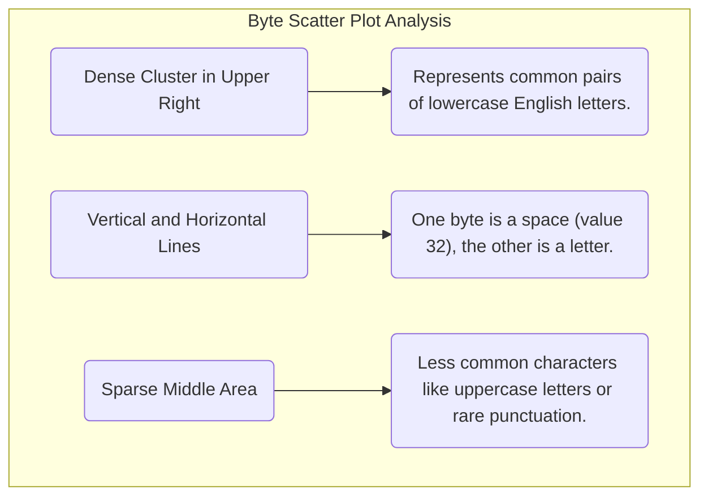
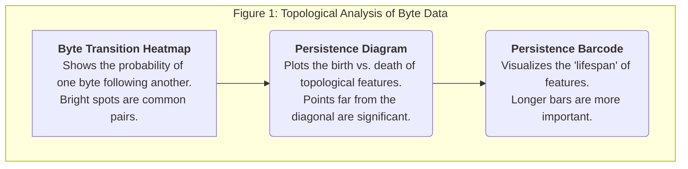

<iframe width="560" height="315" src="https://www.youtube.com/embed/9M_Kjt8I31A" title="YouTube video player" frameborder="0" allow="accelerometer; autoplay; clipboard-write; encrypted-media; gyroscope; picture-in-picture" allowfullscreen></iframe>

What if the secret to the next generation of Large Language Models (LLMs) isn't in complex tokenizers, but in the raw data itself? Top AI labs at Google DeepMind, OpenAI, and Anthropic are exploring a fundamental shift: training models directly on bytes.

The digital world runs on bytes, not tokens. By feeding raw byte sequences to an LLM, we could create a truly universal model that handles any language or data modality without a tokenizer. The problem? Byte sequences are incredibly long, and the computational cost for transformers scales quadratically with sequence length. A model trained on raw bytes would be impossibly slow and expensive.

This is where real AI research begins. To solve this, we must first understand the hidden structure of byte-level data. This guide will take you on an open-source research journey, using visual and topological analysis to uncover these patterns and form hypotheses that could shape the future of LLMs.

## Step 1: From Text to a Visual Universe of Bytes

Our first step is to see what raw text data actually looks like. We'll take a simple piece of text, convert every character into its raw byte value, and then visualize it.

### The Process:
1.  **Take Text**: We start with a sample of text. For this, we'll use the `cosmopedia` dataset from Hugging Face.
2.  **Convert to Bytes**: Every character is converted to its corresponding byte, which is just a number between 0 and 255. A 500-character string becomes a list of 500 numbers.
3.  **Create Coordinates**: We group these numbers into consecutive pairs. The first two bytes become point (x1, y1), the next two become (x2, y2), and so on.
4.  **Plot the Points**: We plot these (x, y) coordinates on a 2D scatter plot.

```python
import matplotlib.pyplot as plt
from datasets import load_dataset
import numpy as np

# 1. Load a document from the dataset
dataset = load_dataset("huggingface/smollm-corpus", "cosmopedia-v2", split="train")
text = next(iter(dataset))['text'][:500] # Take the first 500 characters

# 2. Convert text to a sequence of bytes
text_bytes = text.encode('utf-8')

# 3. Create (x, y) coordinate pairs from consecutive bytes
x_coords = text_bytes[0::2] # Every even-indexed byte
y_coords = text_bytes[1::2] # Every odd-indexed byte

# Ensure both lists are the same length
min_len = min(len(x_coords), len(y_coords))
x_coords, y_coords = x_coords[:min_len], y_coords[:min_len]

# 4. Create the plot
plt.figure(figsize=(10, 8))
plt.scatter(x_coords, y_coords, alpha=0.6)
plt.title('Text Bytes as 2D Coordinates')
plt.xlabel('X Coordinate (Byte Value)')
plt.ylabel('Y Coordinate (Byte Value)')
plt.grid(True)
plt.show()
```

### What We See
If the text were random noise, the dots would be scattered evenly everywhere. But they're not. We see clear, structured patterns.


This simple visualization proves that **byte-level data has a distinct, non-random structure**. Our text data lives in specific "neighborhoods" within the vast 256x256 byte space. This is a crucial first insight.

## Step 2: Uncovering Deeper Structure with Topology

Now that we know there's a structure, we need a more powerful tool to analyze its shape. This is where **Persistent Homology**, a technique from topological data analysis, comes in.

Don't let the name intimidate you. The idea is simple:

Imagine each point on our scatter plot is a tiny island. We're going to slowly increase the radius of a circle around every island. As the circles grow, they start to touch and merge, connecting the islands into larger landmasses (or "components").

Persistent homology tracks two key events:
*   **Birth**: When a new, separate component is formed.
*   **Death**: When a component merges with an older, larger one and ceases to exist as a separate entity.

The **persistence** of a component is its lifespan (Death radius - Birth radius). Features that persist for a long time are structurally significant, while those that appear and disappear quickly are likely just noise.

## Step 3: Interpreting the Topological Fingerprint

This analysis gives us three powerful visualizations of our data's structure.



1.  **Byte Transition Heatmap**: This shows which byte pairs are most common. The y-axis is the current byte, and the x-axis is the next byte. Bright yellow spots show high-probability transitions (e.g., after the byte for 'q', the byte for 'u' is very likely). This reveals the low-level grammar of the language.

2.  **Persistence Diagram**: This is the core of the analysis. Each point represents a connected component.
    *   **Birth (x-axis)**: The connection radius when the component first appeared.
    *   **Death (y-axis)**: The radius when it merged into a larger component.
    *   **The Diagonal Line**: Points close to this line represent noise—features that were born and died almost instantly.
    *   **Points far from the diagonal** are the most important. These are "islands" or clusters that remained distinct for a long time before being absorbed. They represent significant, persistent structures in the data.

3.  **Persistence Barcode**: This is another way to view the same information. Each bar represents a feature.
    *   The start of the bar is its "birth."
    *   The end of the bar is its "death."
    *   **Long bars are the most structurally important features** in our data. They correspond to the points far from the diagonal in the persistence diagram.

## Step 4: Forming Hypotheses for the Future of LLMs

This deep analysis of byte-level structure isn't just an academic exercise. It allows us to form concrete, testable hypotheses about how to build better, more efficient LLMs.

Based on our findings, an AI research assistant might propose the following:

**Hypothesis 1: Byte Frequency Manifolds**
*   **Statement**: Bytes form low-dimensional shapes (manifolds) in a high-dimensional space, and these shapes correspond to linguistic structures like vowels, consonants, and punctuation.
*   **Idea**: If we can identify these core shapes, we can create much more efficient embeddings that capture the essence of language at the byte level.

**Hypothesis 2: Cross-Lingual Topological Invariants**
*   **Statement**: Different languages and scripts will have their own unique topological signatures (different clusters and shapes in the byte space).
*   **Idea**: We could use these signatures to build a tokenizer-free model that understands the fundamental structure of any language it sees, simply by analyzing its byte patterns.

**Hypothesis 3: Hierarchical Byte Structures**
*   **Statement**: Bytes naturally organize into a hierarchy that mirrors how language is built: characters form morphemes, morphemes form words.
*   **Idea**: We could design a new kind of LLM architecture that processes bytes in a hierarchical way, allowing it to learn these linguistic levels naturally instead of being forced to guess them from flat token sequences.

This is the frontier of AI research. By moving beyond surface-level tokens and analyzing the fundamental, topological structure of raw data, we can uncover the building blocks of language and design the next generation of truly intelligent systems.
