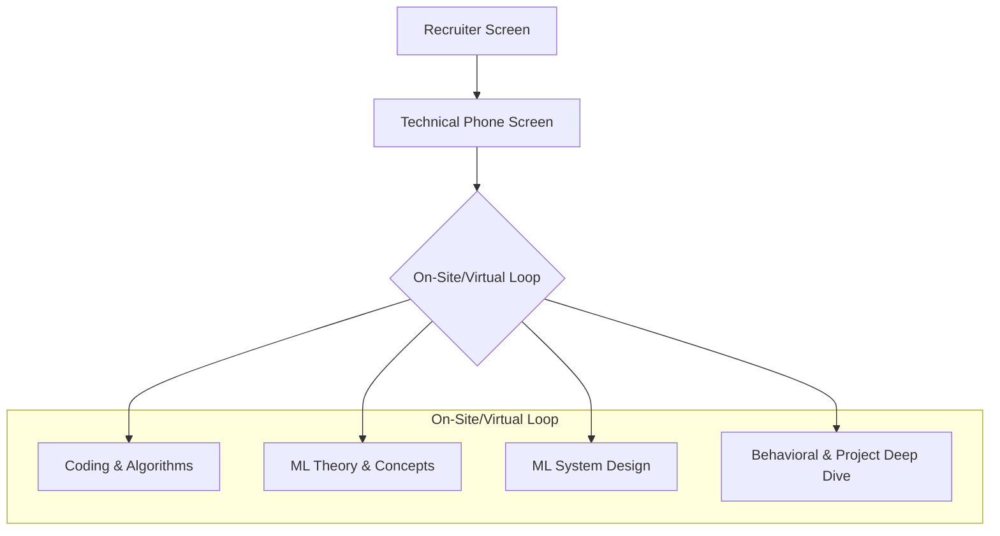

The machine learning and AI interview is a multifaceted challenge designed to test your entire problem-solving process. It evaluates not just what you know, but how you think, communicate, and apply your knowledge to solve practical, often ambiguous, problems.

This comprehensive guide breaks down every component of the modern ML/AI interview loop. We will move beyond simple definitions into the frameworks and thought processes that interviewers are looking for. Our goal is to equip you with the structure, key concepts, and practical "cheats" to confidently demonstrate your expertise.

## The Interview Mindset: It's a Collaboration

Before diving into the technical details, it's crucial to adopt the right mindset. An interview is not a test where you silently work toward a single correct answer.

**The interview is a collaborative problem-solving session.**

Your interviewer wants to see how you work. This means you should:
-   **Think Out Loud:** Verbalize your thought process. Explain your assumptions, why you're choosing a certain approach, and what you're considering next.
-   **Ask Clarifying Questions:** Never assume. When given a problem, start by asking questions to narrow the scope and understand the constraints. This is a key skill for any engineer.
-   **Focus on Trade-offs:** There is rarely one "perfect" solution in machine learning. Great answers discuss the trade-offs of different approaches (e.g., model complexity vs. inference speed, precision vs. recall).

## The Anatomy of the AI/ML Interview

Most interview loops follow a structured path to assess you from multiple angles. Understanding this structure helps you anticipate what's next and prepare accordingly.


-   **Recruiter Screen:** A high-level chat about your background, interests, and why you're a good fit.
-   **Technical Phone Screen:** Often a mix of fundamental coding problems (Data Structures & Algorithms) and core ML theory questions.
-   **The On-Site/Virtual Loop:** A series of 4-5 intensive interviews that cover coding, deep ML theory, a system design challenge, and a detailed review of your past work.

## Part 1: The Deep Dive into Core ML Concepts

This is the foundation. You must have a strong, intuitive understanding of these topics.

### The Learning Paradigms
-   **Supervised Learning:** You train a model on **labeled data** to learn a mapping from inputs to outputs. The goal is to make predictions.
    -   *Example:* Classifying emails as spam or not spam (Classification). Predicting house prices based on features (Regression).
-   **Unsupervised Learning:** You work with **unlabeled data** to find hidden patterns or structures. The goal is to understand the data itself.
    -   *Example:* Grouping customers into segments based on purchasing behavior (Clustering). Reducing data dimensions for visualization (e.g., PCA).
-   **Reinforcement Learning:** An agent learns to make decisions by performing actions in an environment to maximize a cumulative reward.
    -   *Example:* Training a program to play a game like Chess or Go. Optimizing a traffic light control system.

### The Bias-Variance Tradeoff
This is arguably the most important concept in classical machine learning.
-   **Bias** is the error from a model being too simple (underfitting). It makes strong assumptions and can't capture the underlying patterns.
-   **Variance** is the error from a model being too complex (overfitting). It is too sensitive to the noise in the training data and doesn't generalize to new data.

Your goal is to find a balance that minimizes the *total error*. As you decrease bias by making a model more complex, you almost always increase its variance.

### Model Evaluation Metrics
Accuracy is often not enough.
-   **For Classification:**
    -   **Precision:** Of all the times you predicted positive, how many were correct? (Measures false positives).
    -   **Recall:** Of all the actual positive cases, how many did you find? (Measures false negatives).
    -   **F1-Score:** The harmonic mean of Precision and Recall, a good single metric for balance.
    -   **AUC-ROC Curve:** The Area Under the Curve of the Receiver Operating Characteristic plots the true positive rate vs. the false positive rate. It measures how well a model can distinguish between classes.
-   **For Regression:**
    -   **Mean Squared Error (MSE) / Root Mean Squared Error (RMSE):** Measures the average squared difference between predicted and actual values. RMSE is in the same units as the target, making it more interpretable.

### Regularization: Taming Complexity
Regularization techniques are used to prevent overfitting by adding a penalty for complexity to the model's loss function.
-   **L1 Regularization (Lasso):** Penalizes the *absolute value* of coefficients. It can shrink some coefficients to exactly zero, performing automatic feature selection.
-   **L2 Regularization (Ridge):** Penalizes the *squared value* of coefficients. It shrinks coefficients toward zero but rarely makes them exactly zero.

## Part 2: Popular Interview Questions & Answers

#### Q1: What is the difference between L1 and L2 regularization?
**Answer:** Both L1 and L2 regularization are techniques to prevent overfitting by adding a penalty to the loss function based on the size of the model's coefficients. The key difference is in *how* they penalize. L1 (Lasso) uses the absolute value of the coefficients, which results in a diamond-shaped constraint region. L2 (Ridge) uses the squared value, resulting in a circular constraint region.

**Cheat:** The most important practical difference is that **L1 can produce sparse models**, meaning it can shrink some feature coefficients all the way to zero. This makes it useful for feature selection. L2 makes coefficients small but keeps them non-zero. Use L1 when you suspect many features are irrelevant; use L2 when you believe all features contribute.

#### Q2: Can you explain how Gradient Boosting works?
**Answer:** Gradient Boosting is an ensemble method that builds a strong predictive model by sequentially adding weak learners (typically decision trees). Unlike Random Forest, which builds trees in parallel, Gradient Boosting builds them one after another.

Each new tree is trained to predict the **residuals** (the errors) of the preceding model. The final prediction is the sum of the predictions from all the trees in the sequence. By focusing on the mistakes of the previous steps, the model gradually improves and learns complex patterns.

**Cheat:** Use the "team of experts" analogy. The first expert makes a guess. The second expert's job is to correct the first expert's mistakes. The third corrects the second's remaining mistakes, and so on. The final answer is the combination of all their efforts.

#### Q3: What is a Convolutional Neural Network (CNN)?
**Answer:** A CNN is a type of deep learning model designed specifically for processing grid-like data, such as images. Its power comes from two key concepts:
1.  **Convolutional Layers:** These layers apply a set of learnable filters (or kernels) to the input image. Each filter is designed to detect a specific feature, like an edge, a corner, or a texture.
2.  **Pooling Layers:** These layers downsample the feature maps, reducing their spatial dimensions. This makes the model more computationally efficient and helps it learn features that are robust to small shifts in position.

By stacking these layers, a CNN learns a hierarchy of features, from simple edges in the early layers to complex objects in the later layers.

**Cheat:** Emphasize that CNNs are powerful because they use **parameter sharing** (the same filter is used across the entire image) and are **translation invariant** (they can detect an object regardless of where it appears in the image).

## Part 3: The ML System Design Interview

This is where you bring everything together. You'll be given a vague prompt and asked to design an end-to-end system.

### A 6-Step Framework for Success
```mermaid
graph TD
    A[1. Clarify Requirements & Goals] --> B[2. Define the ML Problem & Metric];
    B --> C[3. Data & Feature Engineering];
    C --> D[4. Model Selection (Start Simple!)];
    D --> E[5. System Architecture & Deployment];
    E --> F[6. Scaling, Monitoring & Iteration];
```

### Case Study: Design YouTube's Video Recommendation System

Let's apply the framework to a classic problem.

1.  **Clarify Requirements:**
    -   *Interviewer:* "Design YouTube's recommendation system."
    -   *You:* "Great question. Are we designing the recommendations for the homepage, or the 'Up Next' feature next to a video? Are we optimizing for clicks, or for user watch time? Does it need to be real-time?"
    -   *Goal:* Let's assume we're designing the homepage recommendations and optimizing for long-term user engagement, which we'll measure with **watch time**.

2.  **Define the ML Problem & Metric:**
    -   This is a **ranking problem**. From millions of videos, we need to rank the top N that the user is most likely to watch.
    -   *Offline Metric:* We can use metrics like **NDCG (Normalized Discounted Cumulative Gain)** to evaluate our ranking model.
    -   *Online Metric:* Our primary metric in production will be **average watch time per session**, which we'll measure via A/B testing.

3.  **Data & Feature Engineering:**
    -   **User Features:** Watch history, search history, subscriptions, demographic information (age, location).
    -   **Video Features:** Video title, description, category, tags, thumbnail, length.
    -   **Interaction Features:** User's watch time on similar videos, how fresh the video is.

4.  **Model Selection (Start Simple!):**
    -   **Baseline:** The simplest model is to recommend the **most popular videos** globally or regionally. This is a non-ML baseline that we must beat.
    -   **Iteration 1: Collaborative Filtering.** Use a matrix factorization model (like ALS) to find similar users and videos based on the user-item interaction matrix. This is a classic and powerful approach.
    -   **Iteration 2: Two-Tower Deep Learning Model.** This is the modern standard. We build two separate neural networks (towers): one to create a user embedding (a vector representing the user's tastes) and one to create a video embedding. In production, we can pre-compute embeddings for all videos. When a user logs in, we compute their user embedding and use an efficient search system (like Faiss) to find the video embeddings that are "closest" in the vector space. This is a two-stage process:
        -   **Candidate Generation:** Quickly find a few hundred relevant videos (the two-tower model).
        -   **Ranking:** Use a more complex model (like Gradient Boosted Trees) with more features to rank this smaller set of candidates precisely.

5.  **System Architecture & Deployment:**
    -   We'll need a microservice architecture. A **recommendation service** will take a `user_id` and return a ranked list of `video_id`s.
    -   **Offline Training:** Models will be retrained daily or weekly on the latest data using a workflow orchestrator like Airflow.
    -   **Online Inference:** The trained models and video embeddings will be deployed to servers. The system must be low-latency to provide a good user experience.

6.  **Scaling, Monitoring & Iteration:**
    -   **Monitoring:** We need dashboards to track key metrics: watch time, click-through rate, and system health (latency, error rate). We must also monitor for **data drift** (e.g., are the input feature distributions changing?).
    -   **A/B Testing:** We will roll out new models to a small percentage of users first to compare their performance against the existing model before a full launch.
    -   **Feedback Loop:** The system must log user interactions (clicks, watches) to use as training data for the next iteration of the model.

## Part 4: The Coding and Behavioral Interviews

### The Coding Interview
Expect two types of questions:
1.  **Standard DSA:** These are the same algorithm questions you'd get in a general software engineering interview. Be sharp on arrays, hashmaps, strings, trees, and graphs.
2.  **ML-Flavored Coding:** You might be asked to implement a simple ML algorithm or utility function from scratch.
    -   *Example:* Implement k-Nearest Neighbors.
    -   *Example:* Write a function to calculate Mean Squared Error.

**Python Library Cheats for Data Tasks:**
| Task | Pandas / NumPy Code |
|---|---|
| Load a CSV | `df = pd.read_csv('data.csv')` |
| Filter rows | `df[df['age'] > 30]` |
| Group and aggregate | `df.groupby('category')['sales'].sum()` |
| Handle missing values | `df['column'].fillna(df['column'].mean())` |

### The Behavioral Interview
This is your chance to tell your story. Use the **STAR method** for every answer.
-   **S**ituation: Briefly describe the context and the project.
-   **T**ask: What was your specific goal or responsibility?
-   **A**ction: What did you *personally* do? Describe the technical steps you took.
-   **R**esult: What was the outcome? **Always quantify your impact.** Don't just say "it improved the model." Say "it improved the model's recall by 10%, which led to a 5% reduction in fraudulent transactions."

**"Tell me about a time your model failed."**
This is a test of your maturity. Be honest. Describe the failure, what caused it (e.g., unexpected data in production), how you diagnosed it, how you fixed it, and most importantly, *what you put in place to prevent it from happening again* (e.g., better monitoring, data validation).

This comprehensive approach—combining a collaborative mindset with deep technical knowledge and structured communication—will prepare you to not just answer questions, but to demonstrate that you are a thoughtful, effective, and practical machine learning engineer.
