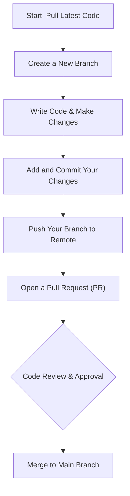
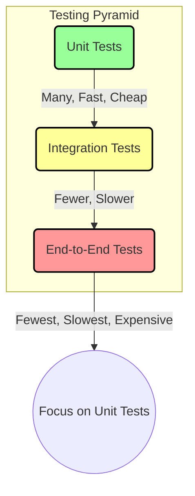

This is a practical guide to the essential concepts you'll use every day as a junior or mid-level software engineer. Going from writing code that just *works* to writing professional, production-ready code involves building a set of core habits. This post covers those habits, from version control and testing to the soft skills that will define your career.

## 1. Version Control with Git

Git is the foundation of modern software collaboration. You will use it every single day. Mastering the basics is non-negotiable.

### The Core Workflow

Your daily work will almost always follow this cycle: get the latest code, make your changes on a separate branch, and then propose to merge them back.



### Common Commands You'll Use Daily

This isn't an exhaustive list, but these commands will cover 95% of your daily Git interactions.

| Command | What It Does |
|---|---|
| `git clone [url]` | Downloads a copy of a remote repository to your local machine. |
| `git pull` | Fetches the latest changes from the remote repository and merges them into your current branch. |
| `git checkout -b [branch-name]`| Creates a new branch and switches to it. |
| `git status` | Shows the current state of your repository (modified files, new files, etc.). Run this often. |
| `git add [file]` | Stages a file, marking it for inclusion in the next commit. Use `git add .` to stage all changes. |
| `git commit -m "Your message"` | Saves your staged changes to the local repository. The message should be a short summary of the change. |
| `git push` | Uploads your committed changes from your local branch to the remote repository. |
| `git log` | Shows a history of all the commits for the current branch. |

<details>
  <summary>Click to see how to fix common mistakes</summary>

  - **Committed to the wrong branch?**
    1.  `git reset HEAD~` (This undoes the last commit but keeps your changes).
    2.  `git stash` (This temporarily saves your changes).
    3.  `git checkout [correct-branch-name]`
    4.  `git stash pop` (This reapplies your changes).
    5.  Now you can `add` and `commit` on the correct branch.

  - **Made a typo in your last commit message?**
    - `git commit --amend -m "New corrected message"`

  - **Need to undo a commit that has been pushed?**
    - `git revert [commit-hash]` creates a *new* commit that undoes the changes from a previous one. This is safer than `reset` for shared history.

</details>

## 2. Writing Clean, Maintainable Code

Writing code that works is the first step. Writing code that other engineers (and your future self) can understand and modify is what makes you a professional.

### The DRY Principle: Don't Repeat Yourself

If you find yourself copying and pasting code, stop and think. That's a sign you should probably write a reusable function or create a class.

**Repetitive Code (Bad):**
```python
# Calculate area for rectangle 1
width1 = 10
height1 = 5
area1 = width1 * height1
print(f"Area 1 is {area1}")

# Calculate area for rectangle 2
width2 = 7
height2 = 3
area2 = width2 * height2
print(f"Area 2 is {area2}")
```

**DRY Principle Applied (Good):**
```python
def calculate_area(width, height):
    return width * height

area1 = calculate_area(10, 5)
print(f"Area 1 is {area1}")

area2 = calculate_area(7, 3)
print(f"Area 2 is {area2}")
```

### Naming Conventions Matter

Your code should be as readable as a book. Use clear, descriptive names.

-   **Bad:** `x = get_data(d)`
-   **Good:** `customer_profile = fetch_customer_by_id(customer_id)`

### Comments: Explain the "Why," Not the "What"

Good code explains *what* it is doing on its own. Use comments to explain *why* it's doing it, especially if the logic is complex or related to a specific business rule.

-   **Bad Comment:** `# Add 1 to i`
-   **Good Comment:** `# We offset by 1 to account for the header row in the legacy CSV format.`

## 3. Mastering the Command Line

You'll be working in the terminal constantly to run servers, manage files, and execute scripts. Knowing your way around is essential.

### Basic Navigation and File Operations

| Command | What It Does |
|---|---|
| `pwd` | **P**rint **W**orking **D**irectory (shows where you are). |
| `ls -la` | **L**i**s**t files and directories, including hidden ones (`-a`) in a long format (`-l`). |
| `cd [directory]` | **C**hange **D**irectory. Use `cd ..` to go up one level. |
| `touch [file]` | Creates a new, empty file. |
| `mkdir [directory]`| **M**a**k**e a new **dir**ectory. |
| `cp [source] [dest]`| **C**o**p**y a file or directory. |
| `mv [source] [dest]`| **M**o**v**e (or rename) a file or directory. |
| `rm [file]` | **R**e**m**ove a file. Use `rm -r [directory]` to remove a directory and its contents. **Be careful with this!** |

### Searching and Filtering with `grep` and `|`

The pipe `|` operator is one of the most powerful tools in the terminal. It lets you send the output of one command as the input to another. This is often used with `grep` to search for text.

```bash
# Search for all lines containing "ERROR" in a log file
cat server.log | grep "ERROR"
```

## 4. Testing Your Code

Untested code is broken code. You don't know it's broken yet, but it is. Writing tests is a fundamental part of the job.

### The Testing Pyramid

This is a simple model for how to think about different types of tests.


**You should spend most of your time writing unit tests.** They are fast, easy to write, and precisely locate bugs.

### What Makes a Good Unit Test?

A good unit test is **F.I.R.S.T.**:
-   **Fast:** It runs in milliseconds.
-   **Independent:** It doesn't depend on other tests.
-   **Repeatable:** It produces the same result every time, no matter the environment.
-   **Self-Validating:** The test determines if it passed or failed on its own, without a human checking the output.
-   **Timely:** You write it at the same time as the code it's testing.

Here is a simple example in Python using `pytest`:
```python
# file: calculations.py
def add(a, b):
    return a + b

# file: test_calculations.py
from calculations import add

def test_add_positive_numbers():
    assert add(2, 3) == 5

def test_add_negative_numbers():
    assert add(-1, -1) == -2
```

## 5. APIs and Data Formats

Modern applications are built from services that talk to each other over the network using APIs (Application Programming Interfaces).

### Understanding REST APIs

Most APIs you'll encounter are REST APIs, which are based on standard HTTP methods.

| HTTP Verb | Action | Example |
|---|---|---|
| `GET` | Retrieve data | `GET /api/users/123` (Get user with ID 123) |
| `POST` | Create new data | `POST /api/users` (Create a new user with data in the request body) |
| `PUT` | Update existing data | `PUT /api/users/123` (Update user 123 with data in the body) |
| `DELETE`| Delete data | `DELETE /api/users/123` (Delete user 123) |

You should also be familiar with common HTTP status codes:
-   `200 OK`: The request was successful.
-   `201 Created`: A new resource was successfully created.
-   `400 Bad Request`: The server couldn't understand your request (e.g., missing data).
-   `404 Not Found`: The requested resource doesn't exist.
-   `500 Internal Server Error`: Something went wrong on the server.

### JSON is Everywhere

JSON (JavaScript Object Notation) is the de-facto standard for sending data between web servers and clients. It's lightweight and easy for both humans and machines to read.

```json
{
  "userId": 123,
  "username": "alex",
  "isActive": true,
  "roles": ["editor", "contributor"]
}
```

## 6. Database Fundamentals

Nearly every application needs a database to store and retrieve data.

### SQL vs. NoSQL at a Glance

-   **SQL (Relational Databases):** Think of data in tables, like an Excel spreadsheet. Examples: PostgreSQL, MySQL. They are great for structured data and enforcing consistency.
-   **NoSQL (Non-Relational Databases):** A broad category for databases that don't use the traditional table structure. Examples: MongoDB (document-based), Redis (key-value). They are often used for large-scale, unstructured data and are very flexible.

### Common SQL Operations

You'll use these four operations constantly when working with SQL databases.

```sql
-- Retrieve data
SELECT id, name, email FROM users WHERE is_active = TRUE;

-- Add new data
INSERT INTO users (name, email) VALUES ('Alice', 'alice@example.com');

-- Change existing data
UPDATE users SET email = 'new_alice@example.com' WHERE id = 1;

-- Remove data
DELETE FROM users WHERE id = 1;
```

## 7. Professional and Soft Skills

Your technical skills will get you the job, but your professional skills will make you successful in it.

**Code reviews are a conversation, not a critique.**
{: .notice--primary}

### How to Give and Receive Code Review Feedback

-   **Giving Feedback:** Be kind and specific. Ask questions instead of making demands (e.g., "What do you think about moving this logic to a helper function?" instead of "Move this to a helper function."). Focus on the code, not the person.
-   **Receiving Feedback:** Don't take it personally. The goal is to improve the code, not to criticize you. Be open to suggestions and ask for clarification if you don't understand a comment.

### Debugging Systematically

Don't just randomly change code and hope it works. Follow a process:
1.  **Reproduce the bug:** Find the exact steps to make it happen consistently.
2.  **Isolate the cause:** Use logs, debuggers, and print statements to narrow down where the problem is.
3.  **Fix the bug:** Write the code to solve the problem.
4.  **Verify the fix:** Write a test that proves the bug is gone and won't come back.

This field guide covers the core practices you'll rely on throughout your career. Don't worry about memorizing everything at once. Focus on building these habits one at a time, and you'll grow into a skilled and effective software engineer.
