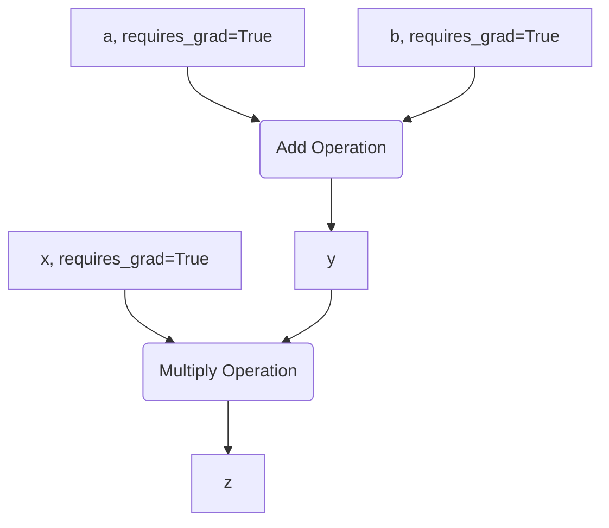

There are three lines of code that train almost every neural network in the world: `loss.backward()`, `optimizer.step()`, and `optimizer.zero_grad()`. You can copy and paste them, and your model will train. But what are they actually doing?

The truth is, the entire PyTorch system follows a simple, five-step recipe. In this guide, we're going to build a learning machine using nothing but basic math and arrays. No magic. Once you've built the engine with your own hands, the professional tools provided by PyTorch will make perfect sense.

<iframe width="500" height="315" src="https://www.youtube-nocookie.com/embed/r1bquDz5GGA?si=F0hsKO5wqWKp12_s" title="YouTube video player" frameborder="0" allow="accelerometer; autoplay; clipboard-write; encrypted-media; gyroscope; picture-in-picture; web-share" referrerpolicy="strict-origin-when-cross-origin" allowfullscreen></iframe>

## Part 1: The Building Blocks

Everything in deep learning starts with a few core components. Master these, and you've built the foundation for everything that follows.

### The Only Data Structure You Need: `torch.tensor`
The `torch.tensor` is the fundamental noun of the PyTorch language. It’s a multi-dimensional array, similar to a NumPy array, but it comes with the ability to run on GPUs and track operations for automatic gradient calculation.

Let's look at the three common ways to create a tensor.

**1. From existing data:**
```python
import torch

# Create a tensor directly from a Python list
data = [,]
my_tensor = torch.tensor(data)
print(my_tensor)
```

**2. From a desired shape:**
You often need to create tensors (like model weights) where you know the shape but not the initial values.

```python
# Create a tensor with a specific shape
shape = (2, 3) # 2 rows, 3 columns
rand_tensor = torch.rand(shape)
ones_tensor = torch.ones(shape)
zeros_tensor = torch.zeros(shape)

print(f"Random Tensor:\n {rand_tensor}")
```

**3. By mimicking another tensor:**
This is useful when you need a new tensor with the exact same properties (shape, data type) as another one.

```python
# Create a tensor that mimics the properties of another
template_tensor = torch.tensor([,])
mimic_tensor = torch.rand_like(template_tensor, dtype=torch.float)

print(f"Mimic Tensor:\n {mimic_tensor}")
```

### A Tensor's Three Key Attributes
Every tensor has three attributes you will use constantly for debugging.
-   `.shape`: A tuple describing the tensor's dimensions. **90% of your errors will be shape mismatches.**
-   `.dtype`: The data type of the elements (e.g., `torch.float32`).
-   `.device`: Where the tensor is stored: `cpu` or `cuda` (GPU).

**Why `float32`?**
Deep learning works by making tiny, continuous adjustments to a model's parameters. You can't nudge a value from 3 to 3.001 if your data type only allows integers. Model parameters *must* be a float type to be learnable.

### The Magic Switch: `requires_grad=True`
By default, a tensor is just a container for data. To tell PyTorch that a tensor is a learnable parameter, you must set `requires_grad=True`.

This single setting activates PyTorch's automatic differentiation engine, **Autograd**. It tells PyTorch: "From now on, track every operation that happens to this tensor."

```python
# A standard data tensor
x_data = torch.tensor([,])

# A learnable parameter tensor
w = torch.tensor([[1.0], [2.0]], requires_grad=True)

print(f"Data tensor 'requires_grad': {x_data.requires_grad}")
print(f"Parameter tensor 'requires_grad': {w.requires_grad}")
```

### The Computation Graph
Once you set `requires_grad=True`, PyTorch starts building a **computation graph** behind the scenes. It's a live recording of all operations.

Let's visualize it. We want to compute `z = x * (a + b)`.


Every tensor created by an operation has a `.grad_fn` attribute that points to the function that created it. This is the trail of breadcrumbs PyTorch will use to calculate gradients.

```python
a = torch.tensor(2.0, requires_grad=True)
b = torch.tensor(3.0, requires_grad=True)
x = torch.tensor(4.0, requires_grad=True)

y = a + b
z = x * y

print(f"Z's grad_fn: {z.grad_fn}")
print(f"Y's grad_fn: {y.grad_fn}")
print(f"A's grad_fn: {a.grad_fn}") # Created by user, so it's None```

## Part 2: Building a Learning Machine From Scratch

Now we'll use these raw components to build a simple linear regression model. This will reveal the universal five-step recipe for training any neural network.

Our model's goal is to learn the formula `y = 2x + 1`. We'll give it the `x` and `y` data, but it will have to discover the weight `w=2` and bias `b=1` on its own.

### The Five-Step Training Recipe

1.  **Forward Pass:** The model makes a guess.
2.  **Calculate Loss:** We measure how wrong the guess is.
3.  **Backward Pass:** We figure out who to blame for the error (calculate gradients).
4.  **Update Parameters:** We nudge the parameters in the right direction.
5.  **Zero Gradients:** We reset for the next round.

### Step 1: The Forward Pass (The Guess)
First, we set up our data and initialize our model's parameters with random values.

```python
# Create some sample data
X = torch.randn(10, 1)
y_true = 2 * X + 1 + 0.1 * torch.randn(10, 1) # y = 2x + 1 + noise

# Initialize random parameters that the model will learn
w = torch.randn(1, 1, requires_grad=True)
b = torch.randn(1, requires_grad=True)

# The forward pass: make a prediction
y_hat = X @ w + b # Using matrix multiplication
```
Our first guess, `y_hat`, will be terrible. That's the point. It's a starting hypothesis.

### Step 2: Calculate the Loss (The Scorecard)
We need a single number to tell us how wrong our guess was. For regression, we use the **Mean Squared Error (MSE)**.

```python
# Calculate the difference, square it, and take the mean
loss = torch.mean((y_hat - y_true)**2)
print(f"Initial Loss: {loss.item()}")
```
Our goal is now clear: make this loss number as small as possible.

### Step 3: The Backward Pass (Assigning Blame)
This is where Autograd does its magic. With one command, we travel backward through the computation graph and calculate the gradient of the loss with respect to every parameter.

```python
# This one command calculates all the gradients
loss.backward()
```
This populates the `.grad` attribute of our `w` and `b` tensors. These gradients tell us the direction of the steepest ascent of the loss function. To *decrease* the loss, we need to move in the *opposite* direction.

```python
print(f"Gradient for w: {w.grad}")
print(f"Gradient for b: {b.grad}")
```

### Steps 4 & 5: Update Parameters and Reset
This is the heart of learning: **gradient descent**. We nudge our parameters in the opposite direction of their gradient.

```python
# We do this inside a no_grad context because it's a manual update,
# not part of the model's computation graph.
learning_rate = 0.01
with torch.no_grad():
    w -= learning_rate * w.grad
    b -= learning_rate * b.grad

# We MUST zero the gradients after updating, or they will accumulate
w.grad.zero_()
b.grad.zero_()
```

### Putting It All Together: The Training Loop
We repeat these five steps over and over. Each full pass through the process is called an **epoch**.

```python
learning_rate = 0.01
epochs = 100

# Re-initialize parameters
w = torch.randn(1, 1, requires_grad=True)
b = torch.randn(1, requires_grad=True)

for epoch in range(epochs):
    # 1. Forward Pass
    y_hat = X @ w + b

    # 2. Calculate Loss
    loss = torch.mean((y_hat - y_true)**2)

    # 3. Backward Pass
    loss.backward()

    # 4. Update Parameters
    with torch.no_grad():
        w -= learning_rate * w.grad
        b -= learning_rate * b.grad

    # 5. Zero Gradients
    w.grad.zero_()
    b.grad.zero_()
    
    if epoch % 10 == 0:
        print(f"Epoch {epoch} | Loss: {loss.item():.4f} | w: {w.item():.4f} | b: {b.item():.4f}")

print(f"\nFinal Learned w: {w.item():.4f}, b: {b.item():.4f}")
print("True values were w=2.0, b=1.0")
```
When you run this, you will see the loss plummet and the values for `w` and `b` get closer and closer to 2.0 and 1.0. We've built a machine that learns!

## Part 3: Graduating to Professional PyTorch

The "from scratch" method was messy. We had loose tensors and manual updates. For a model with millions of parameters, this is impossible. Now we'll refactor our code using PyTorch's professional tools.

### `nn.Module`: The Model Blueprint
The `torch.nn.Module` class is the standard way to organize a model. It packages all your layers and parameters neatly.
-   You define your layers in the `__init__` method.
-   You define the forward pass logic in the `forward` method.

```python
import torch.nn as nn

class LinearRegressionModel(nn.Module):
    def __init__(self, in_features, out_features):
        super().__init__()
        self.linear = nn.Linear(in_features, out_features)

    def forward(self, x):
        return self.linear(x)

# Instantiate the model
model = LinearRegressionModel(1, 1)
print(model)
```
The `nn.Linear` layer does the same `X @ w + b` operation, but it manages `w` and `b` internally.

### `torch.optim`: The Automated Learner
The `torch.optim` module automates the parameter update step. We give it the model's parameters and a learning rate, and it handles the gradient descent logic for us.

```python
import torch.optim as optim

# The Adam optimizer is a great default choice
optimizer = optim.Adam(model.parameters(), lr=0.01)
```

### The Three-Line Mantra
Our messy update steps are now replaced by three clean, powerful lines that form the core of nearly all PyTorch training loops.

```python
# Before: Manual updates and zeroing
# with torch.no_grad():
#     w -= learning_rate * w.grad
#     b -= learning_rate * b.grad
# w.grad.zero_()
# b.grad.zero_()

# After: The three-line mantra
optimizer.zero_grad()  # Step 5: Zero gradients
loss.backward()        # Step 3: Backward pass
optimizer.step()       # Step 4: Update parameters
```

### The Final, Clean Training Loop

```python
# Use a pre-built loss function
loss_fn = nn.MSELoss()

model = LinearRegressionModel(1, 1)
optimizer = optim.Adam(model.parameters(), lr=0.01)

for epoch in range(epochs):
    # 1. Forward Pass
    y_hat = model(X)

    # 2. Calculate Loss
    loss = loss_fn(y_hat, y_true)

    # The Mantra
    optimizer.zero_grad()
    loss.backward()
    optimizer.step()
    
    if epoch % 10 == 0:
        print(f"Epoch {epoch} | Loss: {loss.item():.4f}")
```
We achieve the same result, but our code is now clean, scalable, and uses the standard, optimized tools that power real-world AI.

## Part 4: The Connection to Large Language Models

How does this simple model relate to something massive like GPT? **The process is identical; only the scale and architecture change.**

Inside every Transformer block (the architecture behind all modern LLMs) is a component called a Feed-Forward Network (FFN). It looks like this:

```python
class FeedForwardNetwork(nn.Module):
    def __init__(self):
        super().__init__()
        self.layer1 = nn.Linear(4096, 14336)
        self.activation = nn.GELU()
        self.layer2 = nn.Linear(14336, 4096)

    def forward(self, x):
        x = self.layer1(x)
        x = self.activation(x)
        x = self.layer2(x)
        return x
```
You can read this perfectly. It's just two `nn.Linear` layers with an activation function in between—the same Lego bricks we just learned. The only difference is the size.

| Feature | Our Toy Model | One Layer in an LLM |
|---|---|---|
| **Model** | `LinearRegressionModel` | `Transformer` |
| **Layer** | `nn.Linear` | `nn.Linear` |
| **Weight Shape** | 1x1 | 4096 x 14336 |
| **Operation** | `X @ w + b` | `X @ w + b` |
| **Parameters** | 2 | ~8 Billion (total) |
| **Training** | `zero_grad`, `backward`, `step` | `zero_grad`, `backward`, `step` |

The magic of deep learning is gone, replaced by engineering. You now understand the engine, from a single tensor to the universal process that trains the largest AI models in the world.
