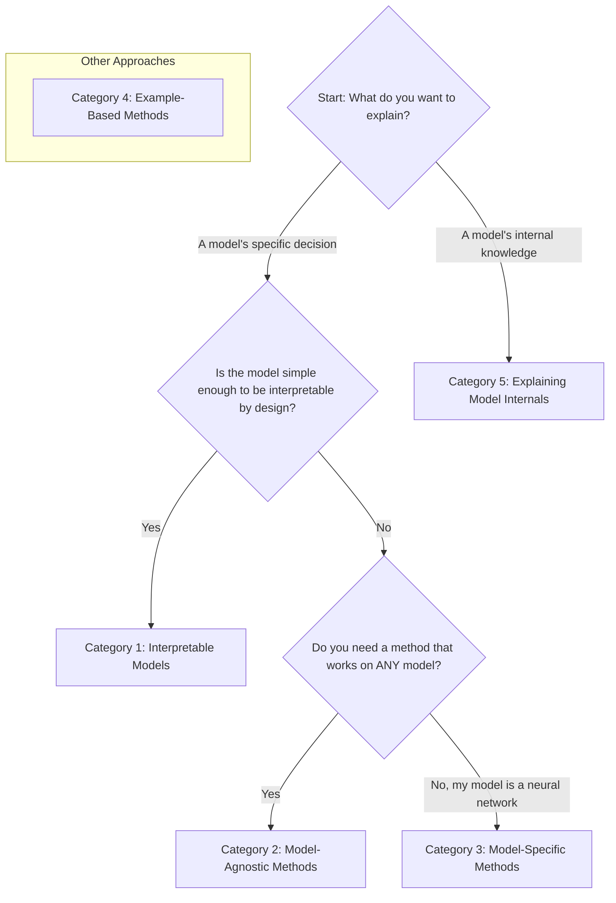

As AI makes more high-stakes decisions in areas like medicine, finance, and law, we need to ensure those decisions are right—and for the right reasons. Explainable AI (XAI) is a set of tools that helps us understand what our machine learning models are actually doing.

It's about opening up the "black box" to see the logic inside. This is crucial for debugging our models, building trust with users, and complying with regulations.

### Right Answer, Wrong Reason
Let's start with a classic example. Imagine we train a computer vision model to identify dog breeds. We show it this picture, and it correctly predicts "Husky."


Success, right? Not so fast.

When we apply an XAI technique called a **saliency map**, it highlights the pixels the model found most important for its decision.
-   **A Bad Model:** The map highlights the snow in the background. The model learned that "snow" is highly correlated with "Husky" in its training data, but it barely looked at the dog itself. It got the right answer for the wrong reason.
-   **A Good Model:** The map highlights the dog's face, eyes, and fur patterns. This is what we want—a model that learns the actual features of a husky.

XAI methods allow us to catch these kinds of dangerous shortcuts and build more reliable models.

## The XAI Cheat Sheet: A Framework for Choosing a Method
Explainable AI isn't just one technique; it's a whole toolbox. The right tool depends on the question you're asking. This flowchart helps you choose the right category of method.



Let's walk through each of these five categories.

### Category 1: Interpretable Models
The simplest form of explainability is to use a model that is transparent by design.
-   **What is it?** These are models whose inner workings are easy for humans to understand directly.
-   **Examples:** Linear Regression, Logistic Regression, Decision Trees.
-   **How it works:** You can look directly at the model's learned coefficients or rules. In a linear model predicting house prices, a large positive coefficient for `square_footage` directly tells you that as square footage increases, the price increases.
-   **When to use it:** Excellent for high-stakes decisions where you must justify every step (e.g., loan applications, certain legal models). The downside is they often aren't powerful enough for complex problems like image recognition.

### Category 2: Model-Agnostic Methods
These are methods that can explain the predictions of *any* model, no matter how complex. They work by treating the model as a black box.
-   **What is it?** A set of techniques that explains a prediction without needing to know the model's internal structure.
-   **Key Example: SHAP (SHapley Additive exPlanations).** SHAP explains a single prediction by showing how each feature contributed to pushing the prediction away from a baseline.
-   **How it works:** Imagine a model predicts a patient's risk of a certain disease is 0.4. SHAP starts with the average risk for all patients (the "base value," say 0.1). Then, it shows how each feature of this specific patient pushed the prediction up or down.

```mermaid
graph LR
    A[Base Value: 0.1] -->|BMI of 40 (+0.15)| B;
    B -->|Blood Pressure of 180 (+0.2)| C;
    C -->|Sex: Female (-0.05)| D;
    D -->|Age: 65 (+0.1)| E[Final Prediction: 0.4];
```
-   **When to use it:** When you have a complex model (like a deep neural network or a large gradient-boosted tree) and you need to explain individual predictions.

### Category 3: Model-Specific Methods
These methods are designed to work with a specific family of models, most often neural networks.
-   **What is it?** Techniques that use the internal structure of a model, like its gradients, to generate explanations.
-   **Key Example: Gradient Saliency Maps.** As we saw with the husky, these maps highlight the input features (e.g., pixels in an image) that were most influential for a decision.
-   **How it works:** In a neural network, gradients are the signals used during training to update the model's weights. These same signals can tell us how a small change in an input pixel would change the final output. Saliency maps visualize these gradients, showing which pixels have the most power to change the model's mind.
-   **When to use it:** Mostly for computer vision and other deep learning tasks where you need to understand which parts of an input are driving the model's prediction.

### Category 4: Example-Based Methods
Sometimes, the best way to explain a model's behavior is to show other examples.
-   **What is it?** Techniques that explain a model by highlighting its successes, failures, or influential training data points.
-   **Key Example: Adversarial Examples.** These are inputs that have been slightly modified in a way that is imperceptible to humans but causes the model to make a completely wrong prediction.
-   **How it works:** An attacker might add tiny, carefully crafted patches to a stop sign. To a human, it's still clearly a stop sign. But the model might suddenly classify it as a "45 mph speed limit" sign with high confidence. Finding these examples is a powerful way to reveal a model's blind spots and vulnerabilities.
-   **When to use it:** For testing the robustness and security of your models, especially in high-stakes environments like self-driving cars.

### Category 5: Explaining Model Internals
This category is different. Instead of explaining a single *decision*, it tries to explain what concepts a model *knows*.
-   **What is it?** Methods that probe the internal components of a model (like individual neurons) to understand what they've learned to detect.
-   **Key Example: Feature Visualization.** This technique generates images that cause a specific neuron in a computer vision model to activate as strongly as possible.
-   **How it works:** By generating these "dream-like" images, we can see what each neuron is looking for.
    -   Neurons in early layers might learn to detect simple things like edges or textures.
    -   Neurons in middle layers might detect more complex patterns like flower petals or animal fur.
    -   Neurons deep in the model can learn to detect entire concepts. Researchers at OpenAI famously found a "Spider-Man neuron" that fired on images of Spider-Man, the text "spider," and comic book art.
-   **When to use it:** For fundamental research into how neural networks work and for auditing models to see if they have learned problematic or biased concepts.

## Conclusion
Explainable AI is not a single solution but a diverse set of tools for asking different questions. Whether you need to justify a decision, debug a faulty prediction, or understand the fundamental concepts your model has learned, there's a method to help you open the black box and build better, safer, and more trustworthy AI systems.

### Further Reading
-   **Book:** *Interpretable Machine Learning* by Christoph Molnar. A comprehensive and freely available online resource.
-   **Podcast:** The NLP Highlights podcast episode with Sameer Singh offers great insights into the field.
-   **Talk:** "Please Stop Doing 'Explainable' ML" by Cynthia Rudin is a thought-provoking talk on the importance of using inherently interpretable models when possible.
